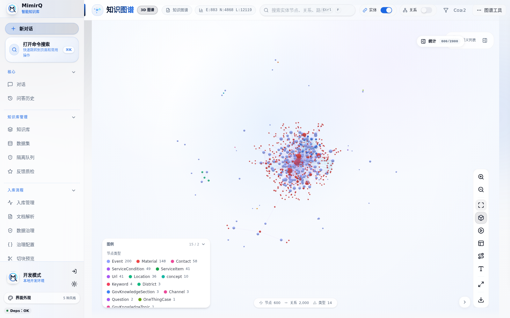
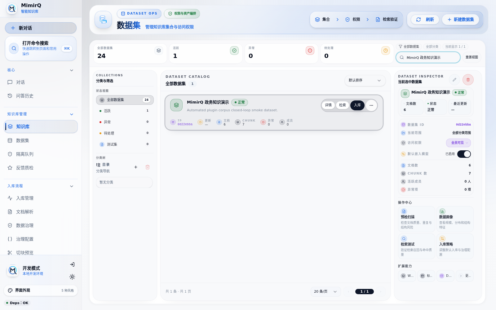
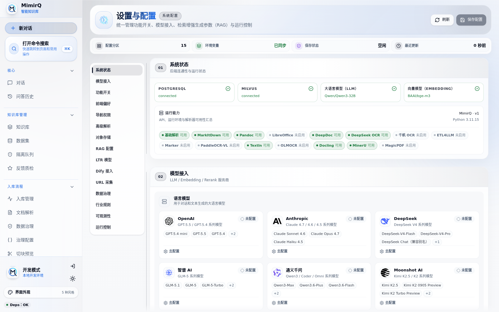
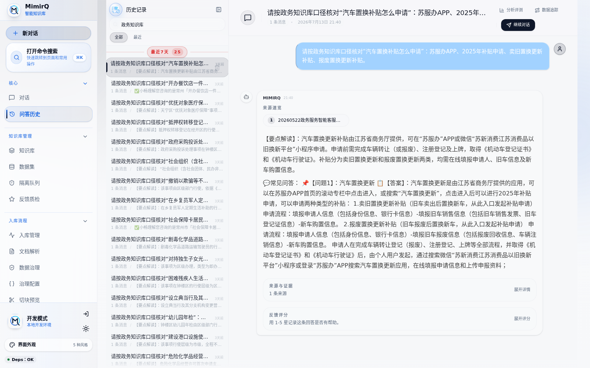
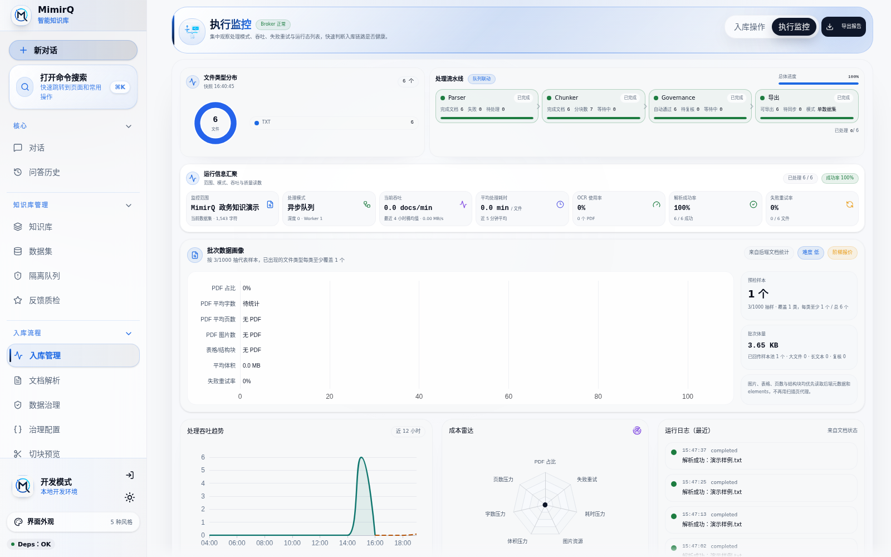
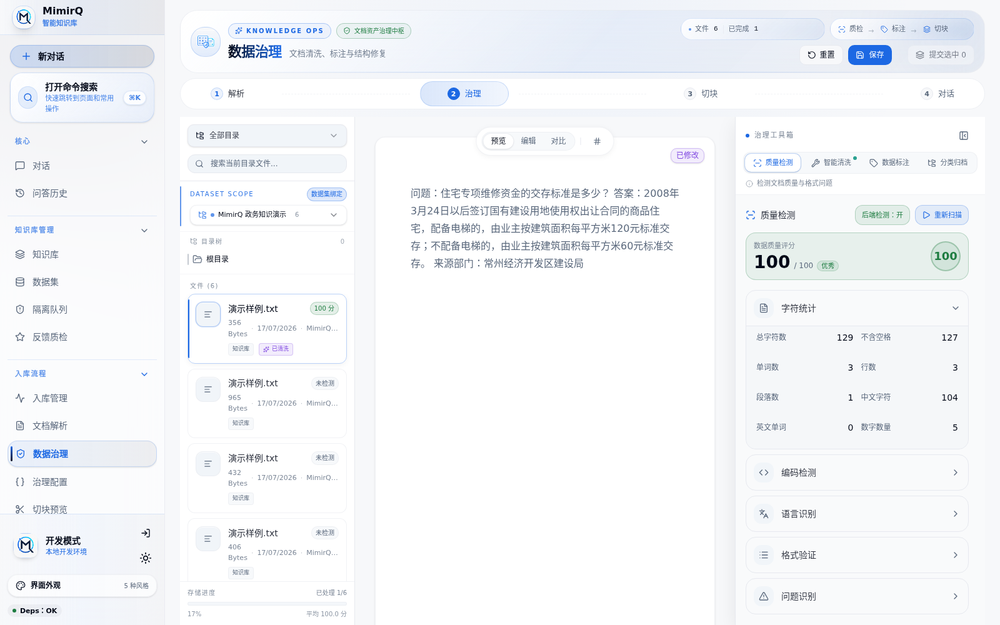
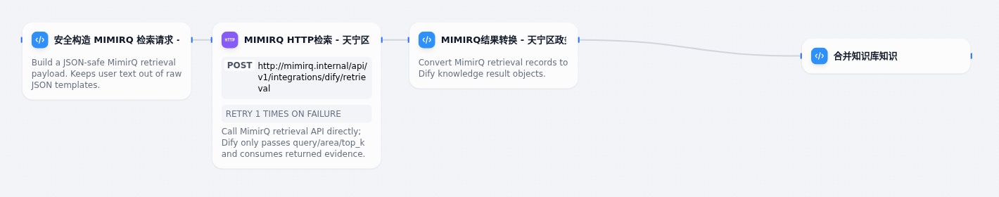
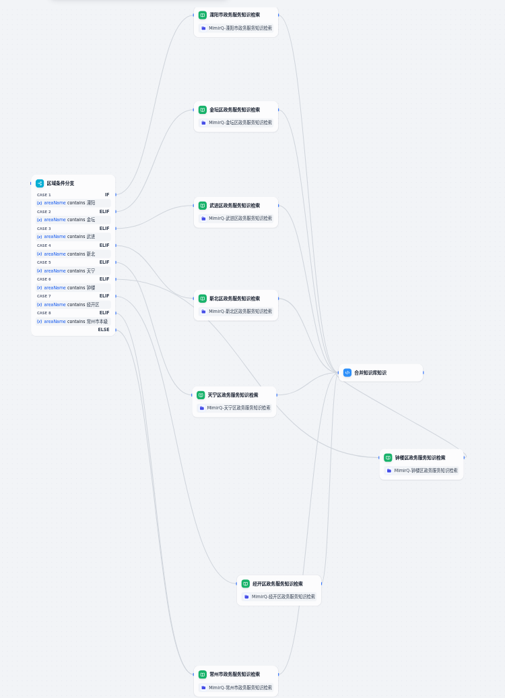

<div align="center">


<p><b>全栈开源、中文优先的企业 RAG 知识库</b><br/>把解析、治理、切块、检索、重排与引用做成可检查、可替换、可回归的知识流水线。</p>

<p>
  <a href="#为什么做-mimirq"><b>为什么 MimirQ</b></a> ·
  <a href="#产品界面"><b>产品界面</b></a> ·
  <a href="#快速开始"><b>快速开始</b></a> ·
  <a href="#dify-接入"><b>Dify 接入</b></a> ·
  <a href="#真实场景验证"><b>800 题实测</b></a> ·
  <a href="./docs/releases/v1.0.1.md"><b>v1.0.1 发布说明</b></a>
</p>

<p>
  <a href="https://www.apache.org/licenses/LICENSE-2.0"></a>
  <a href="https://www.python.org/downloads/"></a>
  
  
</p>

<p>
  <a href="./README.md"></a>
  <a href="./README_EN.md"></a>
  <a href="./README_JA.md"></a>
  <a href="./README_KO.md"></a>
</p>

</div>

---

## 为什么做 MimirQ

**企业知识库真正难的，不是把文档向量化，而是让错误可定位、策略可替换、质量可回归。**

MimirQ 起源于一次真实的政务知识库交付。回答出错时，团队必须能判断：解析是否丢了表格，治理是否漏了规则，切块是否破坏了语义，召回是否漏掉了证据，重排是否排错，还是生成偏离了引用。把整条链路藏在一个“上传并开始问答”的按钮后面，原型很快，长期交付却难以估算、验收和治理。

> **一条可控的企业知识流水线**
>
> `数据评估` → `场景化解析` → `清洗治理` → `业务切块`<br/>→ `向量 / 全文索引` → `混合召回` → `重排与引用` → `Golden 回归`

真实项目先抽样评估数据：统计扫描页、图片、表格、公式和版式复杂度，验证解析质量并估算资源与人工成本；再按材料选择解析器。复杂版式或扫描件可优先评估 [MinerU](https://opendatalab.github.io/MinerU/) / [DeepDoc](https://github.com/infiniflow/ragflow/tree/main/deepdoc)，公式、表格与版面结构密集的材料可纳入 [Docling](https://docling-project.github.io/docling/)，数字原生 Office 或纯文本可从 [MarkItDown](https://github.com/microsoft/markitdown) 等轻量路径开始。高风险资料仍需人工校验。

解析结果经脚本、规则 DSL 或插件治理后，再按标题、章节、业务记录或父子关系切块，而不是统一套用固定长度和重叠窗口。索引层可使用 Milvus 等向量库，并组合 BM25、向量检索与重排；上层应用可以是 Dify、LangGraph、PydanticAI 或一个简单 API 服务。

MimirQ 不试图取代所有平台：

- **业务简单、流程稳定、低代码优先**：直接使用 Dify 或 RAGFlow 通常更快。
- **希望一体化使用 DeepDoc 与 GraphRAG**：RAGFlow 是成熟选择。
- **知识链路需要按业务替换、审计和回归**：MimirQ 将知识能力从具体聊天业务中解耦，也可作为 Dify 的外部知识层。

当前仓库覆盖 30 个解析后端、86 种切块策略、13 类重排器，并保留固定 800 题的实测证据。数字只是实现广度，核心是每一步都能检查输入输出、追溯引用与版本，并用 Golden 题集守住发布质量。完整方法见[企业知识流水线设计准则](./docs/guides/rag_platform_design_principles.md)。

> 最新稳定版：v1.0.1。见 [发布说明](./docs/releases/v1.0.1.md) 与 [发布索引](./docs/releases/README.md)。

---

## 产品界面

以下界面使用仓库内公开的政务插件演示样例生成，不含生产知识库数据。

<table>
  <tr>
    <td colspan="2" align="center">
      
      <br/><strong>知识图谱</strong>
      <br/><sub>在同一画布中检索和分析实体、事件与关系。</sub>
    </td>
  </tr>
  <tr>
    <td width="50%" align="center">
      
      <br/><strong>知识库管理</strong>
      <br/><sub>集中查看数据集、文档、Chunk 与入库状态。</sub>
    </td>
    <td width="50%" align="center">
      
      <br/><strong>Golden 回归评测</strong>
      <br/><sub>标准问答、运行记录与 Recall / MRR 等指标同屏可查。</sub>
    </td>
  </tr>
  <tr>
    <td width="50%" align="center">
      
      <br/><strong>系统设置</strong>
      <br/><sub>集中查看依赖状态、解析能力以及模型服务接入。</sub>
    </td>
    <td width="50%" align="center">
      
      <br/><strong>问答历史与证据回看</strong>
      <br/><sub>检索历史会话，并回看完整回答、来源与反馈入口。</sub>
    </td>
  </tr>
  <tr>
    <td width="50%" align="center">
      
      <br/><strong>入库执行监控</strong>
      <br/><sub>按数据集观察解析、切块、治理、导出和失败重试状态。</sub>
    </td>
    <td width="50%" align="center">
      
      <br/><strong>数据治理</strong>
      <br/><sub>在同一工作台完成文档预览、质量检测、清洗与标注。</sub>
    </td>
  </tr>
</table>

---

## 快速开始

### 前置要求

- [Docker](https://docs.docker.com/get-docker/) 20.10+ 与 [Docker Compose](https://docs.docker.com/compose/install/) 2.0+
- GNU Make；Docker 一键启动另需 Python 3.9+ 生成配置
- 源码开发模式另需 Python 3.11+、Node.js 20+ 与 pnpm 10.26
- 至少 4 核 CPU / 16 GB RAM / 50 GB 磁盘

### 初始化

```bash
git clone --depth 1 --single-branch https://github.com/skygazer42/MimirQ.git
cd MimirQ
make init
```

`make init` 只创建缺失的 `.env` 和 `web/.env.local`，不会覆盖已有配置。编辑 `.env`，按部署场景填写：

- 默认模型调用：`LLM_API_KEY`（必填）
- 自定义 LLM：`LLM_API_BASE`、`LLM_MODEL`
- 独立 Embedding：`EMBEDDING_API_BASE`、`EMBEDDING_API_KEY`、`EMBEDDING_MODEL`
- 启用 Reranker：`ENABLE_RERANKER`、`RERANKER_API_BASE`、`RERANKER_API_KEY`、`RERANKER_MODEL`
- 自动创建首个管理员：`INITIAL_ADMIN_EMAIL`、`INITIAL_ADMIN_USERNAME`、`INITIAL_ADMIN_PASSWORD`

字段取值、独立模型服务和管理员初始化规则见[模型服务与首次管理员配置](./docs/guides/model_services.md)。

启动后如何创建数据集、上传解析、检查切块、验证检索和引用，以及后续治理、评测、Dify 与运维，见[完整操作指南](./docs/user_guide.md)。

| 启动方式 | 适用场景 | 应用运行位置 |
|:---|:---|:---|
| **Docker 一键启动（推荐）** | 首次体验、服务器部署 | 前端、API、Worker 与依赖服务均在容器中 |
| **源码开发模式** | 前后端开发、热更新调试 | `.venv` + pip 运行 API，pnpm 运行 Web；Docker 运行基础设施 |

### 方式一：Docker 一键启动

```bash
make up-web
make api-ping
```

启动后访问 [http://localhost:3000](http://localhost:3000)；未预置管理员时，在页面注册首个账户。首次构建、代理、生产凭据和网络配置见 [Docker Compose 部署指南](./docs/deployment/docker_compose.md)。

停止使用 `make down`；清空持久化数据使用 `make docker-reset`；连同本项目服务镜像删除使用 `make docker-purge`。MimirQ 固定使用独立的 `mimirq` Compose 项目名，不会把同机 Dify 当成本项目；后两项不可恢复。Windows PowerShell、容器归属检查、旧版数据迁移、误删恢复和精确删除范围见 [Docker Compose 部署指南](./docs/deployment/docker_compose.md#4-数据卷与清理)。

<details>
<summary><b>按文档类型启用可选解析器</b></summary>

默认使用内置 DeepDoc。其他解析器仅在业务需要时启动：

| 文档场景 | 建议解析器 | 额外要求 | 启动命令 |
|:---|:---|:---|:---|
| 常规 PDF / Office / 文本 | 内置 DeepDoc | 无 | 无需额外容器 |
| PDF 转 Markdown，服务器无 GPU | Marker | CPU | `make up-marker` |
| 版面、表格与图片混合文档 | ETL4LLM | CPU | `make up-etl4llm` |
| 扫描件、OCR、复杂版面 | PaddleOCR-VL | NVIDIA GPU，建议预留 10 GiB | `make up-paddlevl` |
| 表格、公式与图片较多的 PDF | MinerU pipeline | NVIDIA GPU、首次下载模型 | `make up-mineru` |
| VLM 复杂 PDF | MinerU VLM | NVIDIA GPU，资源占用较高 | `make up-mineru-vlm` |
| 高精度 PDF OCR | olmOCR | NVIDIA GPU，建议 48 GiB 级显存 | `make up-olmocr` |
| 公式 / 表格 PDF 转 Markdown | MagicPDF | NVIDIA GPU | `make up-magicpdf` |
| PDF / 图片走外部视觉 OCR | Qianfan-OCR | 上游 URL 与 API Key，本地无需 GPU | `make up-qianfanocr` |

完整参数和平台限制见 [Docker Compose 部署指南](./docs/deployment/docker_compose.md) 与 [解析器文档](./docs/quickstart.md#可选-启用-etl4llmbisheng-unstructured版面解析)。

</details>

### 方式二：源码开发（Python venv + pip + pnpm）

这是常见的本地开发方式，无需 Conda。FastAPI 运行在 Python `.venv` 中，Next.js 由 pnpm 启动；Docker 只运行 PostgreSQL、Redis、Milvus 等基础设施：

```bash
make setup-host
```

`make setup-host` 会创建 `.venv`、执行 pip 与 pnpm 依赖安装、准备解析模型并启动 Docker 基础设施。默认使用 API 进程内后台任务，只需打开两个终端：

```bash
# 终端 1：FastAPI（热更新）
make backend

# 终端 2：Next.js（热更新）
make web
```

启用独立 Worker 的配置见[模型服务与首次管理员配置](./docs/guides/model_services.md)。验证主机前后端：

```bash
make api-ping
```

结束主机进程后，执行 `make infra-down` 停止依赖服务。

### 服务地址

| 服务 | 地址 |
|:---:|:---|
| **前端 UI** | [http://localhost:3000](http://localhost:3000) |
| **API 文档** | [http://localhost:8000/docs](http://localhost:8000/docs) |

> 低资源模式可使用 `make up-lite`，它用 Chroma/FAISS 替代 Milvus、免 MinIO，默认不含前端；适合验证 API `ready` 与 `make core-e2e` 最小闭环。需要 UI 时另运行 `make web`，或改用 `make up-web`。外部 LLM/Embedding 调用仍需对应模型供应商密钥。

高级模型、解析器和代理配置见 [`.env.example`](./.env.example)。更换 Embedding 模型后必须重建已有知识库索引；更多平台与 Windows 步骤见[开发文档](./docs/quickstart.md)，可选政务示例见[插件说明](./plugins/pipelines/changzhou-gov-service-knowledge/README.md)。

---

## Dify 接入

MimirQ 可作为 Dify 的可治理 RAG 层接入现有应用，不重复实现工作流画布。当前支持两种方式：

- **External Knowledge API**：Dify 负责编排与生成，MimirQ 负责文档治理、检索、重排、权限过滤和证据返回。
- **Workflow HTTP 节点**：Dify 负责自定义路由与参数，MimirQ 按指定知识范围返回证据和 Trace。

### Workflow HTTP 节点

<p align="center">
  <a href="./docs/images/screenshots/dify-mimirq-http-workflow.png">
    
  </a>
  <br/>
  <sub>真实 Dify HTTP 子链（已脱敏）：安全构造 JSON 请求 → HTTP 节点调用 MimirQ retrieval endpoint → 转换结果 → 合并知识证据。</sub>
</p>

### External Knowledge API

<p align="center">
  <a href="./docs/images/screenshots/dify-mimirq-workflow.png">
    
  </a>
  <br/>
  <sub>真实 Dify Chatflow（已脱敏）：绿色知识检索节点通过 External Knowledge API 调用 MimirQ，再统一合并证据；点击查看原图。</sub>
</p>

> 图中的地区路由来自可选示例插件；MimirQ 核心不内置地区、事项或行业规则。

Dify 标准外部知识库端点为 `POST /api/v1/integrations/dify/retrieval`；可选用 `POST /api/v1/integrations/dify/conversation-turns` 回传答案、引用与会话标识。`knowledge_id` 默认必须显式配置在 `DIFY_EXTERNAL_KNOWLEDGE_MAP_JSON` 中。配置见 [`.env.example`](./.env.example)，部署前校验见 [readiness gate](./scripts/README.md)，实测结果见[真实场景验证](#真实场景验证)。

---

## 核心功能对比

<details>
<summary><b>展开查看与 Dify、RAGFlow、FastGPT、AnythingLLM 和 LangChain 的功能对比</b></summary>


| 功能维度 | **MimirQ** | [Dify](https://github.com/langgenius/dify) | [RAGFlow](https://github.com/infiniflow/ragflow) | [FastGPT](https://github.com/labring/FastGPT) | [AnythingLLM](https://github.com/Mintplex-Labs/anything-llm) | [LangChain](https://github.com/langchain-ai/langchain) |
|:---|:---|:---|:---|:---|:---|:---|
| **文档解析** | **30 种解析后端**：PDF、OCR、版式、表格、公式、VLM | Knowledge Pipeline；PDF、PPT 等常见格式 | **DeepDoc**；复杂版式、扫描件、MinerU / Docling | PDF、扫描件、表格、公式转 Markdown | PDF、TXT、DOCX 等文档管道 | Document Loaders 与第三方解析器集成 |
| **切块能力** | **86 种策略**：递归、语义、父子、RAPTOR、Late Chunking；可视化预览 | 通用、父子、Q&A 与可编排处理 | 模板化切块；支持可视化人工干预 | 自动、手工、Q&A 与增强处理 | 文档管道自动分块 | Text Splitters；由应用代码组合 |
| **检索 / 重排** | Milvus / FAISS / Chroma + BM25 / SPLADE / ColBERT / LTR / RRF；**13 种重排器** | 语义、全文、混合检索；可配置 rerank | 多路召回 + 融合重排 | 语义、全文、混合检索 + RRF + rerank | 多种向量库检索 + 来源引用 | Retriever / reranker 组件；自行编排 |
| **知识图谱** | 实体、关系、事件抽取；实体消解、社区发现与多跳检索 | 通过工作流、插件或外部服务接入 | 内建 GraphRAG | 通过工作流或外部服务接入 | 通过 Agent / Tool 外接 | 图数据库集成与自定义链路 |
| **Agent / MCP** | LangGraph Agent、Self-RAG / CRAG / FLARE；MCP client / server | Function Calling / ReAct Agent、工具与 MCP | Agentic Workflow、MCP、代码执行器 | Agent V2、工具、MCP 与 VM 执行 | No-code Agent Builder、MCP、定时任务 | Agents / LangGraph / MCP；代码优先 |
| **可视化工作流** | **无通用节点画布**；专注 RAG 调试、治理页面与 API | **核心能力**：应用 / Agent 节点编排 | Agent 与入库 Pipeline 编排 | **核心能力**：Flow 节点编排 | No-code Agent Builder | 无内建产品 UI；由应用实现 |
| **评测 / 治理闭环** | RAGAS、回归门禁、Leaderboard、显著性检验、证据审计 | 运行日志、观测与人工标注 | 检索测试、切块检查与引用追溯 | 运行详情、检索调试与日志 | 来源引用；无内建 RAG 回归门禁 | 需另接 LangSmith 或自建评测 |
| **安全 Guard** | InputGuard / OutputGuard、PII / Secret 脱敏、SSRF 逐跳校验 | 内容审查节点与工作流规则 | 代码执行沙箱；业务 Guard 需配置 | 工作流内容审查与 VM 沙箱 | Local-first、Agent 工具权限 | 由应用中间件与部署边界实现 |
| **企业权限 / 合规** | 文档 ACL + Security Trimming、RBAC、SCIM / SSO / SAML、审计 | Workspace 权限；企业版组织与 SSO | 账号与 API 鉴权；细粒度合规需按部署建设 | ABAC + RBAC；团队、群组与资源权限 | Docker 版多用户与权限控制 | 框架本身不提供；由应用实现 |
| **RAG 调试可视化** | 切块预览、检索 Trace、重排过程、逐句引用、KG、评测看板 | Dataset 测试、Workflow Trace 与应用日志 | 切块可视化、命中片段与引用 | 知识库测试、Workflow 运行详情 | Workspace、来源引用与聊天 UI | 无内建 UI；可另接观测平台 |
| **Dify 外部知识库** | **原生兼容 Dify External Knowledge API** | 原生消费外部知识库 | 需通过 API 适配 | 需通过 API 适配 | 需通过 API 适配 | 自行实现适配器 |
| **开箱方式** | Docker Compose / Helm；完整企业 RAG 栈 | Docker Compose / Cloud | Docker Compose；官方建议 4C / 16 GB / 50 GB | Docker / Cloud | Desktop / Docker | Python / JS 库；需自行组装应用 |

> 对比基于各项目公开版本与官方文档（2026-07），描述的是**仓库直接提供的能力表面**，不是统一 benchmark。插件、商业版和后续版本可能改变结果。

</details>

---

## 真实场景验证

MimirQ 已用于**市级政务智能问答助手**，覆盖 7 个区域级 + 1 个市级知识库。2026-07-27 使用同一固定 800 题和真实自托管模型复测，五条链路最终均无失败：

<!-- 数据来源：artifacts/dify_4way_800_20260727/comparison_report.json、artifacts/dify_4way_800_20260727/summary_for_sharing.md 与 artifacts/changzhou_local_3model_800_20260727/summary.json；输入 SHA-256 5a4c67c42e8f8123774279d46af39ccc793da1b89fdea19a7359f63c8cb2fac2。 -->

| <sub>链路</sub> | <sub>成功执行</sub> | <sub>准确 / 部分准确 /<br>证据不足</sub> | <sub>准确率 / 可用率</sub> | <sub>证据覆盖</sub> | <sub>平均 / P50 / P95</sub> |
|:---|---:|---:|---:|---:|---:|
| <sub><b>MimirQ 检索直连</b></sub> | <sub><b>800 / 800</b></sub> | <sub><b>791 / 9 / 0</b></sub> | <sub><b>98.9% / 100%</b></sub> | <sub><b>99.5%</b></sub> | <sub><b>3.64s / 2.02s / 12.58s</b></sub> |
| <sub><b>真实 Embedding + Reranker + LLM</b></sub> | <sub><b>800 / 800</b></sub> | <sub><b>727 / 73 / 0</b></sub> | <sub><b>90.9% / 100%</b></sub> | <sub><b>99.7%</b></sub> | <sub><b>2.59s / 1.53s / 8.15s</b></sub> |
| <sub><b>Dify HTTP → MimirQ</b></sub> | <sub><b>800 / 800</b></sub> | <sub>514 / 223 / 63</sub> | <sub>64.3% / 92.1%</sub> | <sub>96.3%</sub> | <sub>13.15s / 12.93s / 17.33s</sub> |
| <sub><b>Dify External → MimirQ</b></sub> | <sub><b>800 / 800</b></sub> | <sub>502 / 232 / 66</sub> | <sub>62.7% / 91.7%</sub> | <sub><b>99.7%</b></sub> | <sub>12.14s / 11.17s / 23.49s</sub> |
| <sub><b>Dify 原生知识库</b></sub> | <sub><b>800 / 800</b></sub> | <sub>309 / 287 / 204</sub> | <sub>38.6% / 74.5%</sub> | <sub>83.8%</sub> | <sub>13.67s / 11.34s / 29.55s</sub> |

直连输出检索证据，其他链路输出生成答案，因此准确率与延迟不是严格同任务横比。Dify HTTP / External 的证据覆盖为 96.3% / 99.7%，答案条款覆盖仅为 83.6% / 83.8%，主要损失在 Dify 生成编排而不是 MimirQ 召回；Dify 原生知识库不经过 MimirQ。

并发 5 直连首轮触发 15 次配置化 admission backpressure，降至并发 3 仅重试失败题后恢复为 800 / 800。MimirQ 没有加入地区、事项或题目特判；不同 Embedding runtime 的多库请求由通用检索层分片处理。

[完整方法、指标解释与历史复测](./docs/benchmarks/changzhou_dify.md) · [Dify 接入方式与真实工作流](#dify-接入)

---

## 部署方式

支持以下部署方式：

| 方式 | 命令 | 说明 |
|:---:|:---|:---|
| **标准部署** | `make up` | 完整栈：Postgres + Milvus + Etcd + MinIO + Redis + API + Worker |
| **标准 + 前端** | `make up-web` | 推荐首次启动；自动初始化本地配置并启动完整 Web 栈 |
| **轻量模式** | `make up-lite` | Chroma/FAISS 替代 Milvus，无需 MinIO，适合快速体验 |
| **开发模式** | `make infra-up` | 仅基础设施，后端/前端本地运行 |
| **Helm / K8s** | `helm install` | 生产级部署，含 HPA、PDB、CronJob、PrometheusRule |
| **解析器扩展** | [Docker Compose 指南](./docs/deployment/docker_compose.md) | 按需启动 CPU / GPU profile |

生产配置和升级顺序见 [Docker Compose 指南](./docs/deployment/docker_compose.md)、[Helm 部署文档](./docs/deployment/helm.md) 和 [运维手册](./docs/deployment/runbook.md)。

---

## 功能指南

| 指南 | 说明 |
|:---|:---|
| [切片预览](./docs/guides/chunk_preview.md) | 可视化文档分块效果与参数调整 |
| [知识图谱](./docs/guides/knowledge_graph.md) | KG 抽取、可视化与 RAG 增强 |
| [文档 ACL](./docs/guides/document_acl.md) | 文档级访问控制与 Security Trimming |
| [URL 导入](./docs/guides/url_ingest.md) | 远程 URL 抓取与批量导入 |
| [文档版本](./docs/guides/document_versions.md) | Pipeline 版本管理与回滚 |
| [稀疏检索](./docs/guides/sparse_retrieval.md) | SPLADE 稀疏检索通道 |
| [ColBERT 重排](./docs/guides/reranking_colbert.md) | ColBERT 晚交互重排序 |
| [RAG 优化](./docs/guides/rag_optimization.md) | 检索效果与回答质量优化 |
| [检索排障](./docs/guides/retrieval_debugging.md) | 检索问题诊断 |
| [SAML SSO](./docs/guides/saml_sso.md) | SAML 单点登录集成 |
| [快速开始](./docs/quickstart.md) | 从源码开发部署 |
| [运维手册](./docs/deployment/runbook.md) | 生产运维与排障 |

---

## 开发自检

提交前建议运行一键自检（后端 + 前端），与 CI 保持一致：

```bash
# 完整自检（后端 lint/test + 前端 lint/test）
make enterprise-checks

# 仅后端
make verify && make test

# 仅前端
cd web && pnpm lint && pnpm test

# 浏览器核心路径（上传/解析/对话 UI + 前端到真实后端）
make test-core-browser-smoke
```

任一部署方式启动并在网页注册账号后，可将该账号写入本地 `.env` 的 `MIMIRQ_SMOKE_IDENTIFIER` 与 `MIMIRQ_SMOKE_PASSWORD`，再运行同一套知识库核心闭环门禁。它验证就绪、入库、解析与检索证据，不依赖 LLM，并在成功后删除临时数据集。不要在需要人工注册的环境中使用 `CORE_E2E_BOOTSTRAP_REGISTER=1`，因为首个管理员创建后会关闭公开注册：

```bash
make core-e2e
# 远程或非默认端口：CORE_E2E_BASE_URL=http://host:8000 make core-e2e
```

已有同请求量的串行与并发负载报告时，可验证并发是否真正提高批量吞吐，而不只是客户端同时发起请求：

```bash
RAG_CONCURRENCY_BASELINE=/tmp/c1.json \
RAG_CONCURRENCY_CANDIDATE=/tmp/cN.json \
make rag-concurrency-gate
```

---

## 路线图

已交付能力见上方对比表。近期计划：

- [ ] RAG 专用调试编排（非通用 Agent 画布）
- [ ] 更多数据源连接器（Confluence / S3 / Notion）
- [ ] 跨语言检索
- [ ] 统一 LLM-as-Judge（G-Eval + Self-Consistency）

> 路线图、功能请求与投票通过 [GitHub Issues](https://github.com/skygazer42/MimirQ/issues) 管理。

---

## 参与贡献

贡献代码、报告问题或提交功能建议前，请阅读 [CONTRIBUTING.md](./.github/CONTRIBUTING.md)。本地开发流程见[快速开始](./docs/quickstart.md)，提交前运行 `make enterprise-checks`。

---

## 许可证

本项目采用 [Apache License 2.0](LICENSE)。第三方组件（含 vendored 自 RAGFlow/DeepDoc 的代码及构建时下载的模型权重）的归属声明见 [NOTICE](NOTICE)。

> **PyMuPDF (AGPL-3.0) 说明**：默认 PDF 解析可能使用 PyMuPDF，其协议为 AGPL-3.0 / 商业双授权。以 SaaS 形式提供服务时，AGPL 网络条款可能要求公开整个组合作品的源码。需要避免该约束时，请改用宽松协议的解析后端（pypdf / pdfplumber）。详见 NOTICE。

---

## 致谢

MimirQ 构建于优秀的开源生态之上，感谢以下项目：

[Dify](https://github.com/langgenius/dify) · [RAGFlow](https://github.com/infiniflow/ragflow) · [FastAPI](https://fastapi.tiangolo.com/) · [LangChain](https://langchain.com/) · [LangGraph](https://langchain-ai.github.io/langgraph/) · [Milvus](https://milvus.io/) · [Next.js](https://nextjs.org/) · [PostgreSQL](https://www.postgresql.org/) · [RAGAS](https://docs.ragas.io/) · [PyMuPDF](https://pymupdf.readthedocs.io/) · [MinerU](https://github.com/opendatalab/MinerU) · [Tailwind CSS](https://tailwindcss.com/) · [shadcn/ui](https://ui.shadcn.com/)

---

<div align="center">

[](https://star-history.com/#skygazer42/MimirQ&Date)

</div>
