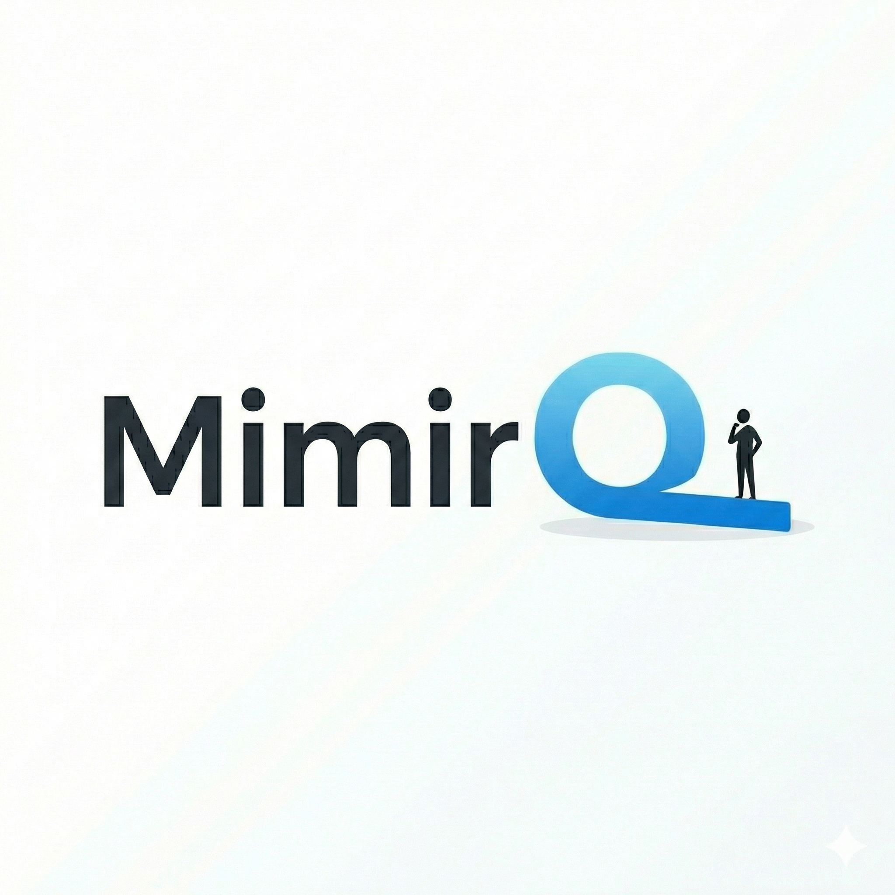
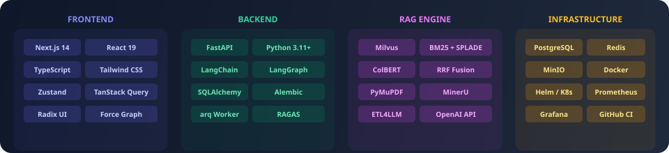

<div align="center">



<h3>Open-Source RAG Knowledge Base Platform</h3>

<p>Deep Document Understanding · Hybrid Retrieval · Knowledge Graph · Visual Chunking · Enterprise Security</p>

<p>
  <a href="https://github.com/skygazer42/MimirQ/wiki"><b>Docs</b></a> ·
  <a href="https://skygazer42.github.io/MimirQ/"><b>API (Pages)</b></a> ·
  <a href="./docs/api/README.md"><b>API Guide</b></a> ·
  <a href="#-quick-start"><b>Quick Start</b></a> ·
  <a href="https://github.com/skygazer42/MimirQ/issues"><b>Feedback</b></a> ·
  <a href="./CHANGELOG.md"><b>Changelog</b></a> ·
  <a href="./CONTRIBUTING.md"><b>Contributing</b></a>
</p>

<p>
  <a href="https://www.apache.org/licenses/LICENSE-2.0"></a>
  <a href="https://www.python.org/downloads/"></a>
  <a href="https://nextjs.org/"></a>
  <a href="https://fastapi.tiangolo.com/"></a>
  <a href="https://langchain.com/"></a>
  <a href="https://langchain-ai.github.io/langgraph/"></a>
  <a href="https://milvus.io/"></a>
</p>

<p>
  <a href="https://github.com/skygazer42/MimirQ"></a>
  <a href="https://github.com/skygazer42/MimirQ/issues"></a>
  <a href="https://github.com/skygazer42/MimirQ/actions"></a>
</p>

<p>
  <a href="./README.md"></a>
  <a href="./README_EN.md"></a>
</p>

</div>

---

## 📑 Table of Contents

- [What is MimirQ?](#-what-is-mimirq)
- [Key Features](#-key-features)
- [System Architecture](#-system-architecture)
- [RAG Pipeline](#-rag-pipeline)
- [Tech Stack](#-tech-stack)
- [Quick Start](#-quick-start)
- [API Reference (OpenAPI / GitHub Pages)](#-api-referenceopenapi--github-pages)
- [Deployment Options](#-deployment-options)
- [Feature Guides](#-feature-guides)
- [Development](#-development)
- [Roadmap](#-roadmap)
- [Contributing](#-contributing)
- [License](#-license)
- [Acknowledgements](#-acknowledgements)

---

## 💡 What is MimirQ?

**MimirQ** (named after **Mímir**, the Norse mythological guardian of the Well of Wisdom) is a full-stack, open-source RAG knowledge base Q&A platform. It combines **deep document understanding**, **hybrid retrieval**, **knowledge graphs**, **visual chunking**, and a **built-in evaluation framework** into a unified system for building **enterprise-grade** knowledge base applications.

What sets MimirQ apart from typical RAG solutions:

- **Retrieval Quality**: Triple hybrid retrieval (Vector + BM25 + SPLADE) with RRF fusion + ColBERT/LTR reranking, balancing semantic understanding and exact matching
- **Observability**: Visual chunk preview, RAG retrieval trace, evaluation leaderboard — full-pipeline transparency
- **Security & Compliance**: Document-level ACL with security trimming, RBAC, SCIM/SSO integration for enterprise data isolation
- **Scalability**: Milvus billion-scale vectors, Helm/K8s production deployment, Prometheus/Grafana monitoring

---

## ✨ Key Features

<div align="center">
  
</div>

<br/>

<table>
  <tr>
    <td width="50%">

**🔍 Hybrid Retrieval Engine**

Triple retrieval fusion: Vector semantic search + BM25 keyword search + SPLADE sparse retrieval. RRF fusion, ColBERT late-interaction reranking, LTR learning-to-rank — balancing recall and precision.

</td>
    <td width="50%">

**📄 Visual Chunk Preview**

Real-time document chunking preview — no more black-box processing. Multiple chunking strategies (recursive/semantic) with precise parameter tuning. What you see is what you get.
→ [Guide](./docs/guides/chunk_preview.md)

</td>
  </tr>
  <tr>
    <td>

**🔄 Multi-Modal Document Parsing**

Supports PDF, Markdown, HTML, TXT and more. Integrates PyMuPDF, MinerU, ETL4LLM, Marker, PaddleOCR-VL, olmOCR, Qianfan-OCR as parsing backends, extensible by design.

</td>
    <td>

**💬 RAG-Powered Q&A**

Streaming responses, citation tracing, multi-turn conversation memory. Built on LangChain Runnable/Retriever architecture with optional LangGraph Agent pipeline.

</td>
  </tr>
  <tr>
    <td>

**🕸️ Knowledge Graph (KG)**

Automatic extraction of events, entities, and relations from document chunks. Graph visualization (Force Graph), KG search, and RAG enhancement via query expansion / chunk injection.
→ [Guide](./docs/guides/knowledge_graph.md)

</td>
    <td>

**📊 RAGAS Evaluation Framework**

Built-in evaluation with Faithfulness, Relevancy, Context Precision metrics. Regression gates + leaderboard + retrieval quality snapshots for continuous quality assurance.

</td>
  </tr>
  <tr>
    <td>

**🔒 Document-Level ACL (Security Trimming)**

Document-level access control on top of dataset permissions (owner / specified members / team members / inherited). Retrieval-side permission trimming prevents unauthorized citations.
→ [Guide](./docs/guides/document_acl.md)

</td>
    <td>

**📑 Document Versioning**

Documents generate different versions under different pipeline configurations (`pipeline_hash`). View, activate, rollback, or delete historical versions — switch and preview in the UI.
→ [Guide](./docs/guides/document_versions.md)

</td>
  </tr>
  <tr>
    <td>

**🔗 URL Import & Connectors**

Server-side URL fetching for ingestion, batch URL import with connector runs (status tracking / stats / errors). Built-in SSRF protection.
→ [Guide](./docs/guides/url_ingest.md)

</td>
    <td>

**🏢 Enterprise Architecture**

Milvus billion-scale vector search, PostgreSQL persistence, OpenAI-compatible API. Docker Compose / Helm / K8s deployment, CI/CD + Prometheus + Grafana.

</td>
  </tr>
</table>

---

## 🔎 System Architecture

<div align="center">
  
</div>

---

## 🔄 RAG Pipeline

<div align="center">
  
</div>

<details>
<summary><b>Pipeline Details</b></summary>

### Ingestion Pipeline

```
Document Upload → Format Parsing (PyMuPDF/MinerU/ETL4LLM) → Smart Chunking (Recursive/Semantic)
→ Embedding (OpenAI/Ollama/Local) → Multi-Index Storage (Milvus + BM25 + SPLADE)
→ [Optional] Knowledge Graph Extraction (Entity/Relation/Event)
```

### Retrieval & Generation Pipeline

```
User Query → Query Embedding → Hybrid Retrieval Top-K (Vector + BM25 + SPLADE)
→ Reranking (RRF + ColBERT/LTR) → Permission Trimming (Security Trimming)
→ Context Assembly → LLM Generation → Streaming Response + Citations
```

</details>

---

## 🛠 Tech Stack

<div align="center">
  
</div>

<br/>

| Layer | Technologies |
|:---:|:---|
| **Frontend** | Next.js 14 (App Router) · React 19 · TypeScript · Tailwind CSS · shadcn/ui · Zustand · TanStack Query · Radix UI · Recharts · react-force-graph |
| **Backend** | FastAPI · Python 3.11+ · LangChain 1.x · LangGraph · SQLAlchemy · Alembic · arq Worker · RAGAS |
| **Retrieval** | Milvus (default) / FAISS / Chroma · BM25 · SPLADE · ColBERT · LTR · RRF Fusion |
| **Parsing** | PyMuPDF · MinerU · ETL4LLM · Marker · Docling · PaddleOCR-VL · olmOCR · Qianfan-OCR |
| **Storage** | PostgreSQL 15 · Redis 7 · MinIO · etcd |
| **Deployment** | Docker Compose · Helm / K8s · Prometheus · Grafana · GitHub Actions CI |

---

## 🚀 Quick Start

### Prerequisites

- [Docker](https://docs.docker.com/get-docker/) 20.10+ & [Docker Compose](https://docs.docker.com/compose/install/) 2.0+
- At least 4 CPU cores / 16 GB RAM / 50 GB disk

### One-Command Setup

```bash
git clone https://github.com/skygazer42/MimirQ.git
cd MimirQ

# 1. Generate local config files and a JWT SECRET_KEY
make init
# Windows (no make): python scripts/init_env.py

# 2. Start backend + infrastructure (Postgres / Milvus / MinIO / Redis)
make up

# 3. [Optional] Start frontend (Next.js production build)
make up-web
```

The first Docker build downloads and verifies a pinned DeepDoc model bundle. Run `make models` before using local source-based parsing.

### Verify Services

```bash
# Check service status
make ps

# Health checks
curl http://localhost:8000/api/v1/health
curl http://localhost:8000/api/v1/health/ready
```

After startup:

| Service | URL |
|:---:|:---|
| **API Docs** | [http://localhost:8000/docs](http://localhost:8000/docs) |
| **Frontend UI** | [http://localhost:3000](http://localhost:3000) |
| **Health Check** | [http://localhost:8000/api/v1/health](http://localhost:8000/api/v1/health) |

> For source-code deployment or local development, see the [Development Guide](./docs/quickstart.md)

---

## 📡 API Reference (OpenAPI / GitHub Pages)

| Resource | Link / notes |
|:---|:---|
| **Hosted API browser (GitHub Pages)** | [https://skygazer42.github.io/MimirQ/](https://skygazer42.github.io/MimirQ/) (Redoc + full `openapi.json`; use `https://<owner>.github.io/<repo>/` after fork) |
| **Repository guide** | [docs/api/README.md](./docs/api/README.md) (auth, base path, full OpenAPI tag map) |
| **Scenario flows** | [docs/api/workflows.md](./docs/api/workflows.md) |
| **Local Swagger** | [http://localhost:8000/docs](http://localhost:8000/docs) when the backend is running |
| **Export OpenAPI** | `make openapi-export` → `web/openapi.json` |
| **Build static site** | `make api-docs-build` → `docs/api/site/` |

Enable **Settings → Pages → GitHub Actions** on the repository; pushes to `main` run [`.github/workflows/api-docs.yml`](./.github/workflows/api-docs.yml). Set **About → Website** to the Pages URL.

---

## 📦 Deployment Options

MimirQ supports multiple deployment modes for different scenarios:

| Mode | Command | Description |
|:---:|:---|:---|
| **Standard** | `make up` | Full stack: Postgres + Milvus + MinIO + Redis + API + Worker |
| **Standard + Web** | `make up-web` | Standard + Next.js frontend |
| **Lite Mode** | `make up-lite` | Chroma/FAISS instead of Milvus, no MinIO — quick evaluation |
| **Dev Mode** | `make up-infra` | Infrastructure only, run backend/frontend locally |
| **Helm / K8s** | `helm install` | Production-grade with HPA, PDB, CronJob, PrometheusRule |
| **Parser Extensions** | `make up-etl4llm` | Enable ETL4LLM / Marker / MinerU / PaddleOCR-VL / Qianfan-OCR parsers |

<details>
<summary><b>Production Deployment Tips</b></summary>

```bash
# Edit docker/.env for production settings
# ENV=production
# AUTH_MODE=jwt
# SECRET_KEY=<random string, 32+ chars>
# POSTGRES_PASSWORD=<strong password>

make up
```

For Kubernetes production deployment, see the [Helm Guide](./docs/deployment/helm.md) and [Runbook](./docs/deployment/runbook.md).

</details>

---

## 📖 Feature Guides

| Guide | Description |
|:---|:---|
| [Chunk Preview](./docs/guides/chunk_preview.md) | Visual document chunking and parameter tuning |
| [Knowledge Graph](./docs/guides/knowledge_graph.md) | KG extraction, visualization, and RAG enhancement |
| [Document ACL](./docs/guides/document_acl.md) | Document-level access control & security trimming |
| [URL Import](./docs/guides/url_ingest.md) | Remote URL fetching and batch import |
| [Document Versions](./docs/guides/document_versions.md) | Pipeline version management and rollback |
| [Sparse Retrieval](./docs/guides/sparse_retrieval.md) | SPLADE sparse retrieval channel |
| [ColBERT Reranking](./docs/guides/reranking_colbert.md) | ColBERT late-interaction reranking |
| [RAG Optimization](./docs/guides/rag_optimization.md) | Retrieval and answer quality optimization |
| [Retrieval Debugging](./docs/guides/retrieval_debugging.md) | Retrieval issue diagnosis |
| [SAML SSO](./docs/guides/saml_sso.md) | SAML single sign-on integration |
| [API guide](./docs/api/README.md) | OpenAPI tag map, Pages link, static build |
| [API workflows](./docs/api/workflows.md) | Endpoint order by scenario |
| [API tutorial](./docs/API.md) | Quick start and code-oriented examples |
| [Quick Start](./docs/quickstart.md) | Development from source |
| [Runbook](./docs/deployment/runbook.md) | Production operations & troubleshooting |

---

## ✅ Development

Run CI-consistent checks before pushing:

```bash
# Full check (backend lint/test + frontend lint/test)
make enterprise-checks

# Backend only
make verify && make test

# Frontend only
cd web && pnpm lint && pnpm test
```

---

## 🗺 Roadmap

- [x] Hybrid Retrieval (Vector + BM25 + SPLADE)
- [x] Visual Chunk Preview
- [x] Knowledge Graph (KG extraction + visualization + search)
- [x] RAGAS Evaluation Framework with Regression Gates
- [x] Document-Level ACL (Security Trimming)
- [x] Document Version Management (Pipeline Versions)
- [x] URL Connectors & Batch Import
- [x] ColBERT / LTR Reranking
- [x] Evidence Capsule Provenance
- [ ] Agent Workflow Orchestration
- [ ] Multi-lingual / Cross-language Retrieval
- [ ] More Data Source Connectors (Confluence / S3 / Notion)
- [ ] Visual RAG Workflow Editor

> See [docs/plans/](./docs/plans/) for the full roadmap.

---

## 🤝 Contributing

We welcome contributions of all kinds! See [CONTRIBUTING.md](./CONTRIBUTING.md) for details.

```bash
# Fork and clone
git clone https://github.com/<your-username>/MimirQ.git
cd MimirQ
make init

# Local development
make up-infra          # Start infrastructure
make models            # Download and verify the pinned DeepDoc models
cd web && pnpm dev     # Frontend dev
python main.py         # Backend dev

# Pre-push checks
make enterprise-checks
```

---

## 📜 License

This project is licensed under the [Apache License 2.0](LICENSE). Attribution for third-party components (including code vendored from RAGFlow/DeepDoc and build-provisioned model weights) is recorded in [NOTICE](NOTICE).

> ⚠️ **PyMuPDF (AGPL-3.0) notice**: Default PDF parsing may use PyMuPDF, which is licensed under AGPL-3.0 / commercial dual license. If you offer this software as a network service (SaaS), the AGPL network clause may require you to release the source of the entire combined work. To avoid this, switch to a permissively-licensed parsing backend (pypdf / pdfplumber). See NOTICE for details.

---

## 🙏 Acknowledgements

MimirQ is built on the shoulders of outstanding open-source projects:

[FastAPI](https://fastapi.tiangolo.com/) · [LangChain](https://langchain.com/) · [LangGraph](https://langchain-ai.github.io/langgraph/) · [Milvus](https://milvus.io/) · [Next.js](https://nextjs.org/) · [PostgreSQL](https://www.postgresql.org/) · [RAGAS](https://docs.ragas.io/) · [PyMuPDF](https://pymupdf.readthedocs.io/) · [MinerU](https://github.com/opendatalab/MinerU) · [Tailwind CSS](https://tailwindcss.com/) · [shadcn/ui](https://ui.shadcn.com/)

---

<div align="center">

**If MimirQ helps you, please give us a ⭐ Star!**

[](https://star-history.com/#skygazer42/MimirQ&Date)

</div>
