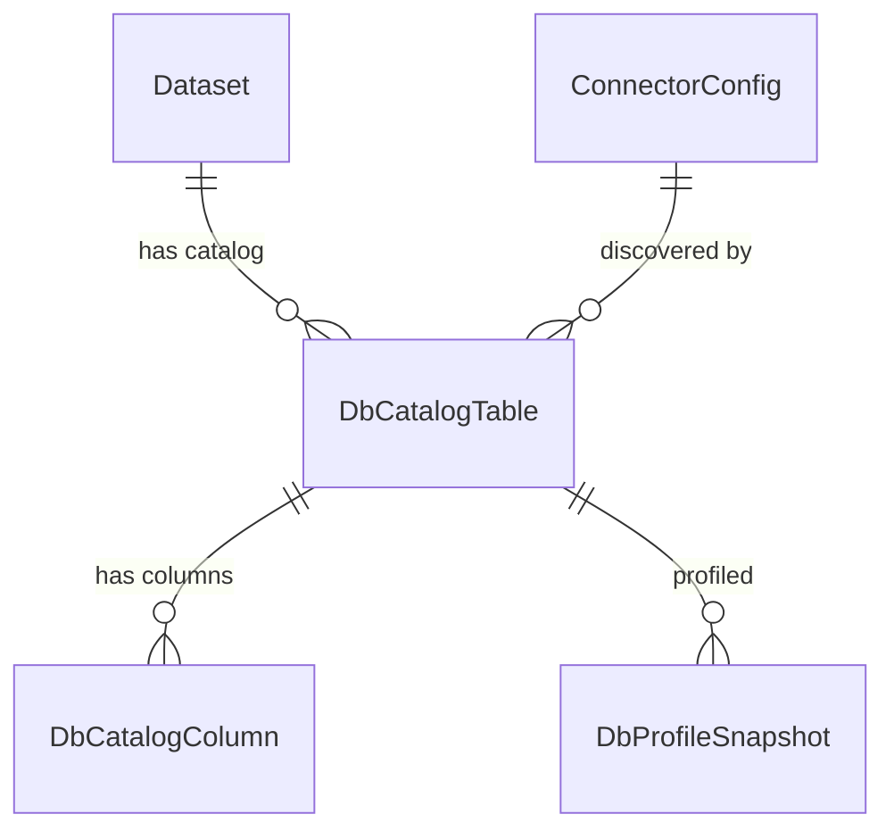
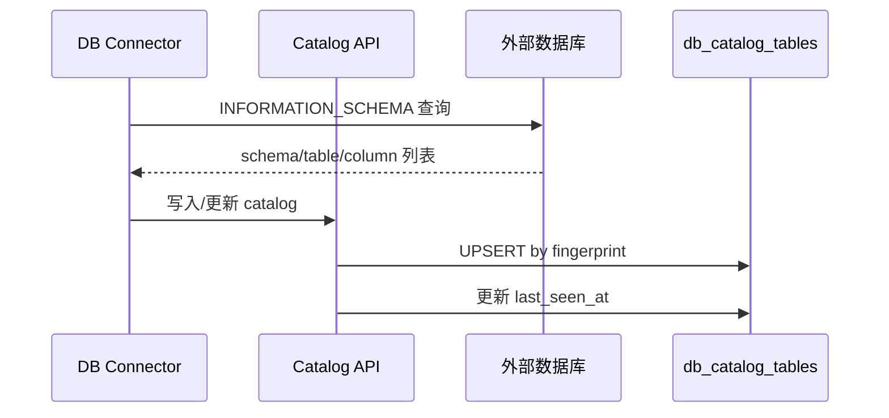

# DB Catalog

DB Catalog 提供**外部数据库连接器的元数据目录**功能，自动发现并记录 MySQL/SQLServer 数据库中的表结构、列信息和基础统计。

## 概念模型

DB Catalog 是 MimirQ 的结构化数据连接能力的基础：通过 Connector 连接外部数据库，自动发现 schema/table/column 元数据并存入目录，供后续的 Text-to-SQL 和 TAG 查询使用。

## 自动发现流程

## DbCatalogTable 模型

| 字段 | 类型 | 说明 |
|------|------|------|
| `id` | UUID | 主键 |
| `tenant_id` | UUID | 租户 ID |
| `dataset_id` | UUID | 归属数据集 |
| `connector_config_id` | UUID | 关联的连接器配置 |
| `engine` | String(32) | 数据库引擎：`mysql` / `sqlserver` |
| `db_name` | String(255) | 数据库名 |
| `schema_name` | String(255) | Schema 名（SQLServer） |
| `table_name` | String(255) | 表名 |
| `table_type` | String(32) | `table` / `view` |
| `comment` | Text | 表注释 |
| `fingerprint` | String(80) | 结构指纹（用于变更检测） |
| `last_seen_at` | DateTime | 最近发现时间 |

## DbCatalogColumn 模型

| 字段 | 类型 | 说明 |
|------|------|------|
| `id` | UUID | 主键 |
| `table_id` | UUID | 关联的 catalog table |
| `ordinal` | Int | 列序号 |
| `name` | String(255) | 列名 |
| `data_type` | String(255) | 数据类型 |
| `nullable` | Bool | 是否可空 |
| `comment` | Text | 列注释 |

:::info 安全设计
DB Catalog 只存储**元数据**（表结构、列名、类型），不存储任何原始数据行。Profile Snapshot 仅包含摘要统计（如行数、distinct count），不含实际值。
:::

## API 端点

DB Catalog 路由挂载在 `/api/v1/db-catalog`：

| 方法 | 路径 | 说明 |
|------|------|------|
| `GET` | `/db-catalog/{dataset_id}/tables` | 查询数据集的表目录 |
| `GET` | `/db-catalog/{dataset_id}/tables/{table_id}` | 表详情（含列信息） |
| `GET` | `/db-catalog/{dataset_id}/tables/{table_id}/profile` | 表统计快照 |

## 与 Text-to-SQL 的关系

DB Catalog 为 Text-to-SQL 提供 schema 上下文。LLM 生成 SQL 时，系统从 catalog 中提取目标表的列定义、类型和注释，拼装为 prompt context。

## 相关链接

- [表与 TAG](./tables-tag.md)
- [连接器](../documents/connectors.md)
- [概述](./overview.md)
- [Redoc API 文档](https://skygazer42.github.io/MimirQ/)
