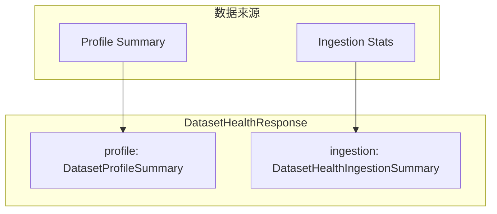

# 数据集健康度（Health）

健康度接口是一个**聚合仪表盘**，将画像（Profile）和入库统计（Ingestion）合并为单一响应，供前端健康度面板展示。

## 数据聚合模型



## 响应结构

`GET /api/v1/datasets/{dataset_id}/health` 返回 `DatasetHealthResponse`：

| 字段 | 类型 | 说明 |
|------|------|------|
| `dataset_id` | UUID | 数据集 ID |
| `generated_at` | datetime | 生成时间 |
| `profile` | DatasetProfileSummary | 画像摘要（含 token 分布、findings 等） |
| `ingestion` | DatasetHealthIngestionSummary | 入库统计 |

### DatasetHealthIngestionSummary

| 字段 | 类型 | 说明 |
|------|------|------|
| `total_documents` | int | 文档总数 |
| `by_status` | dict | 按状态分布（key=status, value=count） |
| `pending` | int | 等待处理 |
| `processing` | int | 处理中 |
| `completed` | int | 已完成 |
| `failed` | int | 失败 |
| `quarantined` | int | 已隔离 |
| `cancelled` | int | 已取消 |

## API 示例

```bash
curl "http://localhost:8000/api/v1/datasets/$DATASET_ID/health" \
  -H "X-Tenant-ID: $TENANT_ID" \
  -H "Authorization: Bearer $TOKEN"
```

响应示例：

```json
{
  "dataset_id": "550e8400-e29b-41d4-a716-446655440000",
  "generated_at": "2026-04-02T10:30:00Z",
  "profile": {
    "total_documents": 156,
    "total_chunks": 4320,
    "token_percentiles": {"p25": 180, "p50": 320, "p75": 510, "p90": 720, "p99": 1100},
    "findings": [
      {"key": "short_chunks", "label": "短 chunk 比例偏高", "severity": "warning", "count": 42}
    ]
  },
  "ingestion": {
    "total_documents": 156,
    "completed": 150,
    "failed": 4,
    "processing": 2,
    "pending": 0,
    "quarantined": 0,
    "cancelled": 0
  }
}
```

:::tip 健康度解读
- **ingestion.failed > 0**：有文档处理失败，需检查错误原因并重试
- **profile.findings 中有 severity=error**：存在严重质量问题，可能影响检索效果
- **processing 长时间不为 0**：可能有文档卡在处理中，参见 [排障](./troubleshooting.md)
:::

## 相关链接

- [画像（Profile）](./profile.md)
- [预检（Precheck）](./precheck.md)
- [排障](./troubleshooting.md)
- [Redoc API 文档](https://skygazer42.github.io/MimirQ/)
