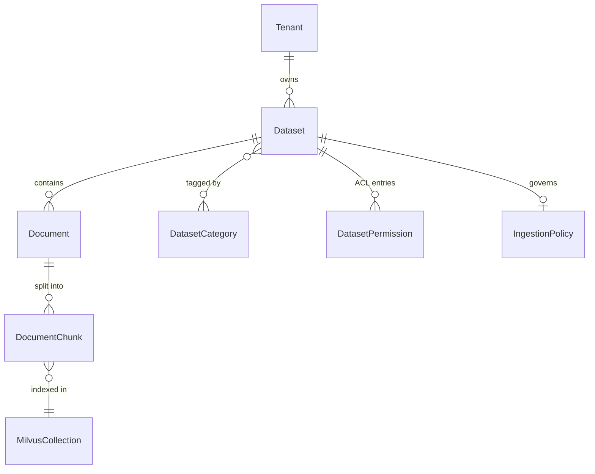
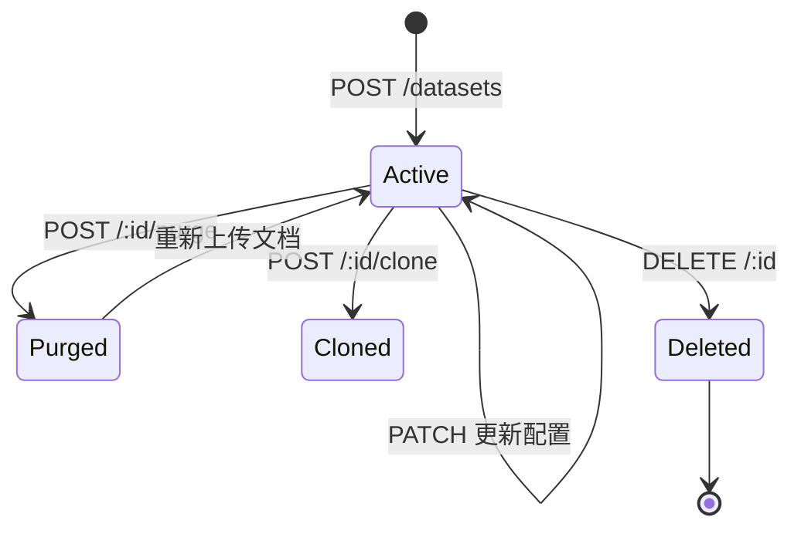

# 数据集（Dataset）概述

数据集是 MimirQ 中**知识组织的顶层容器**。每个数据集归属于一个 Tenant，包含若干文档（Document），并通过分类（Category）进行多维归类。检索时以数据集为边界执行权限过滤与向量召回。

## 核心概念模型

## 生命周期状态

数据集本身没有显式 `status` 字段，但通过 API 操作存在逻辑生命周期：

| 状态 | 含义 | 触发方式 |
|------|------|----------|
| Active | 正常可用，可上传/检索 | 创建后默认 |
| Purged | 保留数据集壳，清除全部文档与向量 | `POST /purge` |
| Cloned | 从源数据集复制配置到新数据集 | `POST /clone` |
| Deleted | 物理删除，不可恢复 | `DELETE /datasets/:id` |

## 核心字段

| 字段 | 类型 | 说明 |
|------|------|------|
| `id` | UUID | 主键 |
| `tenant_id` | UUID | 租户隔离键 |
| `name` | String(255) | 数据集名称，租户内唯一 |
| `description` | String(1024) | 可选描述 |
| `permission` | Enum | `only_me` / `all_team_members` / `partial_members` |
| `owner_id` | String(255) | 创建者 account ID |
| `dataset_metadata` | JSONB | pipeline/ingestion policy/retention policy 等配置 |
| `created_at` | DateTime | 创建时间 |
| `updated_at` | DateTime | 最后更新时间 |

:::info metadata 存储策略
`dataset_metadata` (DB column: `metadata`) 是一个 JSONB 字段，承载 pipeline 配置、ingestion policy、FLS policy、retention policy、RAG defaults 等。各 service 通过 `parse_*_from_metadata()` 读取，`upsert_*_metadata()` 写入，无需额外表。
:::

## 与其他实体的关系

| 关联实体 | 关系 | 说明 |
|----------|------|------|
| Document | 1:N | 一个数据集包含多个文档 |
| DatasetCategory | M:N | 通过 `dataset_category_memberships` 关联 |
| DatasetPermission | 1:N | `partial_members` 模式的用户白名单 |
| DatasetGroupPermission | 1:N | 基于 TenantGroup 的组权限 |
| PrecheckScanRun | 1:N | 入库前质量预检 |
| ProfileScanRun | 1:N | 数据集画像深度扫描 |
| IngestionRun | 1:N | 统一入库批次追踪 |
| ConnectorRun | 1:N | 连接器同步批次 |
| DbCatalogTable | 1:N | DB 连接器表目录 |

## 租户隔离

所有查询通过 `tenant_id` 复合索引过滤。数据集表有 `(tenant_id, id)` 唯一约束，子表通过复合外键 `(tenant_id, dataset_id)` 引用，确保跨租户不可访问。

:::warning
删除数据集会级联删除所有关联文档、chunks、权限记录、precheck/profile 扫描记录。此操作不可逆。
:::

## 相关链接

- [API 参考索引](./api-index.md)
- [Schema 详解](./schemas.md)
- [权限与安全](./permissions.md)
- [文档概述](../documents/overview.md)
- [Redoc API 文档](https://skygazer42.github.io/MimirQ/)
