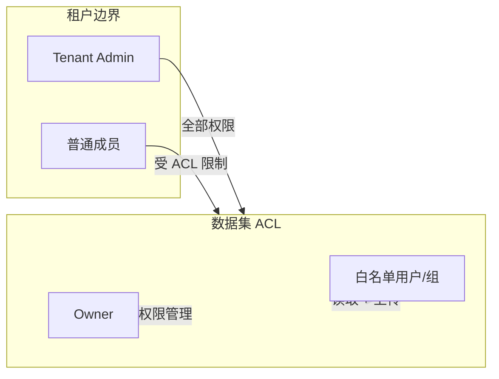
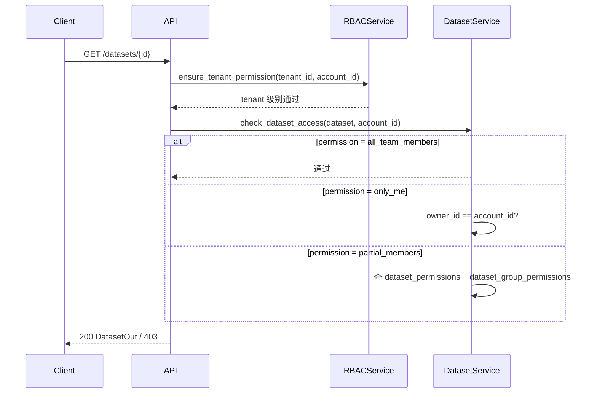

# 数据集权限与安全

MimirQ 采用多层权限模型：**租户隔离** → **数据集 ACL** → **文档级 ACL**。本页聚焦数据集层。

## 权限模式

数据集的 `permission` 字段控制可见性，是一个三值枚举：

| 枚举值 | 含义 |
|--------|------|
| `only_me` | 仅 `owner_id` 可访问 |
| `all_team_members` | 租户内所有成员可访问（默认） |
| `partial_members` | 仅 owner + 白名单用户/组可访问 |

## RBAC 权限矩阵

| 操作 | Tenant Admin | Owner | 白名单成员 | 非白名单成员 |
|------|:---:|:---:|:---:|:---:|
| 查看数据集 | Yes | Yes | Yes | only_me/partial: No |
| 更新数据集 | Yes | Yes | No | No |
| 删除数据集 | Yes | Yes | No | No |
| 上传文档 | Yes | Yes | Yes (EDIT_ROLES) | No |
| 管理权限 | Yes | Yes | No | No |

:::info EDIT_ROLES
编辑操作（上传/删除文档等）需要 `EDIT_ROLES` 权限。后端通过 `DatasetService` 检查当前用户是否为 owner 或在白名单中具有编辑角色。
:::

## ACL 数据模型

### 用户级白名单

`dataset_permissions` 表存储用户级白名单：

| 字段 | 类型 | 说明 |
|------|------|------|
| `id` | UUID | 主键 |
| `tenant_id` | UUID | 租户 ID |
| `dataset_id` | UUID | 数据集 ID |
| `account_id` | String | 被授权用户 ID |

唯一约束：`(tenant_id, dataset_id, account_id)`

### 组级白名单

`dataset_group_permissions` 表存储组级白名单：

| 字段 | 类型 | 说明 |
|------|------|------|
| `tenant_id` | UUID | 租户 ID |
| `dataset_id` | UUID | 数据集 ID |
| `group_id` | UUID | TenantGroup ID |

唯一约束：`(tenant_id, dataset_id, group_id)`

## 权限检查时序

:::warning
`X-Tenant-ID` Header 是租户隔离的关键。后端不会跨租户查询，但请勿在客户端伪造此 Header——生产环境应由 API Gateway 注入。
:::

## 相关链接

- [文档权限](../documents/permissions.md)
- [API 参考索引](./api-index.md)
- [Redoc API 文档](https://skygazer42.github.io/MimirQ/)
