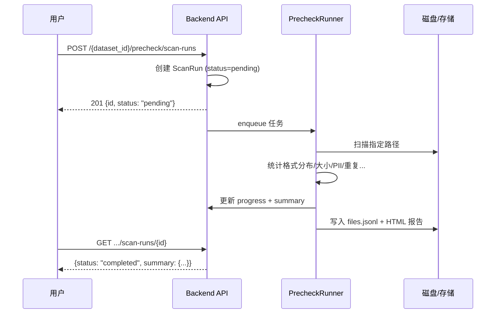

# 数据集预检（Precheck）

预检扫描是**入库前的质量分析**，在文件实际进入解析流水线前评估数据形态，帮助用户提前发现问题。

## 预检流程概览

## 检查项清单

| 检查项 | 说明 | 输出 |
|--------|------|------|
| 格式分布 | 按文件扩展名统计数量和大小 | `format_distribution` |
| 文件大小分析 | 总大小、均值、P50/P90/P99 | `size_stats` |
| 扫描 PDF 检测 | 识别是否为扫描件（图片型 PDF） | `pdf_scan_stats` |
| PII 检测 | 检测个人身份信息（邮箱、电话、身份证等） | `pii_hits` |
| Secrets 检测 | 检测 API Key、Token、私钥等敏感信息 | `secrets_hits` |
| 重复文件 | 基于内容 hash 去重 | `duplicate_files` |
| 编码检测 | 非 UTF-8 文件识别 | `encoding_issues` |
| 空文件/超大文件 | 零字节或超出阈值的文件 | `size_outliers` |

## ScanRun 模型

| 字段 | 类型 | 说明 |
|------|------|------|
| `id` | UUID | 扫描运行 ID |
| `dataset_id` | UUID | 目标数据集 |
| `kind` | String | 扫描类型（`path`） |
| `status` | String | `pending` → `running` → `completed`/`failed`/`cancelled` |
| `progress` | Int | 0-100 |
| `config` | JSONB | 用户提供的选项/阈值 |
| `summary` | JSONB | 完成后的摘要（`DatasetPrecheckSummary`） |
| `artifacts` | JSONB | 产物路径（JSONL/HTML） |
| `error_message` | Text | 失败时的错误信息 |

:::info 产物存储
逐文件明细存储在磁盘 `uploads/{tenant}/precheck/{run_id}/files.jsonl`，不存入数据库。API 提供分页查询接口按需加载。
:::

## API 端点

| 方法 | 路径 | 说明 |
|------|------|------|
| `POST` | `/{dataset_id}/precheck/scan-runs` | 发起预检 |
| `GET` | `/{dataset_id}/precheck/scan-runs` | 列表 |
| `GET` | `/{dataset_id}/precheck/scan-runs/{id}` | 详情 |
| `GET` | `/{dataset_id}/precheck/scan-runs/{id}/summary` | 摘要 |
| `POST` | `/{dataset_id}/precheck/scan-runs/{id}/cancel` | 取消 |
| `GET` | `/{dataset_id}/precheck/scan-runs/{id}/events` | SSE 事件流 |
| `GET` | `/{dataset_id}/precheck/scan-runs/{id}/export` | 导出 JSON |
| `GET` | `/{dataset_id}/precheck/scan-runs/{id}/export-html` | 导出 HTML 报告 |

## 与 Ingestion Policy 的联动

预检结果可用于自动生成入库策略建议。`apply_ingestion_policy_suggestion` 服务方法可将预检发现转换为 Ingestion Policy 规则。

:::tip
建议在首次大批量入库前运行预检，根据格式分布和质量信号调整 parser backend 和 chunk strategy，再正式入库。
:::

## 相关链接

- [状态与任务](./state-jobs.md)
- [画像（Profile）](./profile.md)
- [API 参考索引](./api-index.md)
- [Redoc API 文档](https://skygazer42.github.io/MimirQ/)
