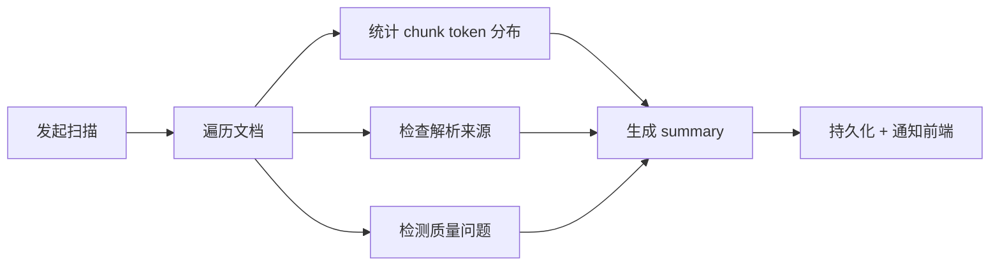

# 数据集画像（Profile）

画像是对数据集内文档和 chunks 的**多维度统计分析**，帮助用户了解数据形态、发现质量问题、优化检索配置。

## 画像扫描流程

画像有两种获取方式：
- **实时摘要**：`GET /profile/summary`，按需计算，适合小数据集
- **深度扫描**：`POST /profile/scan-runs`，异步执行，结果持久化到 `DatasetProfileScanRun`

## 指标维度

### 核心统计

| 指标 | 说明 | 数据来源 |
|------|------|----------|
| `total_documents` | 文档总数 | documents 表 |
| `total_chunks` | chunk 总数 | document_chunks 表 |
| `by_status` | 按文档状态分布 | status 字段 |
| `by_file_type` | 按文件类型分布 | file_type 字段 |

### Token 分布

| 指标 | 说明 |
|------|------|
| `token_percentiles` | P25/P50/P75/P90/P99 分位数 |
| `token_histogram` | 按区间分桶的 token 长度分布 |
| `short_chunk_ratio` | 短 chunk（≤100 tokens）占比 |
| `long_chunk_ratio` | 长 chunk（≥800 tokens）占比 |

### 质量检查（Target Checks）

| 检查项 | status 值 | 含义 |
|--------|-----------|------|
| P50 token 长度 | pass/warn/fail | 是否在目标区间内 |
| 短 chunk 比例 | pass/warn/fail | 是否超过阈值 |
| 长 chunk 比例 | pass/warn/fail | 是否超过阈值 |
| Overlap 浪费 | pass/warn/fail | chunk overlap 重复率 |
| 覆盖率 | pass/warn/fail | 内容覆盖完整度 |

### 发现（Findings）

| severity | 含义 |
|----------|------|
| `info` | 信息性提示 |
| `warning` | 需关注的质量问题 |
| `error` | 严重问题，影响检索效果 |

### 解析来源统计

`DatasetProfileParsingProvenanceStats` 提供解析路由透明度：

| 字段 | 说明 |
|------|------|
| `docs_with_provenance` | 有解析来源标记的文档数 |
| `by_resolved_backend` | 按实际解析后端分布 |
| `fallback_docs` | 使用 fallback 解析的文档数 |
| `elapsed_ms_percentiles` | 解析耗时分位数 |

:::info Recall Risk Hints
画像还提供 `recall_risk_hints`——基于轻量信号推断的检索召回风险提示，帮助用户识别可能影响检索效果的数据问题。
:::

## 导出格式

| 格式 | 端点 | 用途 |
|------|------|------|
| JSON | `GET /profile/export` | 程序化消费 |
| HTML | `GET /profile/export-html` | 可视化报告，可邮件分享 |

## API 端点

| 方法 | 路径 | 说明 |
|------|------|------|
| `GET` | `/{id}/profile/summary` | 实时摘要 |
| `GET` | `/{id}/profile/findings/{key}` | 发现明细（分页） |
| `GET` | `/{id}/profile/buckets/documents` | 按桶文档列表 |
| `POST` | `/{id}/profile/scan-runs` | 发起深度扫描 |
| `GET` | `/{id}/profile/scan-runs` | 扫描历史 |
| `GET` | `/{id}/profile/scan-runs/{run_id}` | 单次扫描详情 |

## 相关链接

- [预检（Precheck）](./precheck.md)
- [健康度（Health）](./health.md)
- [Schema 详解](./schemas.md)
- [Redoc API 文档](https://skygazer42.github.io/MimirQ/)
