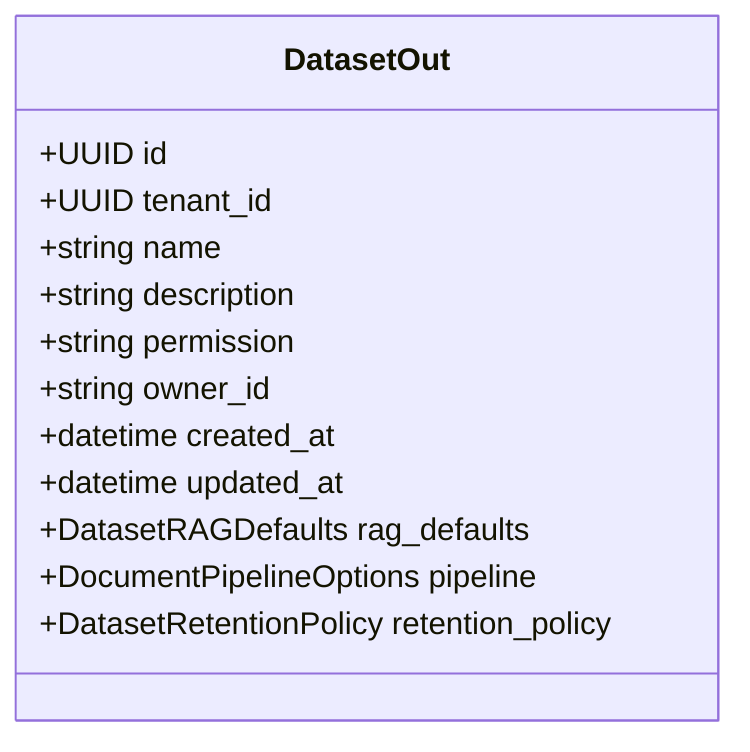

# 数据集 Schema 详解

本页列出数据集域核心 Pydantic Schema 的关键字段，便于联调时快速查阅。完整定义以 [Redoc](https://skygazer42.github.io/MimirQ/) 为准。

## DatasetCreate

创建数据集时的请求体。

| 字段 | 类型 | 必填 | 说明 |
|------|------|------|------|
| `name` | string | Yes | 数据集名称，租户内唯一 |
| `description` | string | No | 描述信息 |
| `permission` | enum | No | `only_me` / `all_team_members` / `partial_members`，默认 `all_team_members` |
| `partial_member_list` | string[] | No | `partial_members` 模式下的用户 ID 列表 |
| `partial_group_list` | string[] | No | `partial_members` 模式下的组 ID 列表 |
| `default_parser_backend` | string | No | 默认解析后端（如 `unstructured`、`mineru`） |
| `default_chunk_strategy` | string | No | 默认分块策略 |
| `rag_defaults` | object | No | 默认 RAG 检索配置（详见下方） |
| `pipeline` | object | No | 默认 pipeline 配置覆盖 |
| `retention_policy` | object | No | 文档保留策略 |

## DatasetUpdate

PATCH 更新时的请求体，所有字段均可选。

| 字段 | 类型 | 说明 |
|------|------|------|
| `name` | string | 新名称 |
| `description` | string | 新描述 |
| `permission` | enum | 变更权限模式 |
| `partial_member_list` | string[] | 覆盖用户白名单 |
| `partial_group_list` | string[] | 覆盖组白名单 |
| `rag_defaults` | object | 更新 RAG 默认配置 |
| `pipeline` | object | 更新 pipeline 配置 |

## DatasetOut（响应）

## DatasetRAGDefaults

数据集级别的默认 RAG 配置，聊天请求未指定时自动使用。

| 字段 | 类型 | 说明 |
|------|------|------|
| `retrieval_profile` | string | 检索预设 |
| `intent_router` | bool | 是否启用意图路由 |
| `top_k` | int (1-100) | 默认检索 top_k |
| `score_threshold` | float (0-1) | 相关性分数阈值 |
| `retrieval_mode` | string | `hybrid` / `vector` / `keyword` / `mmr` / `auto` |
| `retrieval_contract_mode` | string | 检索合约模式 |
| `alpha` | float (0-1) | 混合检索向量权重 |
| `enable_multi_query` | bool | 是否启用多查询扩展 |
| `multi_query_count` | int (1-8) | 多查询生成数量 |
| `enable_hierarchy_recall` | bool | 是否启用层级召回 |

:::info 枚举值速查
**permission**: `only_me` | `all_team_members` | `partial_members`

**retrieval_mode**: `hybrid` | `vector` | `keyword` | `mmr` | `auto`

**retrieval_contract_mode**: 见 `app/rag/retrieval/contract.py` 中 `VALID_RETRIEVAL_CONTRACT_MODES`
:::

## DatasetChunkTargetsV2

画像质量目标配置，用于画像检查与分块自动调优。

| 字段 | 类型 | 说明 |
|------|------|------|
| `token_p50_min` / `token_p50_max` | int (0-4000) | P50 chunk token 长度目标区间 |
| `short_pct_warn` / `short_pct_fail` | int (0-100) | 短 chunk 比例阈值 |
| `long_pct_warn` / `long_pct_fail` | int (0-100) | 长 chunk 比例阈值 |
| `overlap_waste_p50_warn` / `_fail` | int (0-100) | overlap 浪费 P50 阈值 |
| `coverage_p50_warn` / `_fail` | int (0-100) | 覆盖率 P50 阈值 |

## 相关链接

- [API 参考索引](./api-index.md)
- [权限与安全](./permissions.md)
- [画像（Profile）](./profile.md)
- [Redoc API 文档](https://skygazer42.github.io/MimirQ/)
