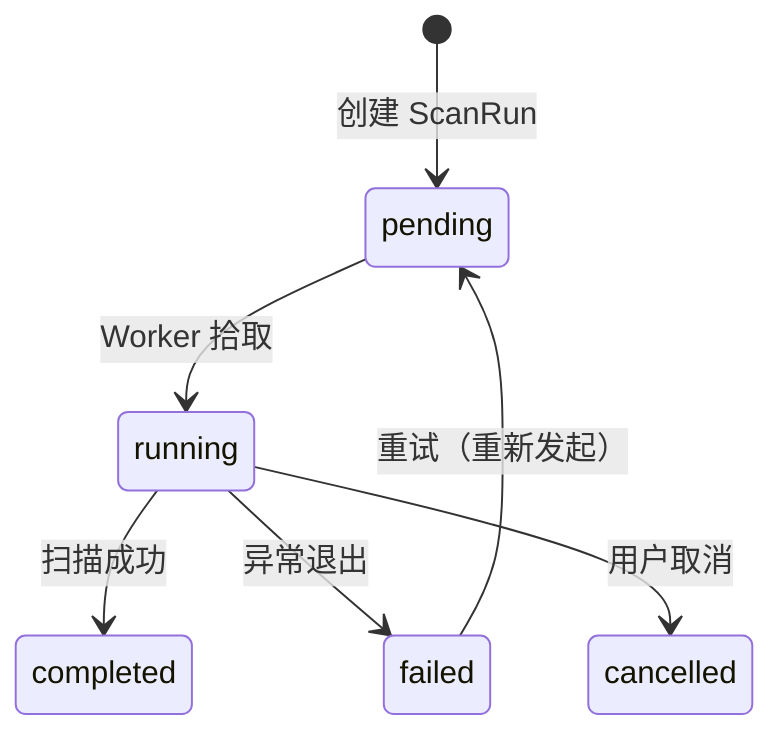
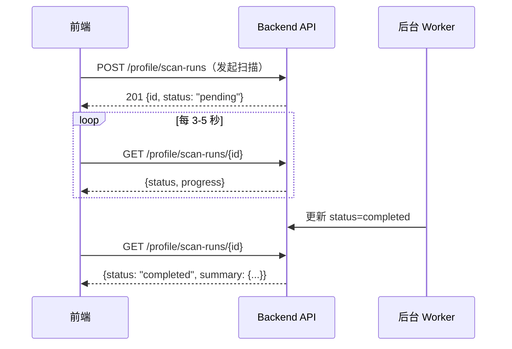

# 数据集后台任务与状态

数据集域有两类主要的异步后台任务：**预检扫描**（Precheck Scan）和**画像扫描**（Profile Scan），均遵循相同的状态生命周期。

## 任务状态机

| 状态 | 含义 | 是否终态 |
|------|------|----------|
| `pending` | 已入队，等待 Worker | No |
| `running` | 正在执行扫描 | No |
| `completed` | 扫描完成，summary 已持久化 | Yes |
| `failed` | 执行异常，error_message 有详情 | Yes |
| `cancelled` | 被用户或系统取消 | Yes |

## 预检扫描（Precheck Scan）

| 字段 | 说明 |
|------|------|
| `kind` | 扫描类型，目前支持 `path`（本地目录扫描） |
| `progress` | 0-100 进度百分比 |
| `config` | 用户提供的选项/阈值（JSONB，可复现） |
| `summary` | 完成后的摘要快照（JSONB） |
| `artifacts` | 磁盘产物路径（JSONL/HTML） |

## 画像扫描（Profile Scan）

| 字段 | 说明 |
|------|------|
| `kind` | 扫描类型，目前支持 `deep`（回填缺失指标） |
| `progress` | 0-100 进度百分比 |
| `config` | 用户提供的选项/阈值（JSONB） |
| `summary` | 完成后的画像摘要（JSONB） |

## 前端轮询策略

:::tip 轮询建议
- 初始间隔 2 秒，后续退避到 5 秒
- `progress` 字段可用于进度条展示
- 终态（completed/failed/cancelled）到达后停止轮询
:::

## 错误恢复

| 场景 | 处理方式 |
|------|----------|
| Worker 崩溃 | `status` 停在 `running`，需人工检查或超时清理 |
| 扫描失败 | 查看 `error_message`，修正后重新 POST 创建新 ScanRun |
| 取消 | 预检支持 `POST .../cancel`；画像扫描目前不支持中途取消 |
| 重试 | 不修改原 Run，创建新的 ScanRun 即可 |

## 相关链接

- [预检（Precheck）](./precheck.md)
- [画像（Profile）](./profile.md)
- [API 参考索引](./api-index.md)
- [Redoc API 文档](https://skygazer42.github.io/MimirQ/)
