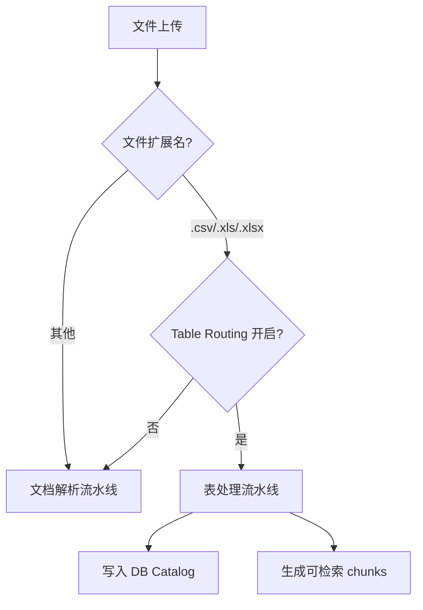
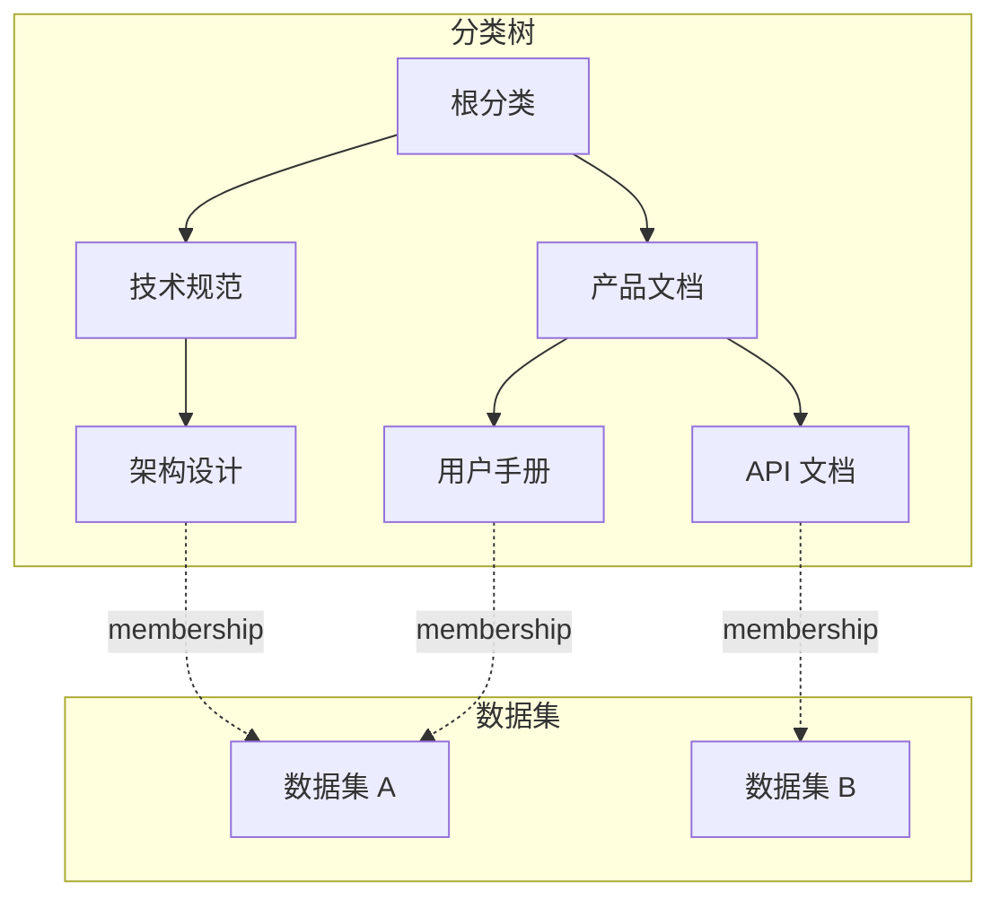

# 表管理与 TAG 系统

MimirQ 支持对结构化数据（CSV/Excel 上传或 DB 连接器同步）进行**表级管理**，并通过 TAG 系统实现细粒度的标签筛选和分类。

## 表路由机制

当上传 CSV/XLS/XLSX 文件时，系统可自动将其路由到表处理流水线（Table Routing），而非普通文档解析流水线：

### Table Routing 优先级

Table Routing 设置有三级优先级（从高到低）：

| 级别 | 来源 | 说明 |
|------|------|------|
| 规则级 | Ingestion Policy 规则 | 按文件名/类型匹配规则覆盖 |
| 数据集级 | Dataset metadata | 数据集默认设置 |
| 全局级 | 系统配置 | 全局默认值 |

:::tip
Table Routing 仅对 `.csv`、`.xls`、`.xlsx` 三种扩展名生效。其他文件类型始终走文档解析流水线。
:::

## TAG 系统

TAG（标签）是对数据集内资源的分类维度。数据集通过 `DatasetCategory` 体系实现层级化标签：

### DatasetCategory 模型

| 字段 | 类型 | 说明 |
|------|------|------|
| `id` | UUID | 分类 ID |
| `tenant_id` | UUID | 租户 ID |
| `name` | String(255) | 分类名称 |
| `parent_id` | UUID | 父分类 ID（NULL 为根） |
| `sort_order` | Int | 同级排序序号 |

唯一约束：`(tenant_id, parent_id, name)` —— 同级不重名。

### 分类分配 API

| 方法 | 路径 | 说明 |
|------|------|------|
| `GET` | `/datasets/{id}/categories` | 获取数据集所属分类 |
| `PUT` | `/datasets/{id}/categories` | 设置分类（覆盖式） |

### 列表过滤

`GET /datasets/` 支持按分类过滤：

| 参数 | 说明 |
|------|------|
| `category_id` | 过滤指定分类 |
| `include_descendants` | 是否包含子分类下的数据集 |

:::info 多对多关系
一个数据集可属于多个分类，一个分类可包含多个数据集。通过 `dataset_category_memberships` 关联表实现。
:::

## 相关链接

- [DB Catalog](./db-catalog.md)
- [概述](./overview.md)
- [API 参考索引](./api-index.md)
- [Redoc API 文档](https://skygazer42.github.io/MimirQ/)
