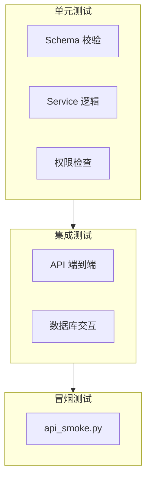

# 数据集测试策略

本页描述数据集域的测试方法、关键用例和运行方式。

## 测试分层



## 关键测试用例

| 测试场景 | 覆盖范围 | 关注点 |
|----------|----------|--------|
| 创建数据集 | Schema 校验 + DB 写入 | 名称唯一约束、默认权限 |
| 租户隔离 | 跨租户查询返回空 | `tenant_id` 过滤 |
| 权限模式切换 | `only_me` → `partial_members` | 白名单正确写入 |
| 组权限 | 组成员访问 | `dataset_group_permissions` 关联 |
| PATCH 更新 | 部分字段更新 | 未传字段不被覆盖 |
| 删除级联 | 删除数据集 | 文档/chunks/权限同步清理 |
| Clone | 配置复制 | metadata 正确复制，文档不复制 |
| Purge | 文档清除 | 数据集壳保留 |
| Ingestion Policy CRUD | 策略版本链 | 版本号递增、回滚正确 |
| Config 导入导出 | 往返一致性 | export → import 后配置一致 |

## 运行测试

```bash
# 运行所有数据集相关测试
pytest tests/ -k "dataset" -v

# 仅跑 API 集成测试
pytest tests/api/ -k "dataset" -v

# 冒烟测试（需要运行中的后端）
python scripts/api_smoke.py --tag datasets
```

:::note 测试数据库
集成测试使用独立的 PostgreSQL test database。确保 `TEST_DATABASE_URL` 环境变量已配置。每次测试自动创建/销毁测试数据。
:::

## 测试覆盖要点

| 模块 | 文件路径 | 说明 |
|------|----------|------|
| API 路由 | `tests/api/test_datasets.py` | CRUD + 权限 + 配置 |
| Service 层 | `tests/services/test_dataset_service.py` | 业务逻辑 |
| Schema 校验 | `tests/schemas/test_dataset_schemas.py` | Pydantic 校验 |
| Precheck | `tests/services/test_precheck_*.py` | 预检扫描逻辑 |
| Profile | `tests/services/test_profile_*.py` | 画像计算逻辑 |

## 相关链接

- [API 参考索引](./api-index.md)
- [排障](./troubleshooting.md)
- [Redoc API 文档](https://skygazer42.github.io/MimirQ/)
