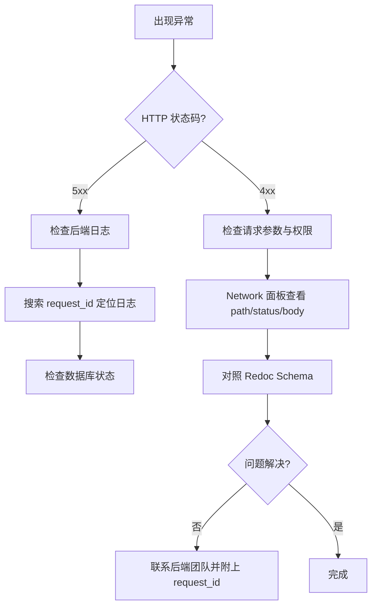

# 数据集排障

常见问题的症状、原因与解决方案速查表。

## 常见问题

| 症状 | 可能原因 | 解决方案 |
|------|----------|----------|
| `GET /datasets/` 返回空列表 | 1. `X-Tenant-ID` 错误 2. Token 对应用户无权限 3. 数据集 ACL 为 `only_me` | 检查 Header；用 owner 身份调 `GET /datasets/{id}` 验证 |
| `PATCH /datasets/{id}` 返回 409 | 名称与同租户下其他数据集冲突 | 检查 `detail` 字段；换一个不重复的名称 |
| `DELETE /datasets/{id}` 失败 | 权限不足（非 owner/admin） | 确认当前用户角色 |
| 预检/画像接口返回 404 | 1. `dataset_id` 不属于当前租户 2. scan_run_id 无效 | 检查 ID 是否正确；确认租户上下文 |
| `config/import` 返回 422 | JSON 结构与 `DatasetConfigImportRequest` 不匹配 | 对照 Redoc Schema 检查字段名/类型 |
| `clone` 后新数据集配置缺失 | clone 只复制配置，不复制文档 | clone 后需重新上传或同步文档 |
| `purge` 后数据集仍有文档 | purge 是异步操作，文档删除需要时间 | 等待完成后再查询；检查响应中的计数 |
| 健康度接口返回空数据 | 数据集无已入库文档 | 确认至少有一条 `completed` 状态的文档 |

## 排查工具

:::tip 调试建议
1. **浏览器 Network 面板**：保留失败请求的 path、status、响应 JSON
2. **后端结构化日志**：通过 `request_id` 关联请求链路
3. **数据库直查**：`SELECT * FROM datasets WHERE tenant_id = ? AND id = ?` 确认数据存在
4. **Redoc 对照**：所有 Schema 以 OpenAPI 生成文档为准
:::

## Ingestion Policy 相关

| 症状 | 原因 | 解决方案 |
|------|------|----------|
| `PUT /ingestion-policy` 返回 400 | 策略 JSON 校验失败 | 检查 `IngestionPolicy` Schema 定义 |
| 回滚版本找不到 | 版本号不存在或已被清理 | `GET .../versions` 查看可用版本 |
| 策略导入后规则未生效 | 新文档才使用新策略，旧文档不变 | 需要对旧文档执行 reingest |
| 导出文件为空 | 数据集尚未配置策略 | 先创建默认策略再导出 |

:::warning
修改 Ingestion Policy 不会对已入库文档生效。如需全量刷新，请在更新策略后对目标文档执行 reingest 操作。
:::

## 相关链接

- [API 参考索引](./api-index.md)
- [状态与任务](./state-jobs.md)
- [Redoc API 文档](https://skygazer42.github.io/MimirQ/)
