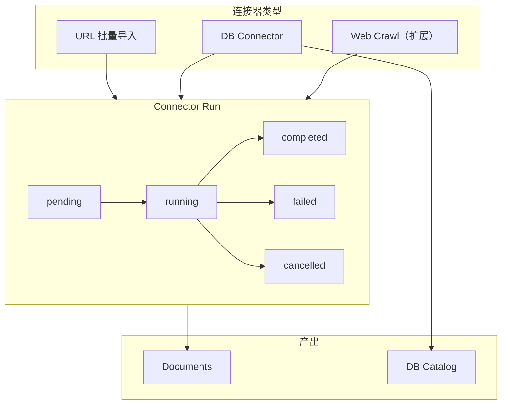
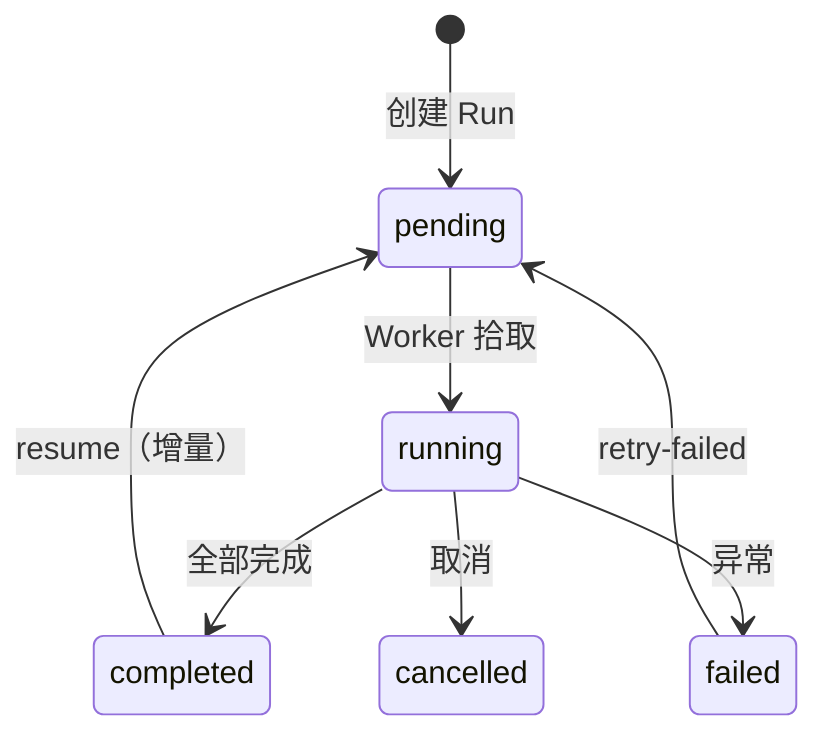

# 连接器（Connectors）

连接器提供**外部数据源的自动化导入**能力。当前主要支持 URL 批量导入和数据库连接器（MySQL/SQLServer），通过 Connector Run 追踪每次同步执行。

## 架构概览

## Connector Run 状态机

## ConnectorRun 模型

| 字段 | 类型 | 说明 |
|------|------|------|
| `id` | UUID | Run ID |
| `tenant_id` | UUID | 租户 ID |
| `dataset_id` | UUID | 目标数据集 |
| `connector_id` | String(80) | 连接器标识（如 `url_batch`） |
| `requested_by` | String | 发起者 account_id |
| `status` | String | `pending`/`running`/`completed`/`failed`/`cancelled` |
| `config` | JSONB | 运行配置 |
| `stats` | JSONB | 运行统计（成功/失败/跳过数） |
| `error_message` | Text | 失败信息 |
| `task_id` | String | 异步任务标识 |

### ConnectorRunDocument

每个 Run 创建的文档通过关联表追踪：

| 字段 | 类型 | 说明 |
|------|------|------|
| `run_id` | UUID | 关联的 ConnectorRun |
| `document_id` | UUID | 创建的文档 |
| `source_ref` | String | 来源引用（如 URL） |
| `status` | String | `created`/`processed`/`failed` |

## SSRF 防护

URL 导入时，后端通过 `validate_url_for_ingest()` 执行安全校验：

| 检查项 | 说明 |
|--------|------|
| 协议白名单 | 仅允许 http/https |
| 内网地址拦截 | 拒绝 127.0.0.0/8, 10.0.0.0/8, 172.16.0.0/12, 192.168.0.0/16 |
| DNS 重绑定 | 解析后二次校验 |
| 重定向跟踪 | 限制重定向次数 |

:::danger SSRF 防护
所有 URL 导入必须经过 `validate_url_for_ingest()` 校验。绕过此校验可能导致 SSRF 漏洞，使攻击者能访问内部服务。
:::

## API 端点

### Connector Run

| 方法 | 路径 | 说明 |
|------|------|------|
| `POST` | `/connectors/runs` | 创建 Run |
| `GET` | `/connectors/runs` | Run 列表 |
| `GET` | `/connectors/runs/{run_id}` | Run 详情 |
| `POST` | `/connectors/runs/{run_id}/retry-failed` | 重试失败项 |
| `POST` | `/connectors/runs/{run_id}/resume` | 恢复/增量同步 |
| `POST` | `/connectors/runs/{run_id}/cancel` | 取消运行 |

### Connector Config

| 方法 | 路径 | 说明 |
|------|------|------|
| `GET` | `/connectors/configs` | 配置列表 |
| `POST` | `/connectors/configs` | 创建配置 |
| `PUT` | `/connectors/configs/{config_id}` | 更新配置 |
| `DELETE` | `/connectors/configs/{config_id}` | 删除配置 |
| `POST` | `/connectors/configs/{config_id}/run` | 基于配置发起 Run |
| `POST` | `/connectors/configs/{config_id}/reconcile` | 对账 |

### 其他

| 方法 | 路径 | 说明 |
|------|------|------|
| `GET` | `/connectors` | 可用连接器列表 |
| `POST` | `/connectors/validate` | 校验连接配置 |
| `POST` | `/connectors/scheduled/tick` | 定时调度触发 |

## 相关链接

- [入库 Run](./ingestion-runs.md)
- [DB Catalog](../datasets/db-catalog.md)
- [API 参考索引](./api-index.md)
- [Redoc API 文档](https://skygazer42.github.io/MimirQ/)
