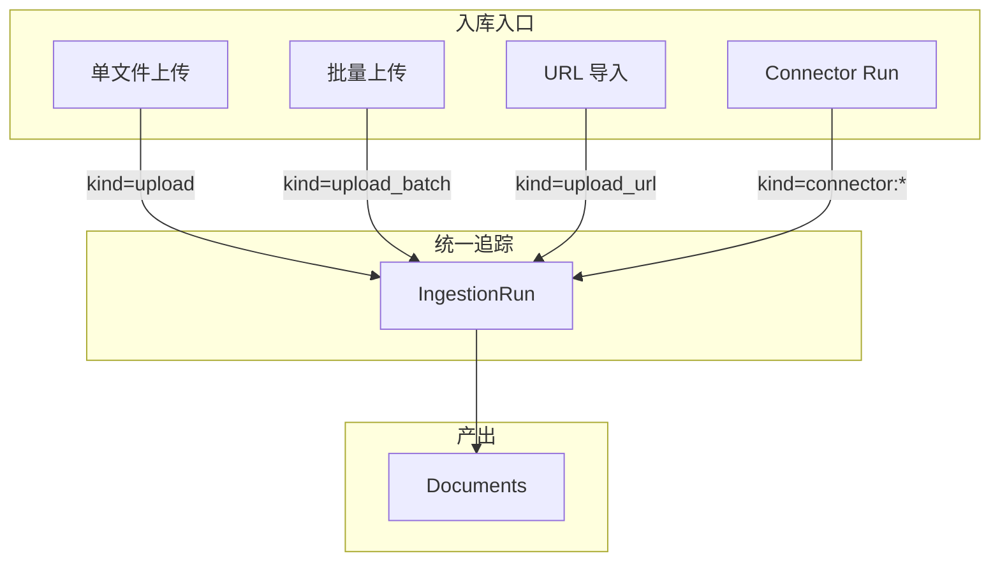
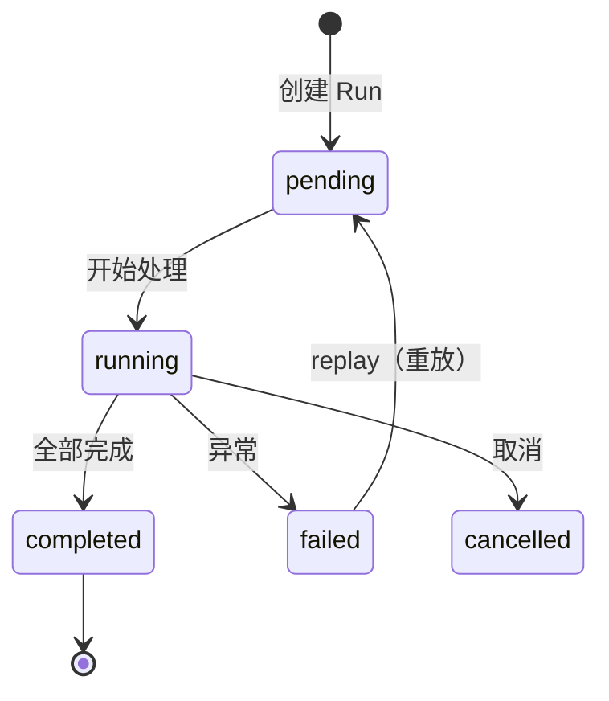

# Ingestion Run

Ingestion Run 是**统一的入库批次追踪模型**，为所有入库入口（单文件上传、批量上传、URL 导入、连接器同步）提供可观测性。

## 概念定位



## IngestionRun 模型

| 字段 | 类型 | 说明 |
|------|------|------|
| `id` | UUID | Run ID |
| `tenant_id` | UUID | 租户 ID |
| `dataset_id` | UUID | 目标数据集 |
| `kind` | String(80) | 入库类型 |
| `requested_by` | String | 发起者 |
| `status` | String | `pending`/`running`/`completed`/`failed`/`cancelled` |
| `config` | JSONB | 运行配置 |
| `stats` | JSONB | 统计信息 |
| `error_message` | Text | 错误信息 |
| `created_at` | DateTime | 创建时间 |
| `started_at` | DateTime | 开始时间 |
| `finished_at` | DateTime | 结束时间 |

### kind 枚举

| kind | 来源 |
|------|------|
| `upload` | 单文件上传 |
| `upload_batch` | 批量上传 |
| `upload_url` | URL 导入 |
| `connector:url_batch` | URL 批量连接器 |
| `connector:web_crawl` | Web 爬虫连接器 |

### stats 字段结构

```json
{
  "total": 10,
  "succeeded": 8,
  "failed": 1,
  "skipped": 1,
  "elapsed_ms": 45000
}
```

## IngestionRunDocument

Run 与文档的关联表：

| 字段 | 类型 | 说明 |
|------|------|------|
| `run_id` | UUID | 关联 IngestionRun |
| `document_id` | UUID | 关联 Document |
| `source_ref` | String | 来源引用（文件名/URL/key） |
| `status` | String | `created`/`pending`/`processing`/`completed`/`failed`/`quarantined`/`cancelled` |

## 状态机



## API 端点

| 方法 | 路径 | 说明 |
|------|------|------|
| `GET` | `/ingestion-runs/runs` | Run 列表 |
| `GET` | `/ingestion-runs/runs/{run_id}` | Run 详情 |
| `GET` | `/ingestion-runs/runs/{run_id}/export` | 导出 Run JSON |
| `GET` | `/ingestion-runs/runs/{run_id}/export-html` | 导出 HTML 报告 |
| `GET` | `/ingestion-runs/runs/{run_id}/compare/{other_id}` | 两次 Run 对比 |
| `POST` | `/ingestion-runs/runs/{run_id}/replay` | 重放 Run |

:::tip Run 对比
`/compare/{other_run_id}` 可对比两次入库 Run 的差异（新增/修改/删除的文档），适合验证增量同步效果。
:::

## 批量操作与重试

| 场景 | 方式 |
|------|------|
| 单文档重试 | `POST /documents/{id}/retry` |
| 批量重试 | `POST /documents/batch/retry` |
| 批量重新入库 | `POST /documents/batch/reingest` |
| Run 重放 | `POST /ingestion-runs/runs/{id}/replay` |

:::info 设计理念
IngestionRun 是轻量级的 "best-effort" 追踪，提供企业级可观测性而不增加入库关键路径延迟。Run 创建和更新均为异步操作。
:::

## 相关链接

- [连接器](./connectors.md)
- [状态与任务](./state-jobs.md)
- [API 参考索引](./api-index.md)
- [Redoc API 文档](https://skygazer42.github.io/MimirQ/)
