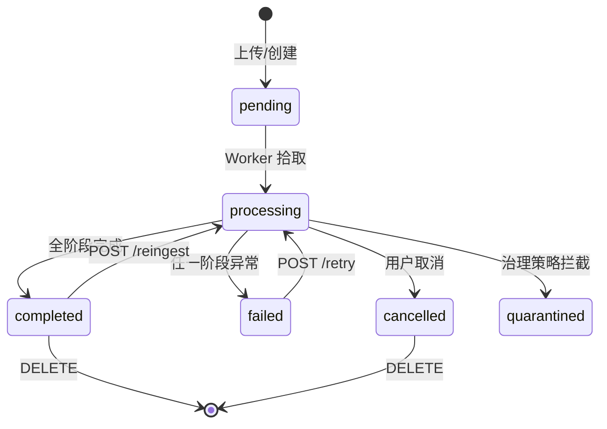
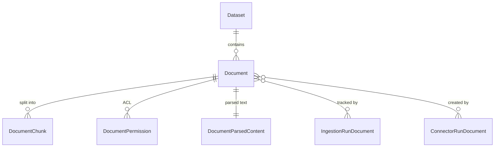

# 文档（Document）概述

文档是 MimirQ 中**知识内容的载体**。每个文档隶属于一个数据集，经过解析、分块、向量化、索引四阶段流水线后，其内容以 chunk 形式进入 Milvus 向量库供检索使用。

## 文档生命周期

### 处理阶段（current_stage）

| 阶段 | 说明 |
|------|------|
| `parsing` | 文件解析为文本 |
| `chunking` | 文本分块 |
| `embedding` | 向量化 |
| `vector_write` | 写入 Milvus |
| `completed` | 全部完成 |

### Publication 状态

独立于处理状态的发布状态，用于治理工作流：

| 状态 | 说明 |
|------|------|
| `draft` | 草稿，不参与检索 |
| `published` | 已发布（默认） |
| `deprecated` | 已废弃 |

## 核心字段

| 字段 | 类型 | 说明 |
|------|------|------|
| `id` | UUID | 文档 ID |
| `tenant_id` | UUID | 租户 ID |
| `dataset_id` | UUID | 归属数据集 |
| `filename` | String(500) | 原始文件名 |
| `file_type` | String(10) | 文件类型（pdf/md/txt/docx...） |
| `file_size` | BigInteger | 文件大小（字节） |
| `file_path` | String(1000) | 存储路径 |
| `status` | String(20) | `pending`/`processing`/`completed`/`failed`/`quarantined`/`cancelled` |
| `current_stage` | String(50) | 当前处理阶段 |
| `processing_progress` | Int | 0-100 进度 |
| `chunk_count` | Int | chunk 数量 |
| `total_characters` | Int | 总字符数 |
| `error_message` | Text | 失败原因 |
| `doc_metadata` | JSONB | 元数据（pipeline 配置、治理结果等） |
| `publication_status` | String | `draft`/`published`/`deprecated` |

### 生命周期元数据

| 字段 | 说明 |
|------|------|
| `owner_id` | 文档 owner（上传者） |
| `access_mode` | ACL 模式 |
| `lifecycle_owner` | 内容生命周期负责人 |
| `review_due_at` | 评审截止日期 |
| `authority_level` | 权威性等级 |
| `supersedes_document_id` | 替代的文档 ID |

:::info 双 owner 设计
`owner_id` 用于 ACL 权限控制（谁能看），`lifecycle_owner` 用于内容治理（谁负责维护）。两者可以不同。
:::

## DocumentChunk 模型

| 字段 | 类型 | 说明 |
|------|------|------|
| `id` | UUID | chunk ID |
| `document_id` | UUID | 归属文档 |
| `chunk_index` | Int | chunk 序号 |
| `content` | Text | chunk 文本 |
| `page_number` | Int | 所在页码 |
| `start_char` / `end_char` | Int | 字符位置 |
| `vector_id` | String | Milvus 向量 ID |
| `doc_metadata` | JSONB | chunk 级元数据 |
| `disabled_at` | DateTime | 禁用时间（非 NULL 则不参与检索） |

## 与其他实体的关系

## 相关链接

- [API 参考索引](./api-index.md)
- [Schema 详解](./schemas.md)
- [流水线阶段](./pipeline.md)
- [数据集概述](../datasets/overview.md)
- [Redoc API 文档](https://skygazer42.github.io/MimirQ/)
