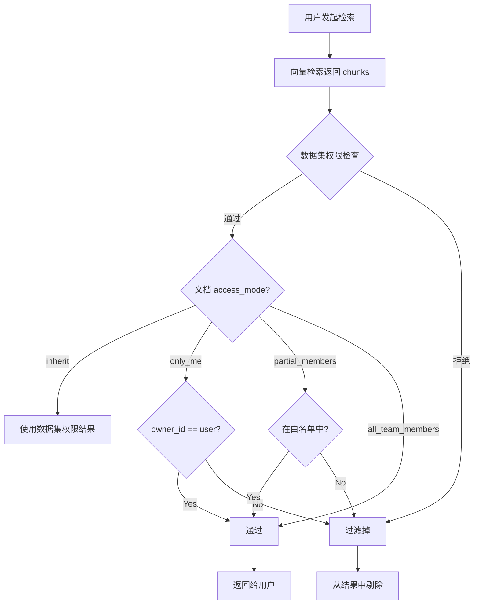
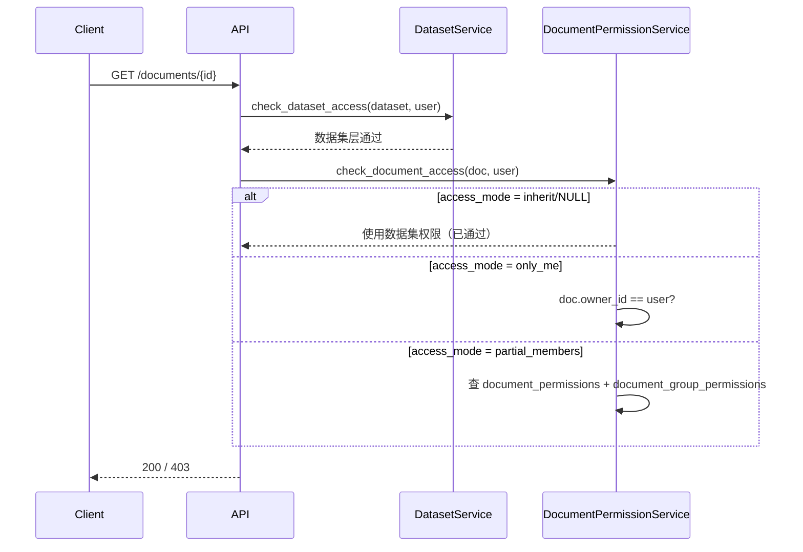

# 文档权限与安全

MimirQ 支持**文档级 ACL**（Access Control List），在数据集权限之下提供更细粒度的访问控制，支持 Security Trimming 场景。

## 访问模式

文档的 `access_mode` 字段控制文档级权限：

| access_mode | 含义 |
|-------------|------|
| `NULL` / `inherit` | 继承数据集权限（默认） |
| `only_me` | 仅 owner 可访问 |
| `partial_members` | owner + 白名单用户/组 |
| `all_team_members` | 租户内所有成员（仍受数据集权限约束） |

## Security Trimming 流程

:::warning 双层过滤
Security Trimming 是**后过滤**：先从 Milvus 检索，再按权限过滤。如果大量文档被过滤，有效结果可能不足 top_k。建议合理规划数据集权限粒度。
:::

## 文档权限数据模型

### 用户白名单

`document_permissions` 表：

| 字段 | 类型 | 说明 |
|------|------|------|
| `id` | UUID | 主键 |
| `tenant_id` | UUID | 租户 ID |
| `document_id` | UUID | 文档 ID |
| `account_id` | String | 被授权用户 |

唯一约束：`(document_id, account_id)`

### 组白名单

`document_group_permissions` 表：

| 字段 | 类型 | 说明 |
|------|------|------|
| `tenant_id` | UUID | 租户 ID |
| `document_id` | UUID | 文档 ID |
| `group_id` | UUID | TenantGroup ID |

唯一约束：`(tenant_id, document_id, group_id)`

## 权限管理 API

| 方法 | 路径 | 说明 |
|------|------|------|
| `GET` | `/{document_id}/access` | 获取当前权限设置 |
| `PUT` | `/{document_id}/access` | 设置权限（覆盖） |
| `POST` | `/batch/access` | 批量设置文档权限 |

## 权限检查时序

:::info
批量权限更新 (`POST /batch/access`) 接受 `DocumentBatchAccessUpdateRequest`，可一次性为多个文档设置相同的 access_mode 和白名单。
:::

## 相关链接

- [数据集权限](../datasets/permissions.md)
- [概述](./overview.md)
- [API 参考索引](./api-index.md)
- [Redoc API 文档](https://skygazer42.github.io/MimirQ/)
