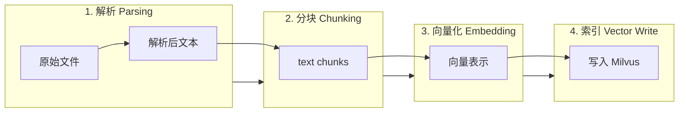
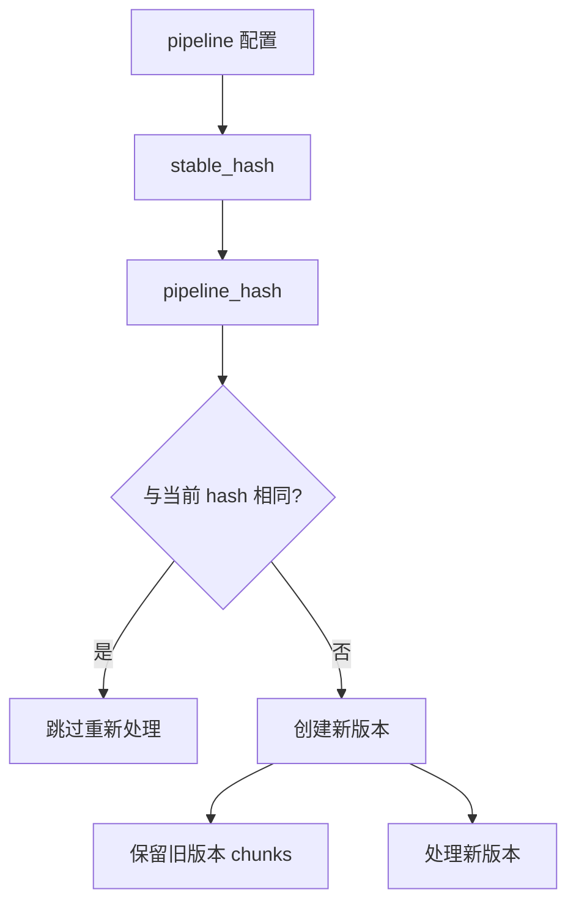

# 文档处理流水线

文档从上传到可检索，经过四个核心阶段：**解析** → **分块** → **向量化** → **索引写入**。每个阶段可配置、可覆盖。

## 四阶段概览

## 阶段 1：解析（Parsing）

将原始文件（PDF/DOCX/MD/HTML 等）解析为结构化文本。

| 配置项 | 说明 | 默认值 |
|--------|------|--------|
| `parser_backend` | 解析后端 | 自动选择 |
| 支持的后端 | `unstructured`, `mineru`, `markitdown`, `simple` 等 | — |

解析后端通过 `ParserFactory` 分发，`normalize_parser_backend()` 标准化名称。解析结果存入 `DocumentParsedContent` 表。

### 治理预处理

解析后、分块前可执行治理（Governance）预处理：

| 功能 | 配置字段 | 说明 |
|------|----------|------|
| 去 TOC | `governance_remove_toc_lines` | 移除目录行 |
| 去噪音行 | `governance_remove_noise_lines` | 移除页眉页脚等 |
| 行合并 | `governance_unwrap_lines` | 合并被换行截断的段落 |
| PII 脱敏 | `governance_pii_anonymize` | 替换/遮蔽个人信息 |
| Secrets 脱敏 | `governance_secrets_redact` | 脱敏 API Key/Token |
| 关键词提取 | `governance_extract_keywords` | 自动提取文档关键词 |
| 语言检测 | `governance_detect_language` | 检测主语言 |
| 段落去重 | `governance_drop_duplicate_paragraphs` | 移除重复段落 |

## 阶段 2：分块（Chunking）

将解析文本切分为适合检索的 chunk。

| 配置项 | 说明 |
|--------|------|
| `chunk_strategy` | 分块策略（separator/semantic/fixed 等） |
| `chunk_size` | chunk 目标大小（token 数） |
| `chunk_overlap` | chunk 间重叠 token 数 |

分块通过 `chunker_factory()` 创建，默认使用 `SeparatorChunker`。

## 阶段 3：向量化（Embedding）

为每个 chunk 生成向量表示。

| 配置项 | 说明 |
|--------|------|
| embedding model | 系统配置，默认 BAAI/bge-m3 |
| 支持 15+ 模型 | 7 个 provider |

## 阶段 4：索引写入（Vector Write）

将向量和元数据写入 Milvus 集合。

| 写入内容 | 说明 |
|----------|------|
| 向量 | chunk embedding |
| 元数据 | tenant_id, dataset_id, document_id, chunk_index 等 |
| `vector_id` | 写入后回填到 `document_chunks.vector_id` |

## pipeline_hash 版本机制

MimirQ 通过 `pipeline_hash` 实现文档版本化：

- 每次处理生成一个基于 pipeline 配置的 hash
- 同一文档可有多个版本（不同 pipeline 配置）
- `POST /{document_id}/versions/{hash}/activate` 激活指定版本
- `build_doc_pipeline_key()` 和 `get_active_pipeline_hash()` 计算和获取 hash

:::tip 配置合并
文档 pipeline 配置通过 `merge_pipeline_options()` 合并三级配置：文档级 > 数据集级 > 全局默认。`resolve_pipeline_effective()` 返回最终生效配置。
:::

## 配置参数汇总

| 级别 | 设置方式 | 说明 |
|------|----------|------|
| 全局 | `app/core/config.py` | 系统默认值 |
| 数据集 | `dataset_metadata.pipeline` | 数据集级覆盖 |
| 文档 | `doc_metadata.pipeline` | 文档级覆盖 |
| 上传时 | upload 表单字段 | 单次上传覆盖 |

## 相关链接

- [状态与任务](./state-jobs.md)
- [概述](./overview.md)
- [连接器](./connectors.md)
- [Redoc API 文档](https://skygazer42.github.io/MimirQ/)
