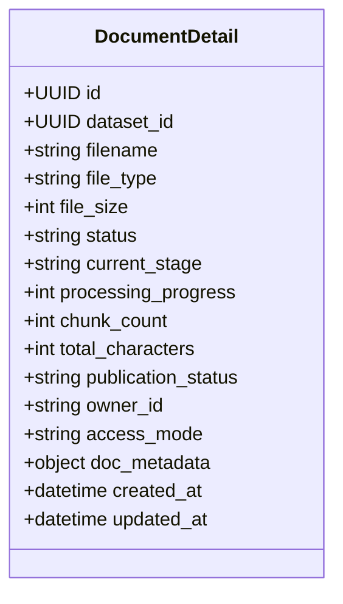

# 文档 Schema 详解

本页列出文档域核心 Schema 的关键字段。完整定义以 [Redoc](https://skygazer42.github.io/MimirQ/) 为准。

## DocumentDetail（响应）

## DocumentStatus

| 枚举值 | 说明 |
|--------|------|
| `pending` | 已创建，等待处理 |
| `processing` | 处理中（parsing/chunking/embedding/vector_write） |
| `completed` | 全部完成 |
| `failed` | 处理失败 |
| `quarantined` | 被治理策略隔离 |
| `cancelled` | 已取消 |

## Upload 请求（multipart/form-data）

`POST /documents/upload` 接受 multipart 表单：

| 字段 | 类型 | 必填 | 说明 |
|------|------|------|------|
| `file` | File | Yes | 上传文件 |
| `dataset_id` | UUID | Yes | 目标数据集 |
| `parser_backend` | string | No | 解析后端覆盖 |
| `chunk_strategy` | string | No | 分块策略覆盖 |
| `user_metadata` | JSON string | No | 自定义元数据 |
| `publication_status` | string | No | `draft`/`published`/`deprecated` |

## ManualDocumentCreate

手动创建文档（纯文本），不需要文件上传：

| 字段 | 类型 | 必填 | 说明 |
|------|------|------|------|
| `dataset_id` | UUID | Yes | 数据集 |
| `filename` | string | Yes | 虚拟文件名 |
| `content` | string | Yes | 文档文本内容 |
| `user_metadata` | object | No | 自定义元数据 |

## DocumentPipelineOptions

每文档级别的 pipeline 配置覆盖，字段众多，核心分组如下：

| 分组 | 代表字段 | 说明 |
|------|----------|------|
| 治理开关 | `governance_enabled`, `governance_remove_toc_lines` | 内容清洗控制 |
| PII 处理 | `governance_pii_anonymize`, `governance_pii_mode` | 个人信息脱敏 |
| Secrets 处理 | `governance_secrets_redact`, `governance_secrets_mode` | 密钥/Token 脱敏 |
| 语言检测 | `governance_detect_language` | 自动检测文档语言 |
| 关键词 | `governance_extract_keywords` | 自动提取关键词 |
| 表格规范化 | `governance_normalize_tables` | Markdown 表格对齐 |
| URL 规范化 | `governance_normalize_urls` | URL 去跟踪参数 |
| 去重 | `governance_drop_duplicate_paragraphs` | 段落去重 |

:::info 配置优先级
Pipeline 配置遵循三级覆盖：**文档级** > **数据集级** > **全局默认**。通过 `resolve_pipeline_effective()` 合并生效。
:::

## DocumentChunkSchema

| 字段 | 类型 | 说明 |
|------|------|------|
| `id` | UUID | chunk ID |
| `document_id` | UUID | 所属文档 |
| `chunk_index` | int | 序号 |
| `content` | string | 文本内容 |
| `page_number` | int | 页码 |
| `start_char` / `end_char` | int | 字符位置 |
| `vector_id` | string | Milvus 向量 ID |
| `metadata` | object | chunk 元数据 |

## ChunkPreviewResponse

分块预览的响应结构：

| 字段 | 类型 | 说明 |
|------|------|------|
| `items` | ChunkPreviewItem[] | 预览 chunk 列表 |
| `stats` | ChunkPreviewStats | 统计信息 |
| `quality_gate` | ChunkPreviewQualityGate | 质量门禁结果 |
| `review_signals` | ChunkPreviewReviewSignals | 审查信号 |
| `recommendation` | ChunkPreviewRecommendationPatch | 推荐调整 |

## 相关链接

- [API 参考索引](./api-index.md)
- [流水线阶段](./pipeline.md)
- [权限与安全](./permissions.md)
- [Redoc API 文档](https://skygazer42.github.io/MimirQ/)
