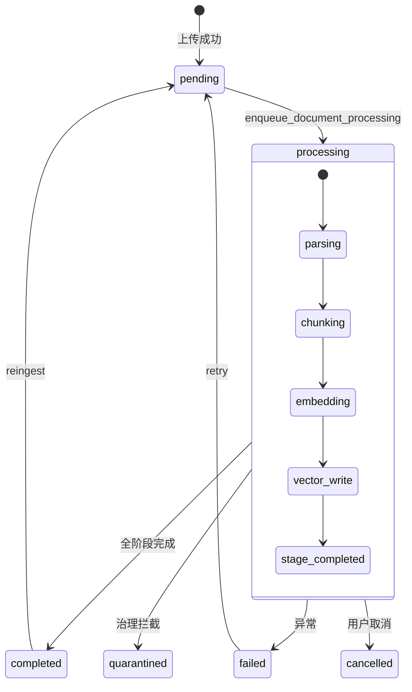
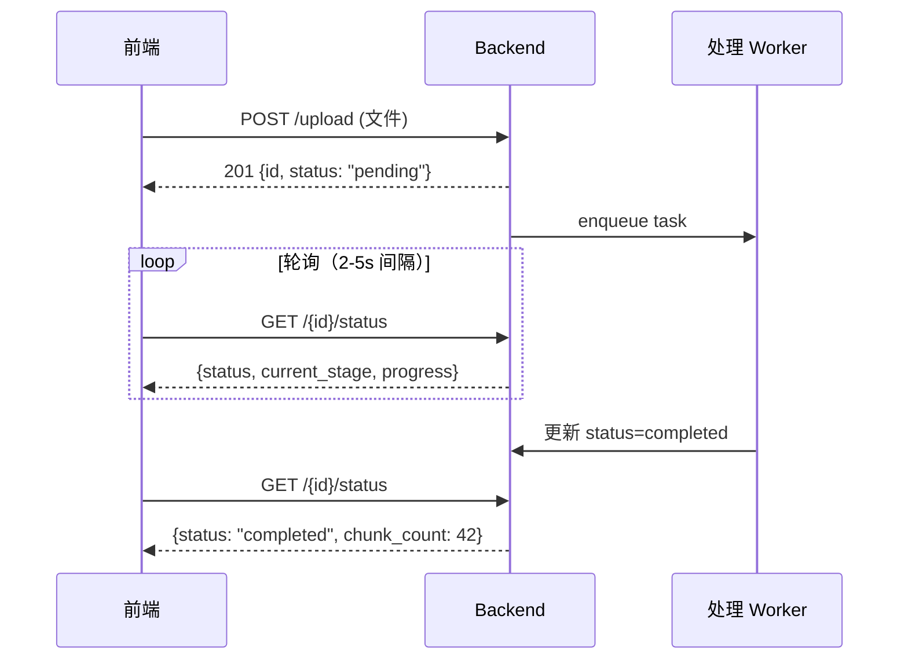

# 文档处理状态与异步任务

文档从上传到可检索，需经过异步处理流水线。本页详解状态机、webhook 通知和监控策略。

## 文档处理状态机

## 状态字段

| 字段 | 值域 | 说明 |
|------|------|------|
| `status` | pending/processing/completed/failed/quarantined/cancelled | 主状态 |
| `current_stage` | parsing/chunking/embedding/vector_write/completed | 处理子阶段 |
| `processing_progress` | 0-100 | 百分比进度 |
| `error_message` | text | 失败时的错误详情 |

## 状态查询接口

| 方法 | 路径 | 说明 |
|------|------|------|
| `GET` | `/{document_id}/status` | 返回 `DocumentStatus`（轻量） |
| `GET` | `/{document_id}` | 返回 `DocumentDetail`（完整） |
| `GET` | `/{document_id}/timeline` | 处理时间线事件列表 |

## 前端轮询策略

:::tip 轮询建议
- 初始间隔 2 秒，逐步退避到 5 秒
- `processing_progress` 可驱动进度条
- 到达终态（completed/failed/quarantined/cancelled）后停止轮询
- 批量上传场景建议用 `GET /documents/?dataset_id=X&status=processing` 统一查询
:::

## 操作控制

| 操作 | 路径 | 前置条件 |
|------|------|----------|
| 取消 | `POST /{id}/cancel` | status 为 pending 或 processing |
| 重试 | `POST /{id}/retry` | status 为 failed |
| 重新入库 | `POST /batch/reingest` | status 为 completed |
| 批量重试 | `POST /batch/retry` | 批量操作失败文档 |

## Timeline 事件

`GET /{document_id}/timeline` 返回按时间排序的处理事件列表（`DocumentTimelineResponse`），每个事件包含：

| 字段 | 说明 |
|------|------|
| `event` | 事件类型 |
| `stage` | 关联阶段 |
| `timestamp` | 事件时间 |
| `details` | 事件详情（JSON） |

## 相关链接

- [流水线阶段](./pipeline.md)
- [概述](./overview.md)
- [排障](./troubleshooting.md)
- [Redoc API 文档](https://skygazer42.github.io/MimirQ/)
