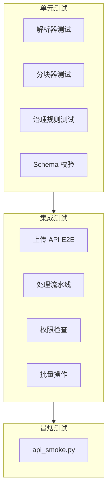

# 文档域测试策略

本页描述文档域（上传、处理、分块、版本管理等）的测试方法和关键用例。

## 测试分层



## 关键测试用例

### 上传与处理

| 测试场景 | 覆盖范围 | 关注点 |
|----------|----------|--------|
| 单文件上传 | multipart 解析 + DB 写入 | 文件类型/大小校验 |
| URL 导入 | URL 校验 + SSRF 防护 | `validate_url_for_ingest()` |
| 批量上传 | 多文件并发 | 部分失败处理 |
| 手动创建 | 纯文本文档 | content 非空校验 |
| 处理流水线 | parsing → chunking → embedding → write | 各阶段状态转换 |
| 取消/重试 | 状态机转换 | 前置条件检查 |

### 分块与向量

| 测试场景 | 覆盖范围 | 关注点 |
|----------|----------|--------|
| Separator 分块 | SeparatorChunker | chunk 大小/overlap |
| Chunk CRUD | 手动创建/更新/删除 | 权限 + vector_id 同步 |
| Reembed | 重新向量化 | Milvus 更新一致性 |
| Chunk 禁用/启用 | disabled_at 字段 | 检索时过滤 |
| Chunk Preview | 预览不入库 | quality_gate 计算 |

### 权限与安全

| 测试场景 | 覆盖范围 | 关注点 |
|----------|----------|--------|
| 文档级 ACL | access_mode 各值 | Security Trimming |
| 批量权限更新 | batch/access | 部分失败处理 |
| 租户隔离 | 跨租户不可见 | tenant_id 过滤 |

### 版本管理

| 测试场景 | 覆盖范围 | 关注点 |
|----------|----------|--------|
| 版本列表 | GET /versions | pipeline_hash 唯一 |
| 版本激活 | POST /activate | chunks 切换 |
| 版本差异 | GET /versions/diff | 前后对比 |
| 版本删除 | DELETE /versions/`{hash}` | 级联清理 |

## 运行测试

```bash
# 文档域全量测试
pytest tests/ -k "document" -v

# 仅解析器测试
pytest tests/parsing/ -v

# 仅分块器测试
pytest tests/chunking/ -v

# 冒烟测试
python scripts/api_smoke.py --tag documents
```

:::note 测试依赖
- 集成测试需要 PostgreSQL + Milvus + 对象存储
- 解析器测试可能需要特定后端（如 mineru）
- 环境变量 `TEST_DATABASE_URL` 必须配置
:::

## 相关链接

- [流水线阶段](./pipeline.md)
- [排障](./troubleshooting.md)
- [API 参考索引](./api-index.md)
- [Redoc API 文档](https://skygazer42.github.io/MimirQ/)
