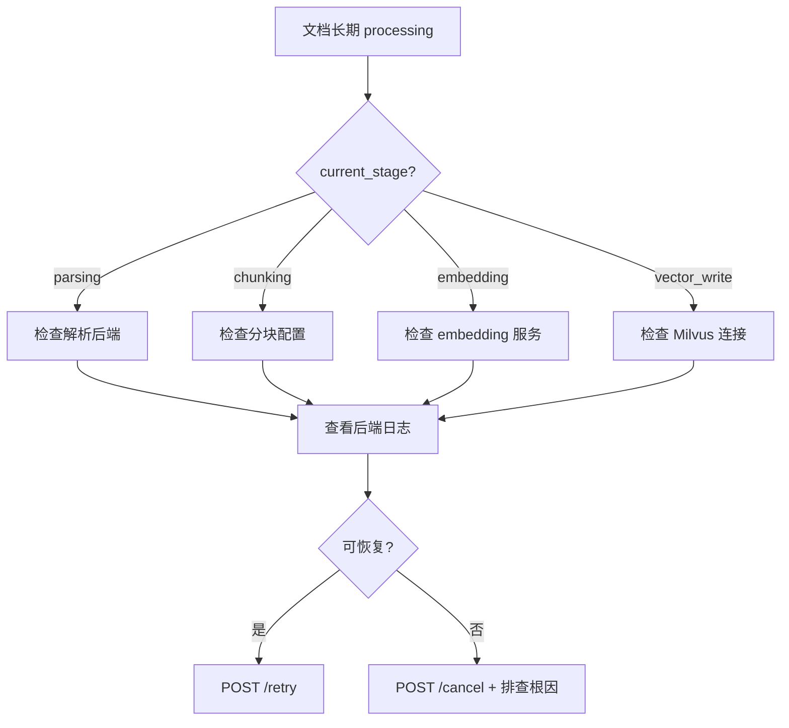

# 文档排障

常见文档处理问题的症状、原因与解决方案。

## 上传问题

| 症状 | 原因 | 解决方案 |
|------|------|----------|
| 上传返回 400 | multipart 字段名错误或缺少必填字段 | 检查 `file` 字段名和 `dataset_id` |
| 上传返回 415 | 不支持的文件类型 | 检查 `file_type` 是否在支持列表中 |
| 上传返回 413 | 文件过大 | 检查反向代理 `client_max_body_size` 和后端限制 |
| 批量上传部分失败 | 个别文件问题 | 检查响应体中逐项错误信息 |

## 处理卡住

| 症状 | 原因 | 解决方案 |
|------|------|----------|
| 卡在 `parsing` | 解析后端崩溃/超时 | 检查 SubprocessWorker 日志；确认 parser backend 可用 |
| 卡在 `embedding` | embedding 服务不可用 | 检查 embedding model 服务状态 |
| 卡在 `vector_write` | Milvus 连接超时 | 检查 Milvus 集群状态和网络 |
| 长时间 `pending` | 任务队列积压或 Worker 未启动 | 检查 `enqueue_document_processing` 任务队列 |

:::warning 超时处理
如果文档处理超过预期时间（如大 PDF 超过 30 分钟），建议：
1. `GET /{id}/timeline` 查看最后事件时间
2. 如果 Worker 已崩溃，`POST /{id}/cancel` 后重新上传
:::

## 内容问题

| 症状 | 原因 | 解决方案 |
|------|------|----------|
| `parsed-content` 为空 | 解析失败但状态未更新 | 检查 `error_message`；重试 |
| `parsed-content` 返回 404 | 文档未完成处理或已被清理 | 确认 status=completed |
| chunk 列表为空 | 分块后无有效内容 | 检查治理配置是否过度清洗 |
| chunk 与检索结果不一致 | 索引未更新或版本不匹配 | `POST /chunks/reembed`；核对 pipeline version |

## 常见错误码

| 错误码 | 含义 | 处理 |
|--------|------|------|
| `PARSE_TIMEOUT` | 解析超时 | 换用更快的 parser backend 或拆分大文件 |
| `CHUNK_EMPTY` | 分块结果为空 | 检查文件内容和治理配置 |
| `EMBEDDING_FAILED` | 向量化失败 | 检查 embedding 服务 |
| `VECTOR_WRITE_FAILED` | Milvus 写入失败 | 检查 Milvus 状态 |
| `QUARANTINED` | 治理策略拦截 | 检查 PII/secrets 阈值配置 |

## 批量操作排障

| 症状 | 原因 | 解决方案 |
|------|------|----------|
| 批量重试部分失败 | 个别文档状态不允许重试 | 检查响应中的逐项结果 |
| batch/move 失败 | 目标数据集不存在或无权限 | 确认目标 dataset_id 和权限 |
| batch/reingest 无效果 | 文档 pipeline 配置未变更 | 检查 pipeline_hash 是否真的变化 |

:::tip 排查工具
- `GET /{id}/status` — 快速查看状态
- `GET /{id}/timeline` — 处理事件时间线
- `GET /{id}/health` — 文档健康卡片
- 后端日志搜索 `request_id` 或 `document_id`
:::

## 相关链接

- [状态与任务](./state-jobs.md)
- [流水线阶段](./pipeline.md)
- [API 参考索引](./api-index.md)
- [Redoc API 文档](https://skygazer42.github.io/MimirQ/)
