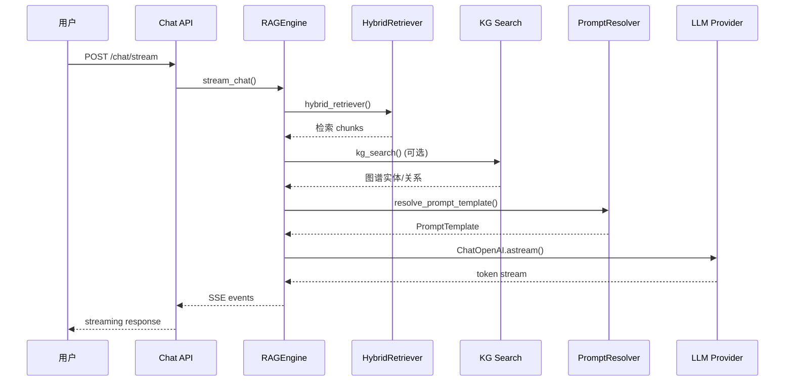

# 对话与模板

MimirQ 的对话引擎基于 RAG 架构，将用户提问经过检索增强后交由 LLM 生成流式回答，同时提供 Prompt 模板管理和多轮对话记忆。

## 架构概览

## Prompt 模板管理

模板由 `PromptResolver` 在运行时解析，支持三种选择策略：

| 优先级 | 选择方式 | 说明 |
|--------|----------|------|
| 1 | `prompt_template_id` | 指定模板 ID，精确匹配 |
| 2 | `template_key` | 按 key 查找最高版本的 active 模板 |
| 3 | `ab_experiment_key` | A/B 实验，按 weight 稳定路由 |

模板内容包含三部分：

- **System Prompt** — 定义助手角色与行为约束
- **RAG Context** — 检索到的 chunks 注入位置（由引擎自动填充）
- **User Prompt** — 用户原始问题 + 对话历史

:::tip A/B 实验路由
A/B 路由使用 `SHA-256(ab_user_key)` 生成稳定哈希，确保同一用户始终命中同一模板变体，适用于 Prompt 效果对比评测。
:::

## 多轮对话记忆

引擎通过 `RAGChatContext.history` 传入对话历史，支持两种记忆策略：

- **滑动窗口** — 保留最近 N 轮对话作为上下文
- **格式化注入** — `format_history_text()` 将历史转换为 `User: ... / Assistant: ...` 文本格式拼入 Prompt

:::info Token 预算控制
`num_tokens_from_string()` + `truncate()` 确保注入的历史不会超出模型 context window，超限部分自动截断。
:::

## 流式响应机制

引擎产出的 SSE 事件流包含多种事件类型：

| 事件类型 | 内容 |
|----------|------|
| `token` | LLM 生成的文本 token |
| `citation` | 引用溯源信息 |
| `confidence` | 置信度分数 |
| `followup` | 推荐追问问题 |
| `done` | 流结束标记 |

响应后处理包括：PII 脱敏（`pii_redaction`）、句级引用标注（`sentence_citations`）、时效性增强（`recency_boost`）。

## Chat API 端点

| 方法 | 路径 | 说明 |
|------|------|------|
| POST | `/api/v1/chat/stream` | 流式 RAG 对话 |
| POST | `/api/v1/chat/completions` | 非流式对话 |
| GET | `/api/v1/conversations` | 对话列表 |
| GET | `/api/v1/conversations/{id}/messages` | 消息历史 |
| DELETE | `/api/v1/conversations/{id}` | 删除对话 |

:::warning Vision 模式
当启用 Vision Reader 时，引擎会将文档页面渲染为图片 block 传入多模态 LLM，适用于含复杂表格/图表的文档问答。
:::

## 关键源码

| 文件 | 职责 |
|------|------|
| `app/rag/engine.py` | RAGEngine 主入口（~2200+ 行） |
| `app/services/prompt_resolver.py` | 模板解析与 A/B 路由 |
| `app/rag/core/conversation.py` | 对话历史格式化 |
| `app/rag/core/sentence_citations.py` | 句级引用标注 |

---

**相关链接：**[检索与 RAG](./retrieval.md) · [证据与可解释性](./evidence.md) · [评测与反馈](./evaluations.md)
