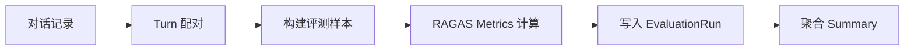
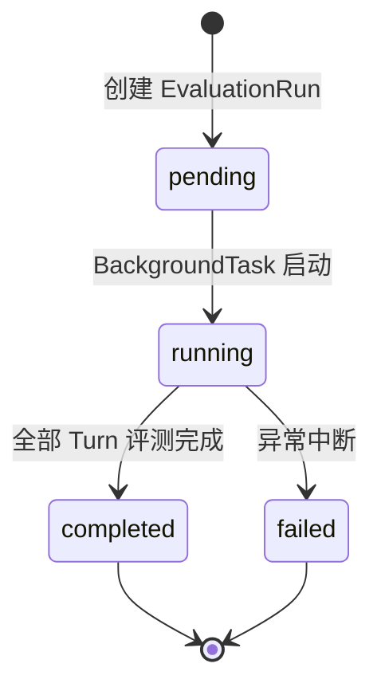
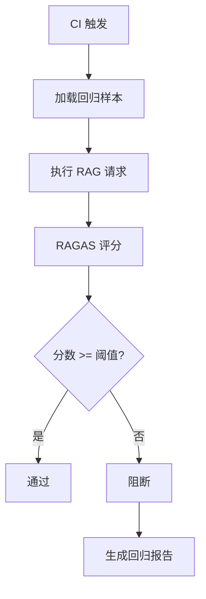

# 评测与反馈

MimirQ 集成 RAGAS 评测框架，支持对 RAG 对话质量进行自动化评估，并提供回归测试门禁能力。

## RAGAS 评测框架

[RAGAS](https://docs.ragas.io/) 是业界标准的 RAG 评测框架，MimirQ 基于已存储的对话消息与引用数据执行评测，无需重新发起 RAG 请求。

## 评测指标

| 指标 | 含义 | 评估维度 |
|------|------|----------|
| **Faithfulness** | 答案是否忠实于检索到的上下文 | 幻觉检测 |
| **Answer Relevancy** | 答案与用户问题的相关程度 | 回答质量 |
| **Context Precision** | 检索上下文中有用信息的比例 | 检索精度 |
| **Context Recall** | 检索是否覆盖了回答所需的全部信息 | 检索召回 |

:::tip 指标选择建议
日常评测建议至少启用 Faithfulness + Context Precision；完整评测可启用全部四项指标，但耗时更长（需 LLM 参与评分）。
:::

## 评测任务生命周期

评测数据模型：

| 模型 | 说明 |
|------|------|
| `RagasEvaluationRun` | 评测运行记录（status / metrics / summary） |
| `RagasEvaluationItem` | 单轮评测结果（per-turn scores） |
| `RagasRegressionRun` | 回归测试运行 |
| `RagasRegressionCase` | 回归基准样本 |
| `RagasRegressionItem` | 回归对比结果 |

## 回归门禁流程

:::warning 阈值配置
回归门禁阈值通过 `RAG_EVAL_SUMMARY_PATH` 配置文件管理，建议 Faithfulness >= 0.85、Context Precision >= 0.75。
:::

## API 端点

| 方法 | 路径 | 说明 |
|------|------|------|
| POST | `/api/v1/evaluations` | 创建评测任务 |
| GET | `/api/v1/evaluations/{id}` | 查询评测结果 |
| GET | `/api/v1/evaluations/{id}/items` | 查询逐轮详情 |
| POST | `/api/v1/evaluations/regression` | 创建回归测试 |
| GET | `/api/v1/evaluations/regression/{id}` | 查询回归结果 |

## 评测配置

| 参数 | 说明 |
|------|------|
| `RAGAS_ENABLED` | 评测功能开关 |
| `RAGAS_LLM_MODEL` | 评分用 LLM 模型 |
| `RAGAS_EMBEDDING_MODEL` | 评分用 Embedding 模型 |
| `RAG_EVAL_SUMMARY_PATH` | 回归基准文件路径 |

## 关键源码

| 文件 | 职责 |
|------|------|
| `app/rag/evaluation/ragas.py` | RAGAS 评测服务主逻辑 |
| `app/models/evaluation.py` | 评测数据模型 |
| `app/api/v1/evaluations.py` | 评测 API 路由 |
| `app/api/schemas/evaluation.py` | 请求/响应 Schema |

---

**相关链接：**[证据与可解释性](./evidence.md) · [对话与模板](./chat.md) · [治理与合规](./governance.md)
