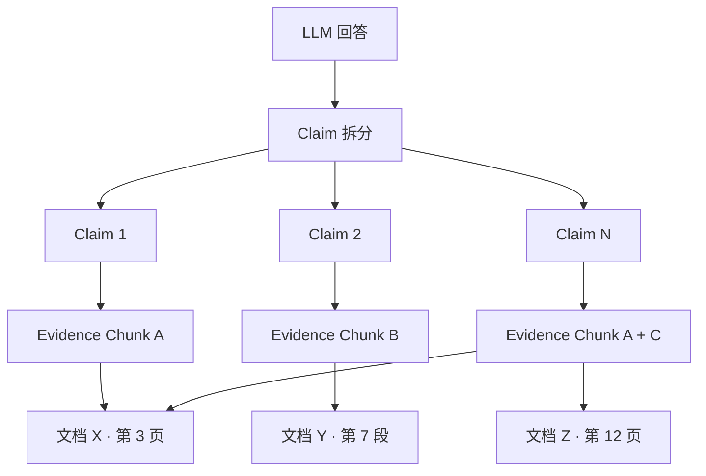

# 证据与可解释性

MimirQ 提供完整的证据溯源链路，将 LLM 生成的每一个论断关联到检索到的原始文档片段，实现答案可验证、可审计。

## Evidence Capsule 概念

Evidence Capsule 是 MimirQ 的证据封装单元，将答案中的每个 claim 与其支撑证据绑定：

## 溯源链路

证据溯源建立了从答案到原始文档的完整链路：

| 层级 | 内容 | 标识 |
|------|------|------|
| **Answer** | LLM 生成的完整回答 | `message_id` |
| **Claim** | 原子级论断（由 `split_into_claims()` 拆分） | claim index |
| **Chunk** | 支撑该 claim 的文档片段 | `chunk_id` |
| **Document** | 原始文档 | `document_id` |
| **Position** | 页码 / 段落 / 字符偏移 | metadata |

:::info 确定性映射
`build_claim_evidence_map()` 采用纯确定性算法（无 LLM 调用），通过 token 级匹配将每个 claim 关联到最佳支撑 chunk，保证生产环境下的稳定性和性能。
:::

## 引用标注

引擎支持两种引用呈现方式：

- **Inline Citation** — `render_sentence_citations_inline()` 在句末插入 `[1][2]` 标记
- **Markdown Citation** — `render_sentence_citations_markdown()` 生成 Markdown 格式脚注

`build_citations_from_docs()` 从检索结果构建结构化引用对象，包含文档标题、页码、分数等元数据。

## 置信度与忠实度

| 指标 | 计算方式 | 说明 |
|------|----------|------|
| **Confidence Score** | `compute_confidence_score()` | 综合检索分数与匹配度 |
| **Faithfulness Score** | `compute_faithfulness_score()` | 答案对检索内容的忠实程度 |
| **Claim Verification** | `verify_claim_with_fallback()` | 逐 claim 验证是否有证据支撑 |

:::warning 无法回答检测
当证据不足时，引擎输出 "Unable to answer" 并通过 `build_abstain_followup()` 生成引导性追问，而非编造回答。
:::

## API 端点

| 方法 | 路径 | 说明 |
|------|------|------|
| GET | `/api/v1/messages/{id}/citations` | 消息引用详情 |
| GET | `/api/v1/messages/{id}/evidence` | 证据映射 |
| GET | `/api/v1/chunks/{id}` | Chunk 原文 |
| GET | `/api/v1/documents/{id}/highlight` | 文档高亮定位 |

## 导出格式

- **JSON** — 完整的 claim-evidence 映射结构，含 chunk 原文、分数、位置信息
- **高亮 PDF** — 在原始 PDF 上标注被引用的段落位置（需前端 PDF Viewer 支持）

## 关键源码

| 文件 | 职责 |
|------|------|
| `app/rag/core/claim_evidence.py` | Claim → Evidence 确定性映射 |
| `app/rag/core/citations.py` | 引用构建 |
| `app/rag/core/sentence_citations.py` | 句级引用标注 |
| `app/rag/core/confidence.py` | 置信度计算 |
| `app/rag/core/faithfulness.py` | 忠实度评分 |
| `app/rag/core/text.py` | Claim 拆分与验证 |

---

**相关链接：**[对话与模板](./chat.md) · [评测与反馈](./evaluations.md) · [检索与 RAG](./retrieval.md)
