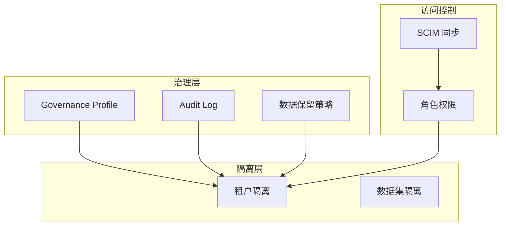

# 治理与合规

MimirQ 提供多层次的数据治理能力，涵盖租户隔离、审计日志、合规策略管理，满足企业级安全与合规要求。

## 治理模型概述

## Governance Profile

Governance Profile 是声明式的"治理脚本"，用于定义管线配置补丁和文本清洗规则：

| 字段 | 类型 | 说明 |
|------|------|------|
| `key` | string | 稳定标识符，用于自动化引用 |
| `name` | string | 显示名称 |
| `is_system` | boolean | 是否为系统内置 Profile |
| `payload` | JSON | 包含 pipeline_patch / regex_rules / input_formats |

:::info 声明式安全
Governance Profile 仅存储配置数据，不包含可执行代码，确保策略变更不会引入安全风险。
:::

## 隔离策略

### 租户级隔离

所有核心数据表（文档、chunks、KG 实体、对话、评测）均包含 `tenant_id` 列，SQL 查询自动注入租户过滤条件。

### 数据集级隔离

在租户内部，数据集（Dataset）作为第二层隔离边界：
- 文档归属于特定数据集
- 检索范围可限定到指定数据集
- 权限可按数据集粒度分配

## 审计日志

`AuditLog` 模型采用 append-only 设计，记录所有关键操作：

| 字段 | 说明 |
|------|------|
| `actor_id` | 操作人 ID |
| `action` | 操作类型（如 `document.upload`、`chat.query`） |
| `resource_type` | 资源类型（document / dataset / conversation） |
| `resource_id` | 资源 ID |
| `request_id` | 请求追踪 ID |
| `ip` / `user_agent` | 客户端信息 |
| `details` | 操作详情（JSONB） |

:::warning PII 最小化
审计日志默认不存储用户问题原文和文档内容，`details` 字段应避免包含 PII 数据，除非合规要求明确需要。
:::

## 合规配置

### 数据保留策略

| 策略 | 说明 |
|------|------|
| 对话保留期 | 超期对话自动归档或删除 |
| 审计日志保留 | 审计记录保留时长（建议 >= 1 年） |
| 文档版本清理 | 旧版本管线产物定期清理 |

### GDPR 支持

- **数据导出** — 支持按租户/用户导出全部关联数据
- **数据删除** — 级联删除用户相关的对话、评测、审计记录
- **PII 脱敏** — `pii_redaction` 模块可在 RAG 响应中自动脱敏

## API 端点

| 方法 | 路径 | 说明 |
|------|------|------|
| GET | `/api/v1/governance/profiles` | 治理 Profile 列表 |
| POST | `/api/v1/governance/profiles` | 创建 Profile |
| PUT | `/api/v1/governance/profiles/{id}` | 更新 Profile |
| GET | `/api/v1/audit/logs` | 查询审计日志 |
| POST | `/api/v1/audit/export` | 导出审计日志 |

## 关键源码

| 文件 | 职责 |
|------|------|
| `app/models/governance_profile.py` | Governance Profile 模型 |
| `app/models/audit_log.py` | 审计日志模型 |
| `app/api/v1/governance.py` | 治理 API 路由 |
| `app/api/v1/audit.py` | 审计 API 路由 |
| `app/services/governance_profiles.py` | 治理服务层 |

---

**相关链接：**[平台与账号](./platform.md) · [评测与反馈](./evaluations.md)
