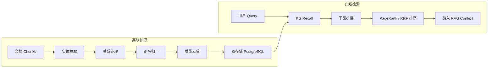
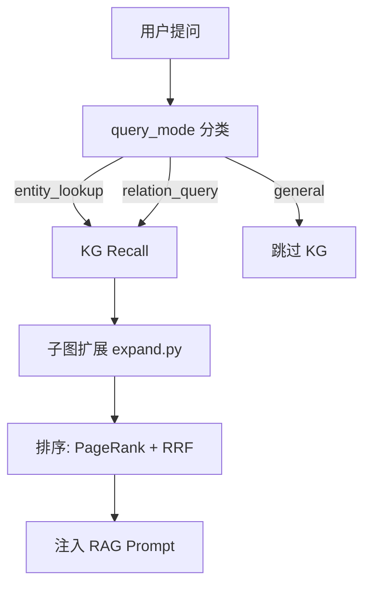

# 知识图谱

MimirQ 内置完整的知识图谱（KG）管线，从文档中抽取实体与关系，构建结构化知识网络，在 RAG 检索时提供图谱增强召回。

## KG 管线架构

## 数据模型

KG 使用 PostgreSQL 存储，核心表结构：

| 模型 | 表名 | 说明 |
|------|------|------|
| `KgEntity` | `kg_entities` | 实体（name, type, description, vector） |
| `KgSourceEvent` | `kg_source_events` | 事件/事实（从 chunk 中抽取） |
| `KgEventEntity` | `kg_event_entities` | 事件-实体关联（角色标注） |
| `KgRelation` | — | 实体间关系（隐含于 Event-Entity 连接） |

每个实体包含 `normalized_name` 用于去重与别名合并，`vector` 字段存储 embedding 向量供语义召回使用。

:::info 多租户隔离
所有 KG 表均包含 `tenant_id` 列并建有索引，确保租户间数据完全隔离。
:::

## 抽取管线

抽取由 `app/rag/kg/extraction/` 下的模块完成：

| 模块 | 职责 |
|------|------|
| `extractor.py` | LLM 驱动的实体/关系抽取 |
| `gliner_extractor.py` | GLiNER 模型轻量抽取 |
| `hybrid_extractor.py` | LLM + GLiNER 混合策略 |
| `entity_verifier.py` | 实体验证与去重 |
| `relation_processor.py` | 关系后处理 |
| `alias.py` | 别名归一化 |

抽取完成后，`loading/processor.py` 负责将结果批量写入数据库。

## KG 增强 RAG

:::tip 查询模式分类
`classify_kg_query_mode()` 自动判断问题是否需要 KG 辅助，避免对简单问题引入不必要的图谱查询延迟。
:::

## 质量保障

`app/rag/kg/quality/` 提供两个质量模块：

- **KG Completeness Scorer** — 评估图谱覆盖率
- **KG Denoiser** — 去除低质量实体和噪声关系

## 配置参数

| 参数 | 默认值 | 说明 |
|------|--------|------|
| `KG_ENABLED` | `false` | 全局开关 |
| `KG_EXTRACTION_BACKEND` | `llm` | 抽取后端（llm / gliner / hybrid） |
| `KG_SEARCH_CACHE_TTL` | `300` | 搜索缓存 TTL（秒） |
| `KG_EXPAND_HOPS` | `1` | 子图扩展跳数 |
| `KG_RECALL_TOP_K` | `10` | 召回实体数量 |

## API 端点

| 方法 | 路径 | 说明 |
|------|------|------|
| GET | `/api/v1/kg/entities` | 实体列表 |
| GET | `/api/v1/kg/entities/{id}` | 实体详情 |
| POST | `/api/v1/kg/search` | 图谱搜索 |
| POST | `/api/v1/kg/extract` | 触发抽取任务 |

## 关键源码

| 文件 | 职责 |
|------|------|
| `app/rag/kg/pipeline.py` | KG Facade 入口 |
| `app/rag/kg/engine/` | KGEngine 核心 |
| `app/rag/kg/search/searcher.py` | 图谱搜索主逻辑 |
| `app/rag/kg/search/ranking/` | PageRank + RRF 排序 |
| `app/rag/kg/models.py` | SQLAlchemy 数据模型 |

---

**相关链接：**[检索与 RAG](./retrieval.md) · [对话与模板](./chat.md) · [解析与切块](./parsing.md)
