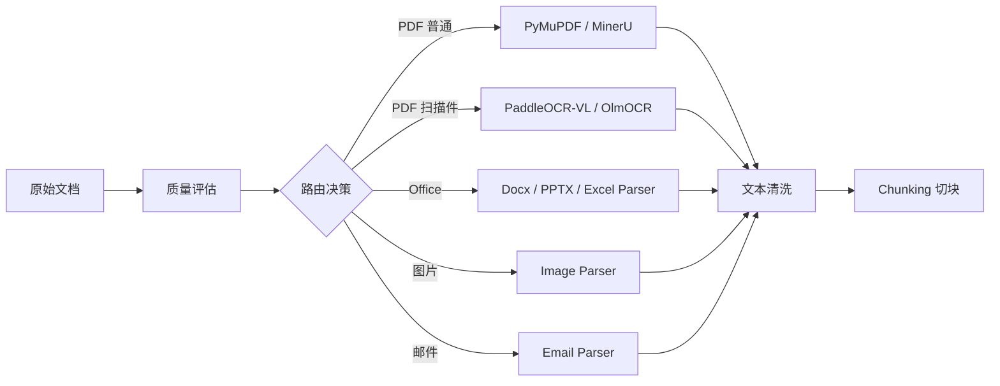

# 解析与切块

MimirQ 内置多引擎解析框架，支持 10+ 种解析后端，覆盖 PDF、Office、图片、邮件等文档类型。解析后的文本交由 chunking 模块进行智能切块。

## 解析流程

## 解析后端对比

| 引擎 | 适用类型 | 优点 | 缺点 |
|------|----------|------|------|
| **MinerU** | PDF（含公式/表格） | 公式识别精准、表格结构保留 | 资源消耗较高 |
| **ETL4LLM** | PDF 通用 | 轻量快速、兼容性好 | 复杂排版效果一般 |
| **Marker** | PDF → Markdown | 输出 Markdown 格式、表格友好 | 依赖 GPU |
| **PaddleOCR-VL** | 扫描件/图片 PDF | 中文 OCR 精度高 | 延迟较高 |
| **OlmOCR** | 扫描件 PDF | 多模态 OCR、版面理解 | 需外部服务 |
| **Docling** | PDF/Office | IBM 开源，多格式支持 | 社区较小 |
| **DeepDoc** | PDF | 深度文档理解 | 配置复杂 |
| **GLM-OCR** | 中文扫描件 | 智谱 GLM 驱动 | 依赖 API |
| **千帆 OCR** | 扫描件 | 百度千帆服务 | 依赖 API |
| **Pandoc** | Markdown/HTML/RST | 格式转换能力强 | 仅文本格式 |

:::tip 自动路由
`routing.py` 根据文件类型、PDF 质量评分自动选择最佳解析后端；`quality/` 模块提供 PDF 质量评估（扫描件检测、OCR 必要性判断）。
:::

## 文档类型选型指南

| 文档类型 | 推荐引擎 | 备选方案 |
|----------|----------|----------|
| 数字 PDF（文字可选） | MinerU / ETL4LLM | Marker |
| 扫描件 PDF | PaddleOCR-VL | OlmOCR / GLM-OCR |
| Word (.docx) | Docx Parser | MarkItDown |
| PowerPoint (.pptx) | PPTX Parser | MarkItDown |
| Excel (.xlsx) | Excel Parser | — |
| 图片 | Image Parser | PaddleOCR-VL |
| 邮件 (.eml) | Email Parser | — |
| Markdown / HTML | Pandoc | Text Parser |

## 质量评估

解析前，`quality/` 模块对 PDF 进行质量评分：

- **文字密度检测** — 判断是否为扫描件
- **OCR 必要性评估** — 决定是否启用 OCR 引擎
- **风险等级** — high / medium / low，可配置自动重入队

:::warning 风险自动重入队
配置 `RETRIEVAL_PARSE_RISK_AUTO_ENQUEUE_LEVELS` 可设定哪些风险等级的文档自动用更高质量引擎重新解析（默认 `high,medium`）。
:::

## 解析配置

| 参数 | 说明 |
|------|------|
| `PARSING_BACKEND` | 默认解析后端 |
| `PARSING_FALLBACK_BACKEND` | 降级后端 |
| `PDF_QUALITY_THRESHOLD` | 质量评分阈值 |
| `PARSING_MAX_WORKERS` | 并行 worker 数 |
| `PARSING_TIMEOUT` | 单文档超时（秒） |

## 关键源码

| 文件 | 职责 |
|------|------|
| `app/parsing/factory.py` | 解析器工厂 |
| `app/parsing/routing.py` | 自动路由决策 |
| `app/parsing/quality/` | PDF 质量评估 |
| `app/parsing/processors/` | 解析工作流编排 |
| `app/parsing/parsers/` | 各引擎实现 |

---

**相关链接：**[检索与 RAG](./retrieval.md) · [平台与账号](./platform.md)
