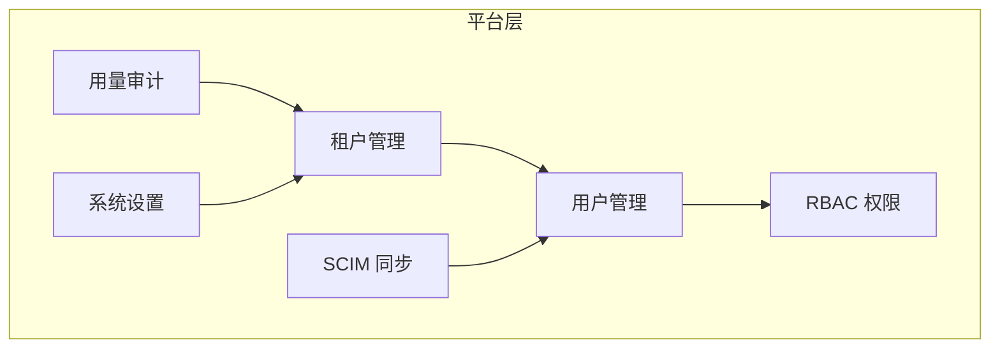

# 平台与账号

MimirQ 提供完整的多租户平台能力，包括租户管理、用户角色权限（RBAC）、SCIM 自动同步和用量审计。

## 平台功能概览

## 租户管理模型

MimirQ 采用单库多租户架构，所有数据表通过 `tenant_id` 列实现逻辑隔离：

| 概念 | 说明 |
|------|------|
| **Tenant** | 顶层组织单元，拥有独立数据空间 |
| **Tenant Group** | 租户分组，用于批量管理与策略继承 |
| **Default Tenant** | 系统默认租户（单租户部署场景） |

:::info 单租户模式
小型部署可使用 `DEFAULT_TENANT_ID` 配置单租户模式，所有数据归属同一租户，简化运维。
:::

## 用户与 RBAC

### 角色定义

| 角色 | 说明 | 典型权限 |
|------|------|----------|
| `owner` | 租户所有者 | 全部权限 + 租户配置 |
| `admin` | 管理员 | 用户管理 + 数据集管理 + 系统设置 |
| `auditor` | 审计员 | 只读 + 审计日志查看 |
| `editor` | 编辑者 | 文档上传/编辑 + 对话 |
| `dataset_operator` | 数据集操作员 | 数据集 CRUD + 文档管理 |
| `viewer` | 查看者 | 只读访问 |

### 权限矩阵

| 操作 | owner | admin | auditor | editor | dataset_operator | viewer |
|------|-------|-------|---------|--------|------------------|--------|
| 租户设置 | Y | — | — | — | — | — |
| 用户管理 | Y | Y | — | — | — | — |
| 数据集管理 | Y | Y | — | — | Y | — |
| 文档上传 | Y | Y | — | Y | Y | — |
| 对话 | Y | Y | — | Y | — | Y |
| 审计日志 | Y | Y | Y | — | — | — |
| 查看内容 | Y | Y | Y | Y | Y | Y |

:::tip 角色校验
角色值在 API 层通过 `field_validator` 自动 normalize（小写化 + trim），无效角色将被拒绝。
:::

## SCIM 同步

MimirQ 实现 SCIM 2.0 协议端点，支持与企业 IdP（如 Azure AD、Okta）自动同步用户和组：

| 端点 | 说明 |
|------|------|
| `/scim/v2/Users` | 用户 CRUD |
| `/scim/v2/Groups` | 组 CRUD |
| `/scim/v2/ServiceProviderConfig` | 能力声明 |

:::warning SCIM Token 安全
SCIM 端点使用独立的 Bearer Token 认证，务必通过环境变量配置并定期轮换。
:::

## 系统设置

平台级配置通过 `app/core/config.py` 集中管理（800+ 配置项），关键分类：

| 分类 | 示例参数 |
|------|----------|
| 安全 | `SECRET_KEY`, `JWT_ALGORITHM`, `CORS_ORIGINS` |
| LLM / Embedding | `LLM_PROVIDER`, `LLM_MODEL`, `EMBEDDING_MODEL` |
| 存储 | `MILVUS_URI`, `POSTGRES_DSN`, `REDIS_URL` |

## API 端点索引

| 方法 | 路径 | 说明 |
|------|------|------|
| GET | `/api/v1/tenants` | 租户列表 |
| POST | `/api/v1/tenants` | 创建租户 |
| GET | `/api/v1/tenants/{id}/members` | 成员列表 |
| PUT | `/api/v1/tenants/{id}/members/{uid}` | 更新成员角色 |
| GET | `/api/v1/rbac/roles` | 角色定义 |
| GET | `/api/v1/settings` | 系统设置 |

## 关键源码

| 文件 | 职责 |
|------|------|
| `app/models/tenant.py` | 租户数据模型 |
| `app/models/tenant_group.py` | 租户分组模型 |
| `app/api/schemas/rbac.py` | RBAC Schema |
| `app/api/v1/rbac.py` | RBAC API 路由 |
| `app/api/v1/scim.py` | SCIM 端点 |
| `app/core/config.py` | 集中配置（800+ 项） |

---

**相关链接：**[治理与合规](./governance.md) · [解析与切块](./parsing.md)
