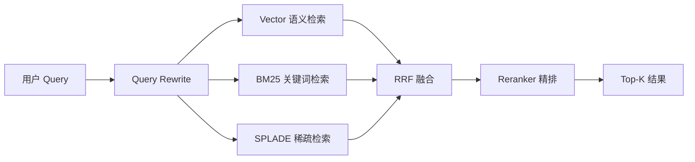

# 检索与 RAG

MimirQ 采用多路混合检索架构，将 Vector、BM25、SPLADE 三路召回并行执行后通过 RRF 融合，再经 ColBERT/Reranker 精排，实现高召回率与高精度的平衡。

## 混合检索架构

:::note
默认混合检索为 **Vector + BM25 + RRF 融合**。SPLADE 稀疏检索默认关闭（`SPARSE_RETRIEVAL_ENABLED=false`），ColBERT 为可选精排后端，二者均需显式启用。
:::

## 检索方式对比

| 检索方式 | 召回率 | 精度 | 延迟 | 适用场景 |
|----------|--------|------|------|----------|
| Vector（Dense） | 高 | 中 | 低 | 语义相似度匹配 |
| BM25（Lexical） | 中 | 高 | 极低 | 精确关键词/术语匹配 |
| SPLADE（Sparse，**默认关闭**） | 高 | 高 | 中 | 稀疏语义+词汇混合；需设 `SPARSE_RETRIEVAL_ENABLED=true` 启用 |
| ColBERT ANN（可选） | — | 极高 | 中 | 精排阶段；deterministic 实现，HF provider 可选 |

:::tip 检索模式自动选择
`guess_retrieval_mode()` 根据 query 特征自动选择最优检索模式；`retrieval_profiles` 提供预设配置（如 `recall_first` 偏召回率优先）。
:::

## RRF 融合

Reciprocal Rank Fusion 将多路排序结果合并为统一分数：

`RRF(d) = Σ 1 / (k + rank_r(d))`

其中 `k` 为平滑常数（默认 60）。各路检索结果按 RRF 分数降序排列后送入 Reranker。

## 加权混合

`HybridSearchOptions` 支持加权融合模式：

| 参数 | 默认值 | 说明 |
|------|--------|------|
| `alpha` | `0.5` | Vector vs Keyword 混合比 |
| `vector_weight` | `0.6` | Vector 路权重 |
| `keyword_weight` | `0.4` | BM25 路权重 |
| `enable_weight_rerank` | `true` | 是否启用加权重排 |

## 重排策略

精排支持多种 Reranker 后端：

- **Cross-Encoder** — 高精度，延迟较高
- **ColBERT ANN** — 近似最近邻，精度与速度兼顾
- **MMR（Maximal Marginal Relevance）** — 兼顾相关性与多样性

:::warning MMR 参数
`mmr_lambda` 控制相关性与多样性的权衡（默认 0.7），`mmr_fetch_k_multiplier` 控制 MMR 候选池倍率（默认 4x）。
:::

## 核心配置参数

| 参数 | 默认值 | 说明 |
|------|--------|------|
| `top_k` | `5` | 最终返回文档数 |
| `score_threshold` | `0.7` | 最低分数阈值 |
| `retrieval_mode` | `hybrid` | 检索模式（vector / keyword / hybrid） |
| `SPARSE_PROVIDER` | `deterministic` | 稀疏检索后端（deterministic / splade） |
| `RETRIEVAL_CONTRACT_MODE` | `""` | 检索合约（evidence_strict / audit_trace 等） |

## 检索合约模式

| 模式 | 说明 |
|------|------|
| `deterministic_recall` | 确定性召回，结果可复现 |
| `must_recall_strict` | 必须召回相关文档，否则报错 |
| `evidence_strict` | 严格证据链要求 |
| `audit_trace` | 审计追踪模式 |

## 关键源码

| 文件 | 职责 |
|------|------|
| `app/rag/retriever.py` | HybridRetriever 主逻辑 |
| `app/rag/retrieval/orchestrator.py` | 检索编排器（~3800+ 行） |
| `app/rag/retrieval/sparse.py` | SPLADE 稀疏检索 |
| `app/rag/retrieval/colbert_ann.py` | ColBERT ANN 索引 |
| `app/rag/reranker/factory.py` | Reranker 工厂 |
| `app/rag/core/retrieval_profiles.py` | 检索 Profile 预设 |

---

**相关链接：**[对话与模板](./chat.md) · [知识图谱](./kg.md) · [证据与可解释性](./evidence.md)
