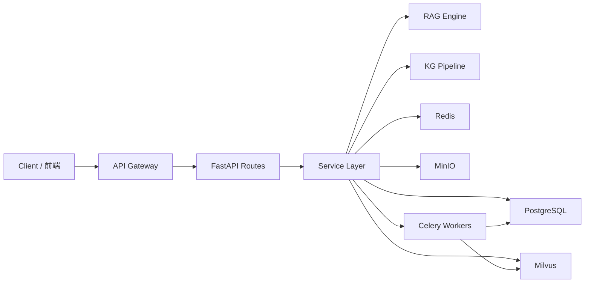

# 后端手册总览

本手册面向 **后端开发者、架构师与联调工程师**，帮助你快速理解 MimirQ 后端的模块边界、API 契约与内部流转。阅读时请以 [OpenAPI / Redoc](https://skygazer42.github.io/MimirQ/) 为权威 Schema 参考，本手册侧重 **导航索引、状态机说明与排障指引**。

## 技术栈

| 层级 | 技术 | 版本 / 说明 |
| --- | --- | --- |
| Web 框架 | FastAPI | 0.135 |
| ORM | SQLAlchemy | 2.0 (async) |
| 向量数据库 | Milvus | 2.x（BM25 + SPLADE + ColBERT ANN 混合检索） |
| 关系数据库 | PostgreSQL | 主存储 |
| 缓存 / 队列 | Redis | Session、限流与 Pub/Sub |
| 任务队列 | Celery | 异步解析、索引、评测任务 |
| 对象存储 | MinIO / S3 兼容 | 文档原始文件 |

## 系统架构

## 模块地图

| 业务域 | 概述 | API 索引 | 状态机 / 排障 |
| --- | --- | --- | --- |
| 数据集 Datasets | [概述](./datasets/overview) | [API 索引](./datasets/api-index) | [状态与任务](./datasets/state-jobs) / [排障](./datasets/troubleshooting) |
| 文档 Documents | [概述](./documents/overview) | [API 索引](./documents/api-index) | [状态与任务](./documents/state-jobs) / [排障](./documents/troubleshooting) |
| 对话 Chat | [Chat 模块](./more/chat) | — | — |
| 检索 Retrieval | [Retrieval 模块](./more/retrieval) | — | — |
| 知识图谱 KG | [KG 模块](./more/kg) | — | — |
| 评测 Evaluations | [评测模块](./more/evaluations) | — | — |
| 治理 Governance | [治理模块](./more/governance) | — | — |
| 解析 Parsing | [解析模块](./more/parsing) | — | — |
| 溯源 Evidence | [Evidence 模块](./more/evidence) | — | — |
| 平台 Platform | [平台模块](./more/platform) | — | — |

## 建议阅读顺序

:::tip 阅读路线
1. **本页** -- 建立全局视图
2. **数据集** -- [概述](./datasets/overview) → [API 索引](./datasets/api-index) → [Schema](./datasets/schemas) → [状态与任务](./datasets/state-jobs)
3. **文档** -- [概述](./documents/overview) → [Pipeline](./documents/pipeline) → [状态与任务](./documents/state-jobs)
4. **检索与 RAG** -- [Retrieval](./more/retrieval) → [KG](./more/kg) → [Chat](./more/chat)
5. **治理与评测** -- [Governance](./more/governance) → [Evaluations](./more/evaluations)
6. **联调排障** -- 各域 `troubleshooting` 页 + [集成总览](../integration/welcome)
:::

## Embedding 与模型支持

后端内置多种 Embedding 模型，Provider 适配层覆盖 **OpenAI / Ollama / DashScope / Local** 等真实实现（Voyage / Cohere / Jina / Bedrock 目前为占位适配，复用 OpenAI 兼容协议，无原厂特性）。仓库随 `.env.example` 发布的默认模型是 `BAAI/bge-m3`；如果你没有显式设置 `EMBEDDING_MODEL`，后端代码仍保留 `text-embedding-3-small` 作为回退值。生产和团队环境应以 `.env.example` / 部署配置为准，不要依赖进程内默认值。RAG Engine 默认 **Vector + BM25 + RRF** 混合检索，SPLADE / ColBERT ANN 为可选后端（需显式启用）。

## 关键配置与文件路径

| 文件 | 用途 |
| --- | --- |
| `app/core/config.py` | 1200+ 配置项，pydantic-settings 驱动 |
| `alembic.ini` / `alembic/` | 数据库迁移 |
| `docker-compose.yml` | 本地开发环境编排 |
| `app/rag/engine.py` | RAGEngine 主流程（streaming） |
| `app/rag/retriever.py` | HybridRetriever 混合检索 |
| `app/rag/pipelines/langgraph.py` | LangGraph Functional API 管线 |
| `app/rag/kg/` | 知识图谱抽取 / 召回 / 扩展 / 重排 |

:::info 配置优先级
环境变量 > `.env` 文件 > `config.py` 默认值。生产部署时建议通过环境变量注入敏感配置。
:::

## 相关链接

- [OpenAPI / Redoc](https://skygazer42.github.io/MimirQ/)
- [前端视角总览](../frontend/welcome)
- [集成与联调总览](../integration/welcome)
- [运维总览](../ops/welcome)
