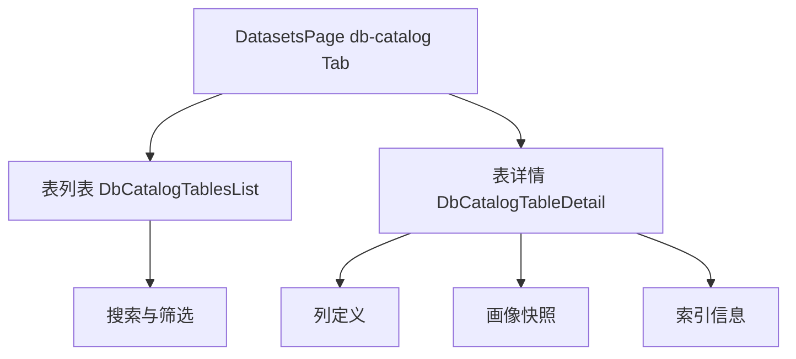
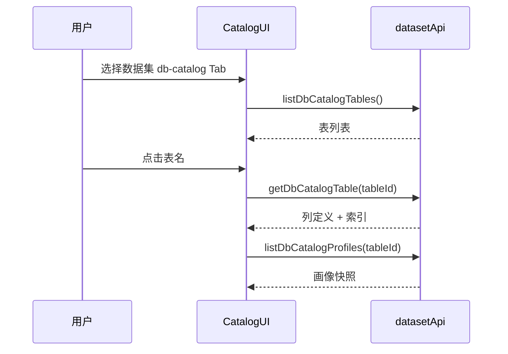

# 数据集 — DB Catalog 界面

## 功能概述

DB Catalog 页面展示数据集中的结构化表资产，支持浏览表结构、列信息和数据画像快照。

## 组件结构

## 关键交互

| 操作 | API 调用 | 说明 |
|------|----------|------|
| 浏览表列表 | `datasetApi.listDbCatalogTables()` | 分页表资产列表 |
| 查看表详情 | `datasetApi.getDbCatalogTable()` | 列定义、索引等 |
| 画像快照 | `datasetApi.listDbCatalogProfiles()` | 历史画像快照 |

## 表信息展示

表详情页以表格形式展示：
- **列定义**: 列名、类型、是否可空、默认值
- **索引**: 索引名称、列组合、唯一性
- **画像统计**: 空值率、基数、最大/最小值等

## 数据流

:::info
DB Catalog 功能依赖后端连接器采集元数据。如果数据集未配置数据库连接器，该 Tab 不显示内容。
:::

:::tip
表列表支持按表名搜索，输入关键词后实时过滤。列定义表格支持按列名排序。
:::

## 相关链接

- [web/lib/api 模块](./api-client) — Catalog API 方法
- [表 / TAG 界面](./tables-ui) — SQL 查询界面
