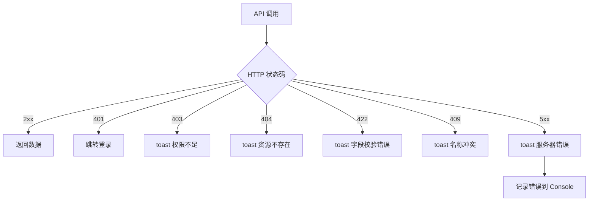

# 数据集 — 错误处理

## 错误层次

前端错误处理分为三个层次：

| 层次 | 机制 | 文件 |
|------|------|------|
| **路由级** | Next.js Error Boundary | `app/datasets/error.tsx` |
| **API 级** | `buildFetchError` → `ApiError` | `lib/fetch-errors.ts` |
| **用户通知** | Sonner toast | 各组件内 `toast.error()` |

## API 错误处理流程

## 常见错误码

| HTTP 状态 | 前端表现 | 用户提示 |
|-----------|----------|----------|
| `401 Unauthorized` | 重定向到登录页 | — |
| `403 Forbidden` | Toast 警告 | "权限不足，请联系管理员" |
| `404 Not Found` | Toast 错误 | "数据集不存在或已删除" |
| `409 Conflict` | Toast 错误 | "名称冲突，请重试" |
| `422 Validation` | Toast + 字段高亮 | 显示后端返回的 `detail` |
| `429 Rate Limit` | Toast 警告 | "请求过于频繁，请稍后重试" |
| `500+` | Toast 错误 | "服务端异常，请稍后重试" |

:::warning
未知错误码会显示通用 "操作失败" 消息。调试时打开浏览器 Network 面板查看完整响应体。
:::

## Error Boundary 行为

路由级 Error Boundary 捕获渲染阶段的未处理异常：
- 显示 fallback UI（含"重试"按钮）
- 调用 `router.refresh()` 重新加载页面数据
- 错误信息输出到 Console 便于开发者排查

:::tip
开发时可在 `error.tsx` 中临时添加 `console.error(error)` 查看完整堆栈。生产环境建议接入错误监控服务（如 Sentry）。
:::

## 相关链接

- [排障](./troubleshooting) — 常见问题排查
- [后端 · 数据集测试](../../backend/datasets/testing.md) — 后端错误场景
