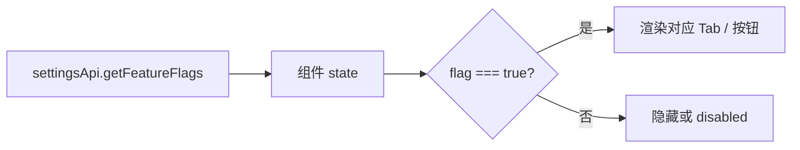

# 数据集 — 功能开关

## Feature Flag 来源

功能开关通过 `settingsApi.getFeatureFlags()` 从后端获取，返回 `FeatureFlags` 对象。

| Flag | 类型 | 控制区域 |
|------|------|----------|
| `kg_enabled` | boolean | KG Tab 显隐、KG 抽取按钮 |
| `deepdoc_enabled` | boolean | DeepDoc 解析器选项 |
| `docling_enabled` | boolean | Docling 解析器选项 |
| `etl4llm_enabled` | boolean | ETL4LLM 解析器选项 |
| `marker_enabled` | boolean | Marker 解析器选项 |
| `paddle_vl_enabled` | boolean | PaddleVL 解析器选项 |
| `markitdown_enabled` | boolean | MarkItDown 解析器选项 |
| `llama_index_enabled` | boolean | LlamaIndex 相关功能 |
| `mineru_enabled` | boolean | MinerU 解析器选项 |
| `magicpdf_enabled` | boolean | MagicPDF 解析器选项 |

## 前端消费模式



:::info
Feature flag 在组件挂载时获取一次，不会实时更新。修改后端配置后需刷新页面。
:::

## 条件渲染示例

```typescript
// 数据集详情页根据 flag 决定 Tab 显隐
const tabs = [
  { key: 'overview', label: '概览' },
  featureFlags.kg_enabled && { key: 'kg', label: 'KG' },
].filter(Boolean);

// 解析器选择下拉框过滤可用选项
const parsers = allParsers.filter(
  (p) => featureFlags[`${p.key}_enabled`] !== false
);
```

## RBAC 与 Flag 叠加

部分功能同时受 RBAC 角色和 Feature Flag 控制。仅当两者都通过时才显示。

| 条件 | Feature Flag | RBAC | 结果 |
|------|-------------|------|------|
| 全部满足 | `true` | 有权限 | 显示 |
| Flag 关闭 | `false` | 有权限 | 隐藏 |
| 无权限 | `true` | 无权限 | 隐藏 |

:::warning
新增 Feature Flag 后需确保前端有对应的条件渲染逻辑，否则该 flag 不会影响 UI 展示。
:::

## 相关链接

- [用户路径与入口](./overview) — 路由表
- [后端 · 平台配置](../../backend/more/platform.md) — Feature Flag 后端配置
