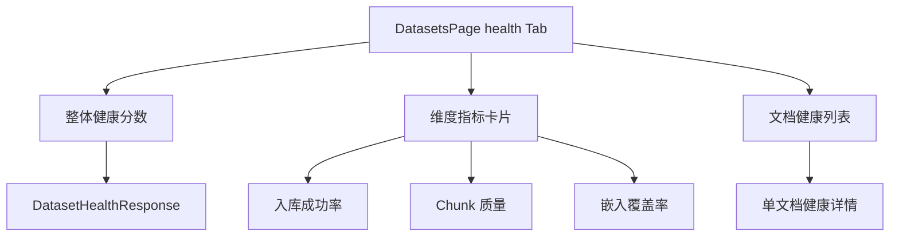

# 数据集 — 健康度界面

## 功能概述

健康度 (Health) 仪表盘展示数据集整体质量状况，包括文档健康卡片、入库统计、异常指标告警等。

## 组件结构

## 关键交互

| 操作 | API 调用 | 说明 |
|------|----------|------|
| 获取健康度 | `datasetApi.getHealth()` | 数据集级健康摘要 |
| 入库统计 | `datasetApi.getIngestionStats()` | 入库数量与成功率 |
| 文档健康卡片 | `documentApi.health()` | 单文档级健康信息 |

## 阈值颜色映射

| 分数区间 | 颜色 | 含义 | 建议操作 |
|----------|------|------|----------|
| 80-100 | 绿色 | 健康 | 无需操作 |
| 60-79 | 黄色 | 需关注 | 检查问题文档 |
| 0-59 | 红色 | 异常 | 立即排查入库错误 |

## 指标维度说明

| 维度 | 计算方式 | 说明 |
|------|----------|------|
| 入库成功率 | 成功文档 / 总文档 | 文档入库完成比例 |
| Chunk 质量 | 有效 chunk / 总 chunk | 非空且长度合理的分块占比 |
| 嵌入覆盖率 | 已嵌入 chunk / 总 chunk | 向量嵌入完成比例 |

:::warning
健康度分数依赖文档已完成入库。新建数据集或入库中的数据集可能显示为 "暂无数据"。
:::

:::tip
点击维度指标卡片可跳转到对应的详情列表，快速定位问题文档。
:::

## 相关链接

- [web/lib/api 模块](./api-client) — 健康 API
- [后端 · 数据集健康](../../backend/datasets/health.md) — 后端健康检查逻辑
