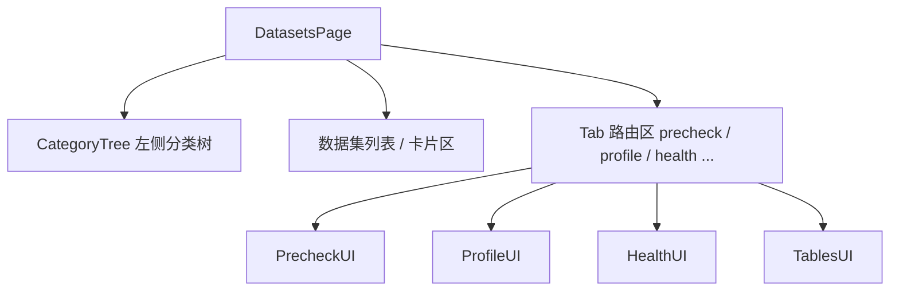
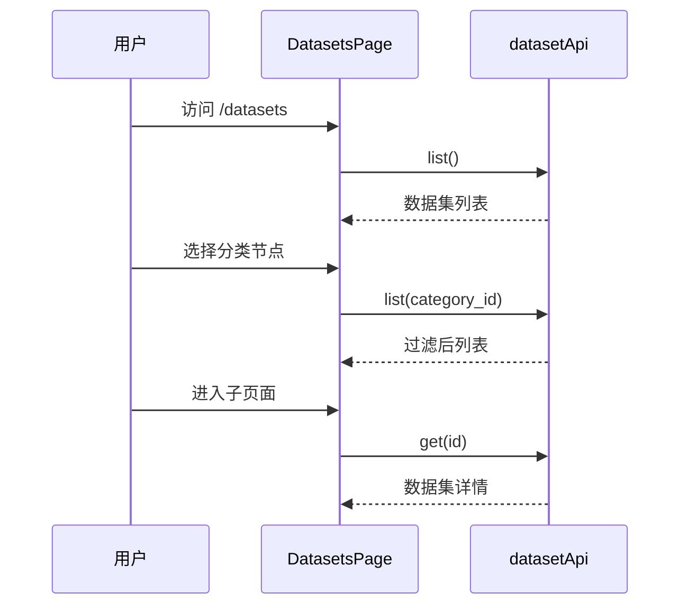

# 数据集 — 用户路径与入口

## 路由表

Next.js App Router 布局，`[id]` 为数据集 UUID。

| 路由 | 页面文件 | 核心组件 | 功能 |
|------|----------|----------|------|
| `/datasets` | `app/datasets/page.tsx` | `DatasetsPage` | 数据集列表、分类筛选、CRUD |
| `/datasets/[id]/precheck` | `app/datasets/[id]/precheck/page.tsx` | `DatasetsPage`(预检 Tab) | 入库前质量预检 |
| `/datasets/[id]/profile` | `app/datasets/[id]/profile/page.tsx` | `DatasetsPage`(画像 Tab) | 数据画像与扫描 |
| `/datasets/[id]/health` | `app/datasets/[id]/health/page.tsx` | `DatasetsPage`(健康 Tab) | 健康度仪表盘 |
| `/datasets/[id]/db-catalog` | `app/datasets/[id]/db-catalog/page.tsx` | `DatasetsPage`(Catalog Tab) | DB Catalog 浏览 |
| `/datasets/[id]/tables` | `app/datasets/[id]/tables/page.tsx` | `DatasetsPage`(表 Tab) | 表查询 / TAG |
| `/datasets/[id]/ingestion` | `app/datasets/[id]/ingestion/page.tsx` | `DatasetsPage`(入库 Tab) | 入库统计与策略 |
| `/datasets/[id]/kg` | `app/datasets/[id]/kg/page.tsx` | `DatasetKGWorkbenchPage` | KG 抽取与可视化 |
| `/datasets/[id]/evidence` | `app/datasets/[id]/evidence/page.tsx` | — | 证据工作台入口 |
| `/datasets/[id]/workflow` | `app/datasets/[id]/workflow/page.tsx` | — | 工作流管理 |

## 核心组件

:::tip
菜单可见性受 **RBAC** 和 **Feature Flag** 控制；部分 Tab 仅在后端启用对应功能时显示。
:::

## 数据流概览

1. `DatasetsPage` 在挂载时调用 `datasetApi.list()` 加载数据集列表
2. 分类树通过 `datasetApi.listTree()` 获取树结构，选中节点后用 `category_id` 过滤列表
3. 进入子页面时通过 `datasetApi.get(id)` 获取数据集详情，各 Tab 再加载对应数据

## 相关链接

- [web/lib/api 模块](./api-client) — API 调用详情
- [状态与加载](./state-ui) — 前端状态管理
- [后端 · 数据集总览](../../backend/datasets/overview.md) — 后端实现
