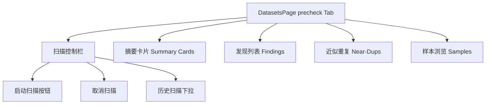
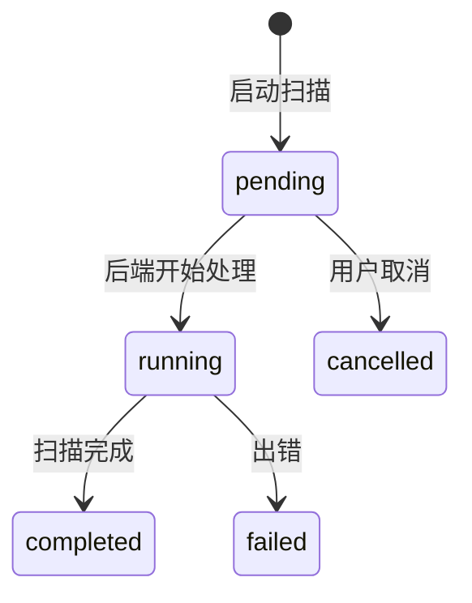

# 数据集 — 预检界面

## 功能概述

预检 (Precheck) 页面在数据正式入库前对数据集质量进行检查，发现问题并提供优化建议。

## 组件结构

## 关键交互

| 操作 | API 调用 | 说明 |
|------|----------|------|
| 启动扫描 | `datasetApi.startPrecheckScan()` | 创建 scan run |
| 实时进度 | `sseApi.streamPrecheckScanEvents()` | SSE 推送扫描事件 |
| 查看摘要 | `datasetApi.getPrecheckSummary()` | 各维度统计 |
| 查看发现 | `datasetApi.listPrecheckFinding()` | 分页发现列表 |
| 近似重复 | `datasetApi.getPrecheckNearDups()` | 近似重复文档对 |
| 差异对比 | `datasetApi.diffPrecheckScanRuns()` | 两次扫描结果对比 |
| 策略建议 | `datasetApi.suggestPrecheckIngestionPolicy()` | 根据结果推荐策略 |

:::tip
扫描过程通过 SSE (Server-Sent Events) 实时推送进度。前端使用 `streaming.ts` 中的 `readSseDataStrings` 解析事件流。
:::

## 扫描状态流转

## 状态轮询

扫描启动后前端通过 SSE 接收实时事件；SSE 断开时降级为轮询 `getPrecheckScanRun()` 获取状态。

:::warning
扫描过程中切换到其他页面不会中断后端任务，但前端 SSE 连接会断开。返回后需手动刷新或等待轮询恢复状态。
:::

## 相关链接

- [web/lib/api 模块](./api-client) — 预检相关 API
- [后端 · 数据集预检](../../backend/datasets/precheck.md) — 后端实现
