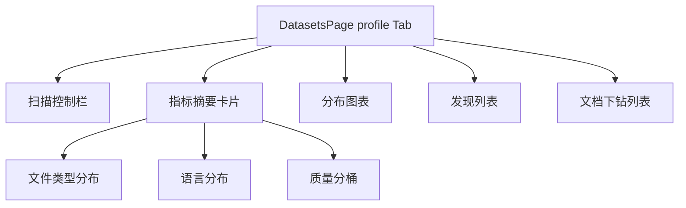
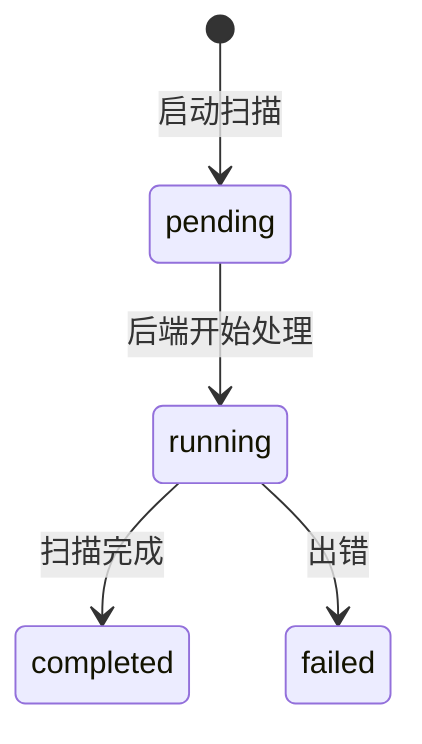

# 数据集 — 画像界面

## 功能概述

画像 (Profile) 页面对数据集内文档进行多维度统计分析，呈现文件类型分布、语言分布、质量分桶等指标。

## 组件结构

## 关键交互

| 操作 | API 调用 | 说明 |
|------|----------|------|
| 启动扫描 | `datasetApi.startProfileScan()` | 创建 profile scan run |
| 查看摘要 | `datasetApi.getProfileSummary()` | 各维度统计数据 |
| 查看发现 | `datasetApi.listProfileFinding()` | 异常与建议 |
| 文档下钻 | `datasetApi.listProfileBucketDocuments()` | 按维度下钻到文档列表 |
| 扫描历史 | `datasetApi.listProfileScanRuns()` | 历史扫描列表 |
| 导出 | `datasetApi.exportProfileSummary()` | 导出 JSON / HTML |

## 可视化

画像页使用 Recharts 渲染分布图表：
- **饼图**: 文件类型分布
- **柱状图**: 质量分桶 (quality_bucket)
- **横向条形图**: 语言分布

点击图表区域触发下钻，跳转到对应 bucket 的文档列表。

## 扫描状态与轮询

:::info
扫描是异步任务，启动后通过轮询 `getProfileScanRun()` 获取进度，直到状态变为 `completed` 或 `failed`。
:::

:::tip
导出功能支持 JSON 和 HTML 两种格式。HTML 格式可直接在浏览器中查看，适合分享给非技术人员。
:::

## 相关链接

- [web/lib/api 模块](./api-client) — 画像相关 API
- [后端 · 数据集画像](../../backend/datasets/overview.md) — 后端实现
