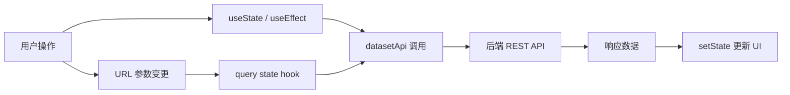
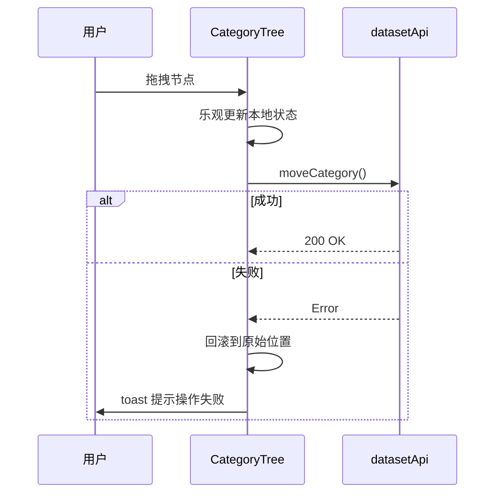

# 数据集 — 状态与加载

## 状态管理方案

当前数据集模块采用多种状态管理方式混合使用。

| 方案 | 使用场景 | 典型文件 |
|------|----------|----------|
| `useState` + `useEffect` | 大部分页面数据加载 | `datasets-page.tsx` |
| TanStack Query (`useQuery`) | 部分列表缓存 | `knowledge-page.tsx` |
| Zustand Store | 全局 UI 状态（文档查看器等） | `store/document-view.ts` |
| URL Query Params | 分页、排序、筛选持久化 | `use-knowledge-query-state.ts` |

## 加载状态处理

- **页面级**: `app/datasets/loading.tsx` 提供 Next.js Suspense boundary 骨架屏
- **组件级**: `useState` 的 `isLoading` 标志控制 Spinner / Skeleton
- **错误边界**: `app/datasets/error.tsx` 捕获渲染错误并展示 fallback UI

:::tip
目前多数 hooks 仍使用 `useEffect` + `useState` 手动 fetch，尚未全面迁移到 TanStack Query。后续优化计划中会逐步统一到 `useQuery` / `useMutation`。
:::

## 乐观更新

分类树拖拽排序采用乐观更新模式：先在本地移动节点位置，再异步调用 `datasetApi.moveCategory()`，失败时回滚到原始位置。

## 空态与分页

- 列表为空时显示引导插画与"新建数据集"按钮
- 分页通过 `skip` / `limit` 参数由组件自行管理

## 相关链接

- [web/lib/api 模块](./api-client) — API 调用层
- [错误处理](./errors) — 错误边界与通知
- [后端 · 数据集状态](../../backend/datasets/state-jobs.md) — 后端任务状态
