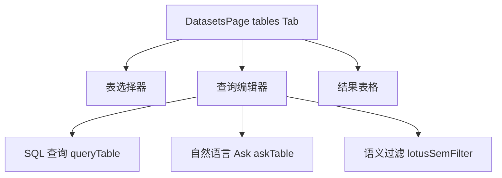
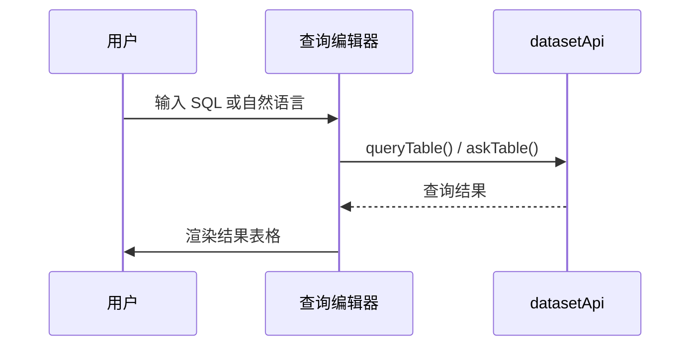

# 数据集 — 表 / TAG 界面

## 功能概述

表 (Tables) 页面支持对数据集中的结构化表资产进行 SQL 查询、自然语言查询 (Ask) 以及语义过滤 (Lotus SemFilter)。

## 组件结构

## 关键交互

| 操作 | API 调用 | 说明 |
|------|----------|------|
| 浏览表列表 | `datasetApi.listTables()` | 数据集下的表资产 |
| 查看表详情 | `datasetApi.getTable()` | 表结构与预览 |
| 预览数据 | `datasetApi.previewTable()` | 前 N 行数据 |
| SQL 查询 | `datasetApi.queryTable()` | 执行 SQL |
| 自然语言查询 | `datasetApi.askTable()` | NL2SQL |
| 语义过滤 | `datasetApi.lotusSemFilter()` | Lotus 语义过滤 |

## 查询模式

| 模式 | 输入 | 特点 |
|------|------|------|
| **SQL** | SQL 语句 | 直接执行，结果以表格展示 |
| **Ask** | 自然语言问题 | 后端 NL2SQL 转换后执行 |
| **SemFilter** | 语义过滤条件 | Lotus 引擎语义匹配 |

:::tip
Ask 模式会在结果中显示生成的 SQL，方便用户验证查询意图。
:::

## 查询流程

:::info
SQL 查询仅支持 SELECT 语句，不允许执行 DDL 或 DML 操作。后端会对 SQL 进行安全校验。
:::

## 结果表格功能

- 支持列排序（点击表头切换升序/降序）
- 支持列宽拖拽调整
- 大结果集自动分页展示

## 相关链接

- [DB Catalog 界面](./catalog-ui) — 表结构浏览
- [web/lib/api 模块](./api-client) — 表查询 API
