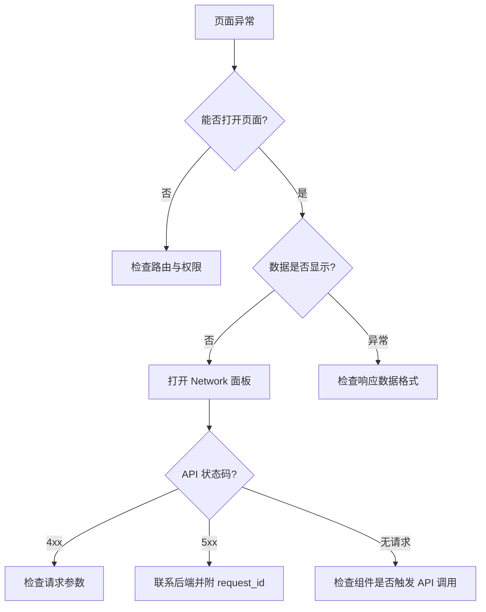

# 数据集 — 排障

## 常见问题

| 症状 | 可能原因 | 排查步骤 |
|------|----------|----------|
| 数据集列表为空 | 后端未返回数据 / 分类筛选过严 | 清除分类筛选；检查 Network `GET /api/v1/datasets/` 响应 |
| 分类树不显示 | `listTree` 返回空 | 确认后端已初始化分类；检查 RBAC 权限 |
| 预检扫描无进度 | SSE 连接断开 | 检查 EventSource 连接；查看 Console 错误 |
| 健康度图表空白 | 数据集无文档或入库未完成 | 确认数据集有已完成入库的文档 |
| 画像扫描一直 pending | 后端 Celery worker 未运行 | 检查后端 worker 日志 |
| 上传文件失败 | 文件过大 / 格式不支持 | 检查 Nginx `client_max_body_size`；确认文件类型 |
| KG Tab 消失 | `kg_enabled` 为 false | 检查 Feature Flag 配置 |
| Toast 显示 "操作失败" | API 返回未知错误 | 打开 Network 面板查看完整响应体 |

## 排查流程

## 调试工具

1. **浏览器 DevTools Network**: 筛选 `/api/v1/` 请求，查看请求/响应
2. **Console**: 前端错误日志与 Warning
3. **React DevTools**: 检查组件 props 与 state
4. **Application Tab**: 检查 localStorage / sessionStorage 中的缓存数据

:::tip
后端返回的每个响应都带有 `X-Request-ID` 头。将此 ID 提供给后端团队可以快速定位日志。
:::

:::warning
清除浏览器缓存或 localStorage 后部分页面状态（如分类树展开状态、筛选条件）会丢失。
:::

## 性能问题

| 症状 | 原因 | 解决方案 |
|------|------|----------|
| 列表渲染卡顿 | 数据集数量过多 | 使用分类筛选缩小范围 |
| Tab 切换白屏 | 子页面数据加载慢 | 检查后端响应时间；确认网络状况 |
| 页面内存持续增长 | 轮询未清理 | 刷新页面；检查 useEffect 清理逻辑 |

:::info
遇到难以复现的问题时，可在 Console 中执行 `localStorage.clear()` 清除本地缓存后重试。
:::

## 相关链接

- [错误处理](./errors) — 错误码映射
- [后端 · 数据集测试](../../backend/datasets/testing.md) — 后端排障
