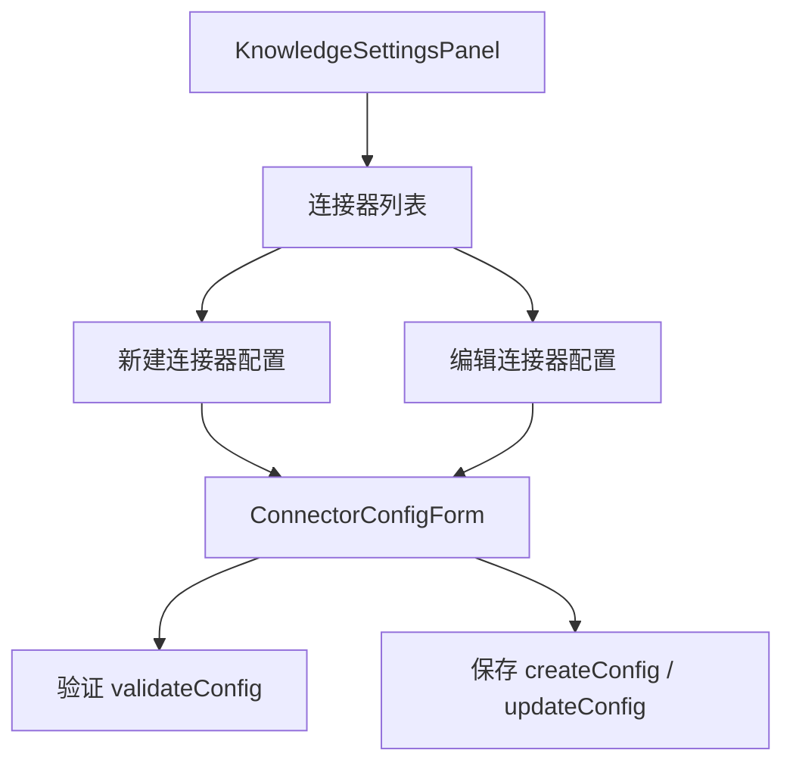
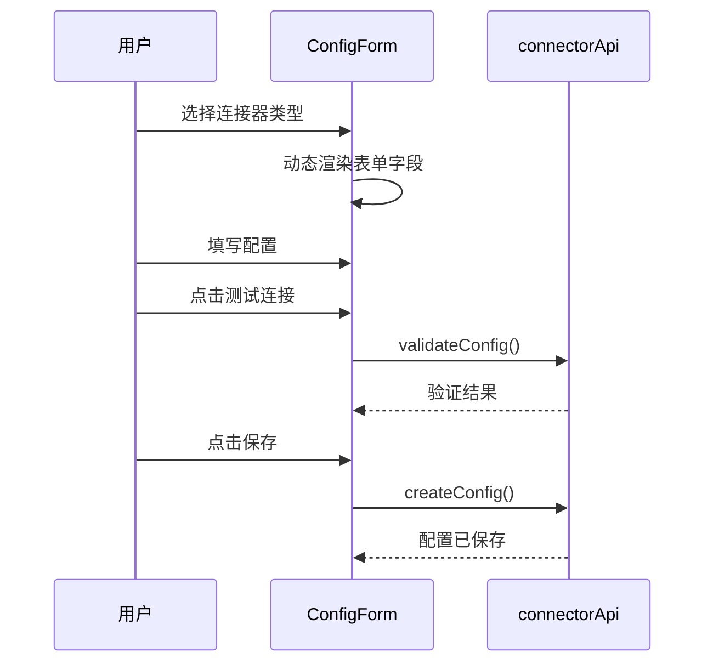

# 文档管理 — 连接器配置

## 功能概述

连接器 (Connector) 用于从外部数据源自动采集文档。前端提供连接器的配置、验证、运行和调度管理界面。

## 组件结构

## API 方法

| 操作 | 方法 | 说明 |
|------|------|------|
| 查看可用连接器 | `connectorApi.listConnectors()` | 后端支持的连接器类型 |
| 验证配置 | `connectorApi.validateConfig()` | 检测连接是否可用 |
| 创建配置 | `connectorApi.createConfig()` | 保存新连接器配置 |
| 更新配置 | `connectorApi.updateConfig()` | 修改已有配置 |
| 删除配置 | `connectorApi.deleteConfig()` | 移除连接器配置 |
| 手动运行 | `connectorApi.runConfig()` | 触发一次采集 |
| 数据调和 | `connectorApi.reconcileConfig()` | 同步数据源变更 |
| 调度查询 | `connectorApi.getConfigScheduledTick()` | 查看下次定时执行 |

## 配置流程

## 连接器类型

后端返回的 `ConnectorInfo` 描述每种连接器的能力。前端根据类型动态渲染表单字段。

| 字段类型 | UI 组件 |
|----------|---------|
| `string` | Input |
| `password` | Password Input |
| `boolean` | Switch |
| `select` | Select 下拉 |
| `url` | URL Input + 验证 |

:::tip
保存前建议先点"测试连接"按钮（调用 `validateConfig`），确认配置正确后再保存。
:::

:::warning
连接器配置中的 password 字段在编辑时不会回显明文。如果不修改密码，留空即可保持原值。
:::

## 相关链接

- [入库 Run 界面](./ingestion-ui) — 运行历史
- [后端 · 文档管线](../../backend/documents/pipeline.md) — 后端连接器实现
