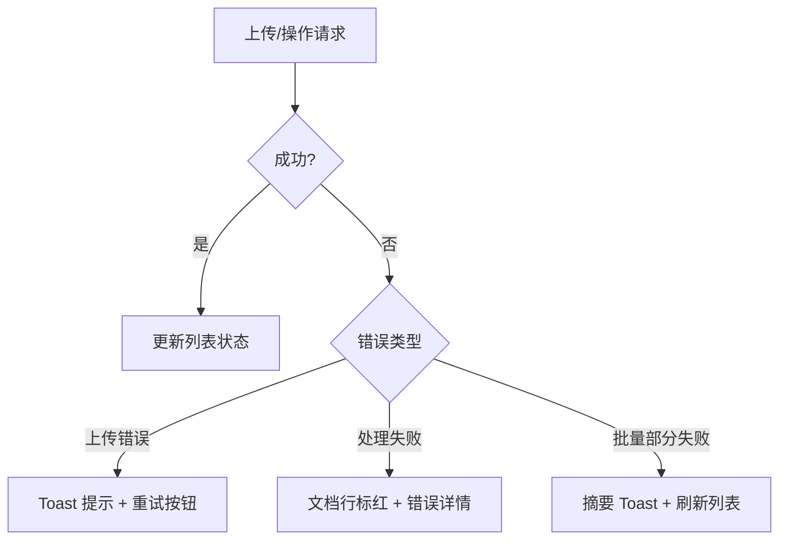

# 文档管理 — 错误处理

## 上传错误

| 错误场景 | HTTP | 前端表现 |
|----------|------|----------|
| 文件过大 | `413` / Nginx 拒绝 | Toast "文件超过大小限制" |
| 不支持的 MIME 类型 | `422` | Toast 显示不支持的文件类型 |
| 权限不足 | `403` | Toast "无权上传到此数据集" |
| 数据集不存在 | `404` | Toast "目标数据集不存在" |
| 重复文件 | `409` | Toast 提示文件已存在（去重启用时） |
| 网络中断 | — | Toast "网络连接中断，请检查网络" |

## 错误处理流程

## 处理错误

文档处理失败时，`document.status` 变为 `failed`，前端显示：

- 文档行标红并显示错误图标
- 展开详情显示 `error_message`
- 提供"重试"按钮调用 `documentApi.batchRetry()`

## 批量操作错误

批量删除/移动/重试时，部分文档可能成功部分失败。前端会：
1. 显示操作结果摘要 Toast（成功 N 个，失败 M 个）
2. 刷新列表反映最终状态

:::tip
上传大文件前请确认 Nginx `client_max_body_size` 配置。默认限制可能小于后端允许的最大文件大小。
:::

## Zod 校验

`documentApi.getParsedContent()` 使用 Zod schema 校验响应，确保前端类型安全。校验失败时会抛出 `ZodError`。

:::warning
Zod 校验失败通常意味着后端响应结构发生了变化。请检查 OpenAPI 规范是否有更新，并重新生成前端类型定义。
:::

## 网络错误处理

网络异常（断网、超时等）由 `apiClient` 底层统一捕获，抛出 `NetworkError`。前端显示 "网络连接异常，请检查网络后重试" 的 Toast 提示。

## 相关链接

- [排障](./troubleshooting) — 问题排查
- [后端 · 文档测试](../../backend/documents/testing.md) — 后端错误场景
