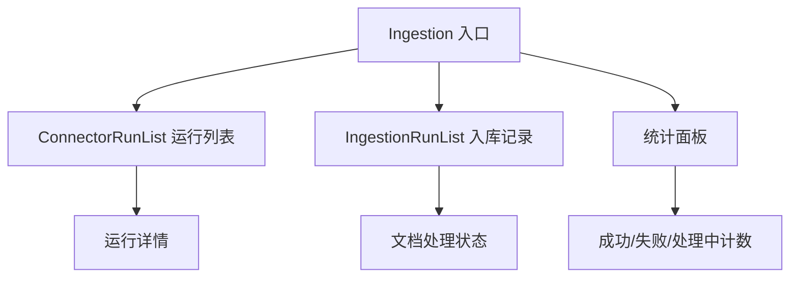
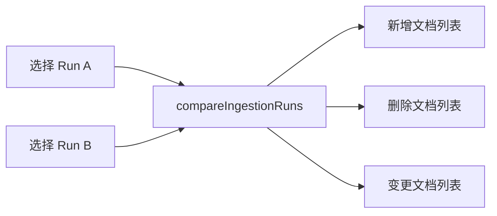

# 文档管理 — 入库 Run 界面

## 功能概述

入库 Run 界面展示连接器运行历史、入库管线执行记录和入库统计。

## 组件结构

## 关键交互

| 操作 | API 调用 | 说明 |
|------|----------|------|
| 查看运行列表 | `connectorApi.listRuns()` | 连接器执行历史 |
| 查看入库记录 | `connectorApi.listIngestionRuns()` | 入库管线运行记录 |
| 对比入库 | `connectorApi.compareIngestionRuns()` | 两次入库结果差异 |
| 触发运行 | `connectorApi.runConfig()` | 手动触发连接器 |
| 调和 | `connectorApi.reconcileConfig()` | 数据调和 |

## 运行状态

| 状态 | 图标 | 说明 |
|------|------|------|
| `running` | Spinner | 正在执行 |
| `completed` | 绿色勾 | 成功完成 |
| `failed` | 红色叉 | 执行失败 |
| `scheduled` | 时钟 | 等待定时触发 |

## 运行对比

入库对比功能允许选择两次 Run 进行差异分析：

:::info
入库 Run 列表按创建时间倒序展示。定时运行由后端 scheduler 控制，前端仅展示与手动触发。
:::

:::tip
手动触发运行后，页面会自动轮询运行状态直到完成。无需手动刷新。
:::

## 相关链接

- [连接器配置](./connectors-ui) — 连接器 UI
- [后端 · 文档管线](../../backend/documents/pipeline.md) — 后端管线实现
