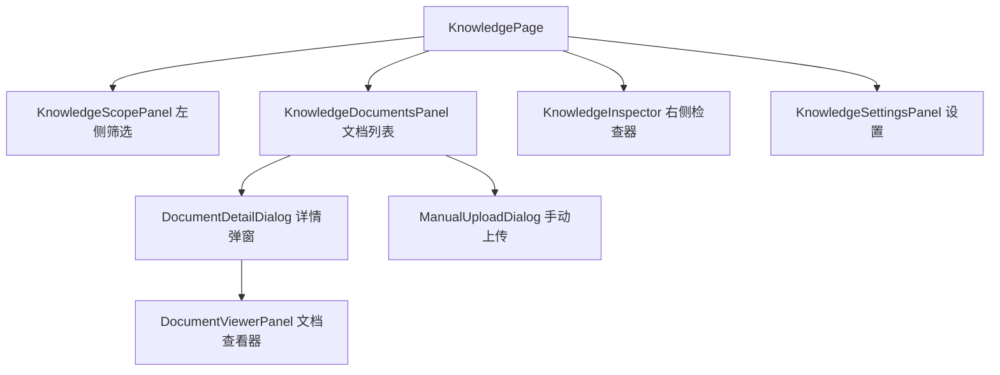
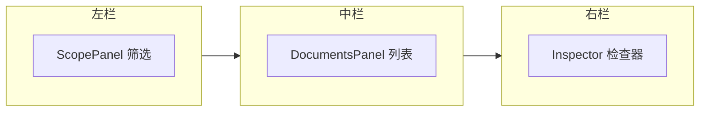

# 文档管理 — 用户路径与入口

## 路由表

文档管理功能分散在多个产品模块中，并非单一 `/documents` 路由。

| 路由 | 页面文件 | 核心组件 | 功能 |
|------|----------|----------|------|
| `/knowledge` | `app/knowledge/page.tsx` | `KnowledgePage` | 文档库主界面 |
| `/knowledge/ingestion` | `app/knowledge/ingestion/page.tsx` | — | 入库队列与上传 |
| `/knowledge/quarantine` | `app/knowledge/quarantine/page.tsx` | — | 隔离区审核 |
| `/knowledge/evidence` | `app/knowledge/evidence/page.tsx` | — | 证据工作台入口 |
| `/knowledge/[id]` | `app/knowledge/[id]/page.tsx` | — | 单文档详情 |
| `/parsing` | `app/parsing/page.tsx` | `ParsingPage` | 解析工作台 |
| `/datasets/[id]/ingestion` | `app/datasets/[id]/ingestion/page.tsx` | — | 数据集入库统计 |

## 核心组件

:::info
KnowledgePage 是文档管理的核心页面，集成了文档列表、筛选面板、检查器和文档查看器。布局为三栏结构。
:::

## 关键子组件

| 组件 | 文件 | 职责 |
|------|------|------|
| `KnowledgeScopePanel` | `knowledge-scope-panel.tsx` | 数据集/文件夹/状态筛选 |
| `KnowledgeDocumentsPanel` | `knowledge-documents-panel.tsx` | 文档表格、批量操作 |
| `KnowledgeInspector` | `knowledge-inspector.tsx` | 选中文档元数据展示 |
| `DocumentDetailDialog` | `document-detail-dialog.tsx` | 文档详情弹窗 |
| `DocumentViewerPanel` | `document-viewer-panel.tsx` | Chunk/预览/文本查看 |

## 三栏布局

左栏宽度固定，中栏自适应，右栏在选中文档时展开。

:::tip
右侧检查器面板可通过点击文档行展开。再次点击或按 `Esc` 键关闭。
:::

## 相关链接

- [web/lib/api 模块](./api-client) — API 调用详情
- [状态与进度](./state-ui) — 文档状态管理
- [后端 · 文档管线](../../backend/documents/pipeline.md) — 后端入库流程
