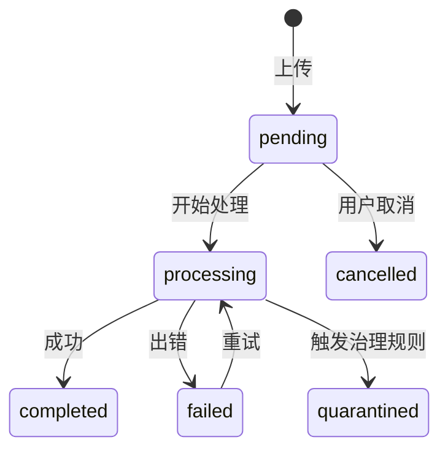

# 文档管理 — 状态与进度

## 文档状态流转

文档在前端展示以下状态，与后端 `DocumentStatus` 枚举对应。

| 状态 | 前端显示 | 说明 |
|------|----------|------|
| `pending` | 等待中 | 已上传，等待处理 |
| `processing` | 处理中 | 正在解析/分块/嵌入 |
| `completed` | 已完成 | 入库成功 |
| `failed` | 失败 | 处理出错 |
| `cancelled` | 已取消 | 用户取消 |
| `quarantined` | 已隔离 | 触发治理规则 |

## 上传进度跟踪

批量上传使用 `documentApi.uploadBatch()` 返回 `DocumentBatchUploadResponse`。前端通过 `getBatchUploadStatus()` 轮询批次状态。

| 组件 | 职责 |
|------|------|
| `ManualUploadDialog` | 文件选择、拖拽上传、进度条 |
| `KnowledgeDocumentsPanel` | 文档列表实时状态刷新 |

## 状态轮询策略

| 场景 | 轮询间隔 | 触发条件 |
|------|----------|----------|
| 上传后状态检查 | 2s | 文档处于 `pending` / `processing` |
| 列表自动刷新 | 10s | 列表中存在 `processing` 状态文档 |
| 手动刷新 | 即时 | 用户点击刷新按钮 |

:::warning
大批量上传时轮询频率不宜过高，避免给后端带来压力。前端使用了请求去重和 abort 机制。
:::

:::tip
文档状态变为 `completed` 或 `failed` 后，前端会自动停止轮询该文档，降低不必要的网络开销。
:::

## 相关链接

- [web/lib/api 模块](./api-client) — API 方法
- [入库 Run 界面](./ingestion-ui) — 入库运行管理
- [后端 · 文档状态](../../backend/documents/state-jobs.md) — 后端状态机
