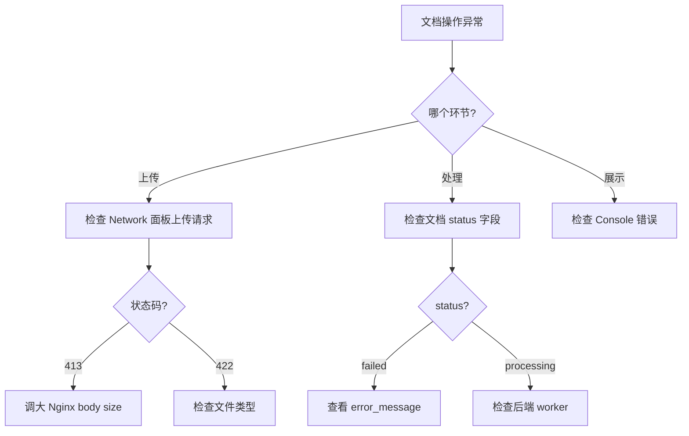

# 文档管理 — 排障

## 常见问题

| 症状 | 可能原因 | 排查步骤 |
|------|----------|----------|
| 上传卡在 0% | 网络问题 / Nginx 限制 | 检查 Network 面板；确认 `client_max_body_size` |
| 上传成功但状态一直 processing | Worker 未运行 / 队列堆积 | 查看后端 Arq worker 状态 |
| 文档列表加载慢 | 数据量大 / 缺少索引 | 使用筛选缩小范围；确认后端分页 |
| 解析内容为空 | 解析器不支持文件格式 | 检查 `parser_backend` 配置 |
| Chunk 预览报错 | 后端解析器服务不可用 | 检查后端解析器容器日志 |
| 文档查看器白屏 | 响应过大 / JS 错误 | 检查 Console；设置 `max_chars` 限制 |
| 批量上传部分失败 | 单文件错误不影响其他 | 查看 batch status 中各文件详情 |
| CORS 错误 | 反向代理配置 | 检查 Nginx CORS 头配置 |

## 排查流程

## SSE 连接排查

部分功能使用 SSE 流式推送。常见问题：

- **连接被关闭**: 检查代理 `proxy_read_timeout` 配置
- **事件丢失**: 确认后端 SSE 端点正常；检查 `Accept: text/event-stream` 请求头

:::tip
前端每个 API 请求都会附带 `X-Request-ID` 头。将此 ID 发给后端可以精确定位日志条目。
:::

:::warning
上传超大文件（超过 100MB）时，浏览器可能出现内存压力。建议将大文件分批上传。
:::

## 调试工具

| 工具 | 用途 | 操作方式 |
|------|------|----------|
| Network 面板 | 查看 API 请求/响应 | 筛选 `/api/v1/documents` |
| Console | 查看前端错误 | 关注 Error 级别日志 |
| React DevTools | 检查组件状态 | 查看 `KnowledgeDocumentsPanel` props |
| Application Tab | 检查存储 | 查看 localStorage 缓存 |

:::info
文档查看器支持键盘快捷键：按 `Esc` 关闭查看器，按左右箭头切换上/下一篇文档。
:::

## 相关链接

- [错误处理](./errors) — 错误码映射
- [后端 · 文档测试](../../backend/documents/testing.md) — 后端排障
