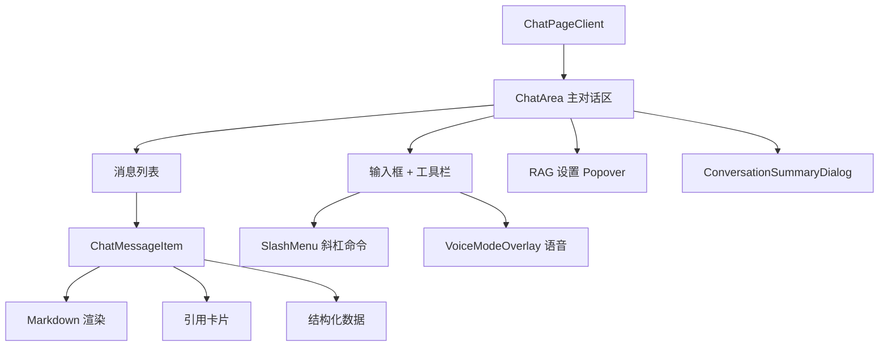
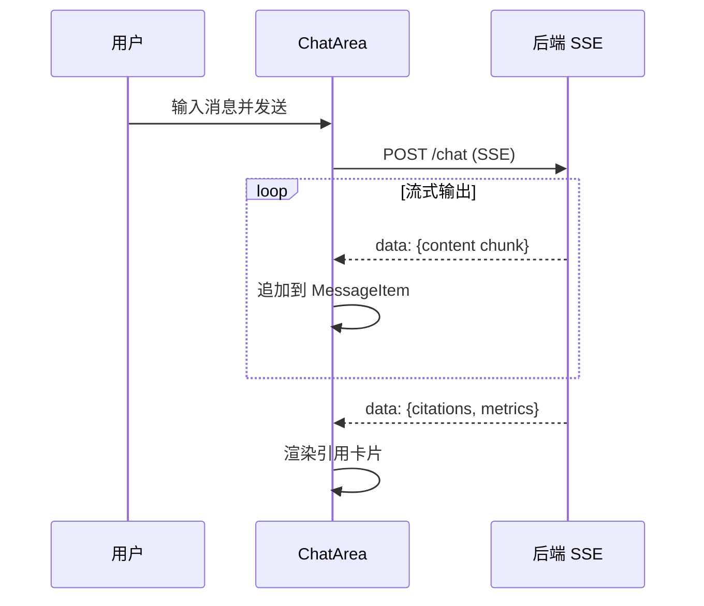

# 对话

## 功能概述

对话界面是 MimirQ 的核心交互入口，支持 RAG 增强的多轮对话、Streaming 输出、引用展示和语音模式。

## 路由

| 路由 | 页面文件 | 功能 |
|------|----------|------|
| `/` | `app/page.tsx` | 对话主页面 |
| `/history` | `app/history/page.tsx` | 对话历史列表 |

## 组件架构

## 核心交互

| 操作 | API | 说明 |
|------|-----|------|
| 创建对话 | `chatApi.createConversation()` | 新建 conversation |
| 发送消息 | `chatApi.chat()` | 流式 SSE 响应 |
| 消息历史 | `chatApi.getMessages()` | 分页加载 |
| 对话列表 | `chatApi.listConversations()` | 历史对话 |
| 导出对话 | `chatApi.exportConversation()` | Markdown / JSON |
| 摘要 | `chatApi.getConversationSummary()` | 对话摘要 |

## Streaming 流程

## RAG 设置

对话输入区提供 RAG 参数调整 Popover：
- 数据集选择
- Prompt 模板选择
- 元数据过滤模式 (`all` / `exclude_qa` / `qa_only` / `custom`)
- 检索模式配置

:::tip
ChatArea 约 1350 行，ChatMessageItem 约 1330 行。建议通过搜索 `useChat` hook 理解数据流。
:::

## 相关链接

- [检索与 RAG](./retrieval) — 检索调试 UI
- [后端 · 对话引擎](../../backend/more/platform.md) — RAGEngine 实现
