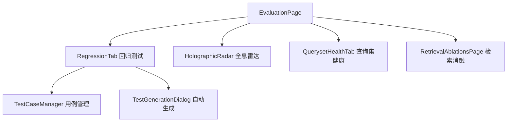

# 评测

## 功能概述

评测 (Evaluation) 界面支持 RAG 系统的端到端质量评估，包括 RAGAS 评测、回归测试、检索消融实验和全息雷达图。

## 路由

| 路由 | 页面文件 | 功能 |
|------|----------|------|
| `/evaluation` | `app/evaluation/page.tsx` | 评测主页面 |
| `/evaluations` | `app/evaluations/page.tsx` | 评测列表 |

## 组件结构

## 关键 API

| 操作 | API | 说明 |
|------|-----|------|
| 创建回归测试 | `evaluationApi.createRegressionRun()` | 启动回归测试 |
| 测试用例 CRUD | `evaluationApi.createCase / listCases` | 用例管理 |
| 自动生成用例 | `evaluationApi.generateFromDocs()` | 从文档生成测试 |
| | `evaluationApi.generateFromConversations()` | 从对话生成测试 |
| RAGAS 评测 | `evaluationApi.listRagasRuns()` | RAGAS 评测运行列表 |
| 回归对比 | `evaluationApi.getRagasRegressionDiff()` | 两次评测差异 |
| KG 诊断 | `evaluationApi.kgSearchDiagnostics()` | KG 检索诊断 |

## 测试用例管理

`TestCaseManager` 组件提供：
- 手动创建测试用例（问题 + 期望答案 + 期望引用）
- 从文档自动生成 Golden Questions
- 从对话历史提取测试用例
- 批量导入/导出

## 全息雷达

`HolographicRadar` 组件以雷达图展示多维度评测指标，支持多次评测结果叠加对比。

:::tip
评测运行是异步任务。启动后通过轮询获取结果。大数据集评测可能耗时较长。
:::

## 相关链接

- [证据工作台](./evidence) — 证据管理
- [后端 · 评测](../../backend/more/platform.md) — 后端评测引擎
