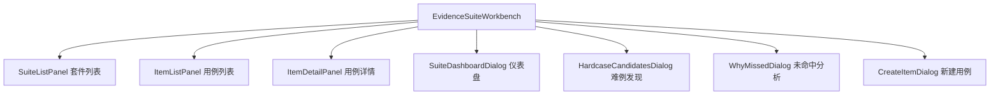
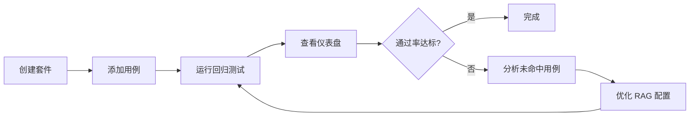

# 证据工作台

## 功能概述

证据工作台 (Evidence Workbench) 用于管理 RAG 质量验证的证据集合、测试用例和回归测试。

## 路由

| 路由 | 页面文件 | 功能 |
|------|----------|------|
| `/knowledge/evidence` | `app/knowledge/evidence/page.tsx` | 证据工作台入口 |
| `/datasets/[id]/evidence` | `app/datasets/[id]/evidence/page.tsx` | 数据集证据 |

## 组件结构

## 关键 API

| 操作 | API | 说明 |
|------|-----|------|
| 套件 CRUD | `evidenceApi.createSuite / listSuites / getSuite` | 证据套件管理 |
| 用例 CRUD | `evidenceApi.createItem / listItems / patchItem` | 测试用例管理 |
| 仪表盘 | `evidenceApi.getSuiteDashboard()` | 套件统计面板 |
| 难例发现 | `evidenceApi.getSuiteHardcaseCandidates()` | 自动发现困难用例 |
| 漂移审计 | `evidenceApi.referenceDriftAudit()` | 引用源变更检测 |
| 回归同步 | `evidenceApi.syncRegression()` | 回归测试同步 |
| 导入/导出 | `evidenceApi.importItems / exportSuite` | 批量导入导出 |

## 工作流

## 状态管理

`useEvidenceSuiteWorkbenchState` hook（约 3.2 万字符）管理工作台全局状态，包括：
- 当前选中的套件和用例
- 加载状态和错误状态
- 筛选条件和分页

:::warning
证据工作台的状态 hook 较为复杂。修改时建议先通读 `use-evidence-suite-workbench-state.ts`。
:::

:::tip
导入用例支持 JSON 格式。可以先导出已有套件获取模板，再批量编辑后导入。
:::

## 相关链接

- [评测](./evaluations) — 评测结果 UI
- [后端 · 证据管理](../../backend/more/platform.md) — 后端证据 API
